

  

<h3 align="center">Universidad Peruana de Ciencias Aplicadas</h3>
<h4 align="center">Carrera de Ingeniería de Software</h4>

  <b>1ACC0238</b> 
  Aplicaciones para Dispositivos Móviles 
  <b>NRC</b> 4951

<h2 align="center">Informe del Trabajo Final</h2>

  <b>Docente</b> 
  Mayta Guillermo, Jorge Luis

  <b>Equipo</b> 
  Performily

  <b>Proyecto</b> 
  Flowboard

<b>Integrantes</b>

<table align="center" style="display: table; width: auto; margin: 0 auto; border: none;">
  <tr>
    <td style="border: none; padding: 2px 16px;"><b>Código</b></td>
    <td style="border: none; padding: 2px 16px;"><b>Apellidos y Nombres</b></td>
  </tr>
  <tr>
    <td style="border: none; padding: 2px 16px;">u202412270</td>
    <td style="border: none; padding: 2px 16px;">Ávila De La Cruz, Darío Fabián</td>
  </tr>
  <tr>
    <td style="border: none; padding: 2px 16px;">u202412663</td>
    <td style="border: none; padding: 2px 16px;">Diaz Villalba, Diego Alonso</td>
  </tr>
  <tr>
    <td style="border: none; padding: 2px 16px;">u202411799</td>
    <td style="border: none; padding: 2px 16px;">Esquicha Alcántara, Diego Alonso</td>
  </tr>
  <tr>
    <td style="border: none; padding: 2px 16px;">u202419655</td>
    <td style="border: none; padding: 2px 16px;">Galvez Meza, Salym Pool</td>
  </tr>
  <tr>
    <td style="border: none; padding: 2px 16px;">u202410478</td>
    <td style="border: none; padding: 2px 16px;">Vasquez Llave, Oscar Lizandro</td>
  </tr>
</table>

  Período 202620 
  Septiembre 2026

# Registro de Versiones del Informe

| Versión | Fecha | Autor | Descripción de modificación |
| :-----: | :---: | :---- | :-------------------------- |
| v1.0 | 31/08/2026 | Vasquez Llave, Oscar Lizandro | Creación del repositorio del informe en la organización de GitHub del equipo y definición de la estructura de secciones. Elaboración de la carátula, el Registro de Versiones y la tabla de contenidos. |
| v1.1 | 02/09/2026 | Vasquez Llave, Oscar Lizandro | Redacción del Capítulo I. Startup Profile con la descripción de la startup, la misión, la visión y los perfiles de los cinco integrantes. |
| v1.2 | 04/09/2026 | Vasquez Llave, Oscar Lizandro | Elaboración del Solution Profile. Antecedentes y problemática aplicando la técnica de las 5W y 2H, puntos que debe resolver la solución, objetivos y restricciones del proyecto. |
| v1.3 | 06/09/2026 | Vasquez Llave, Oscar Lizandro | Incorporación del Lean UX Process completo: Problem Statements, los cinco tipos de Assumptions, Hypothesis Statements y Lean UX Canvas. Descripción de los segmentos objetivo. |
| v1.4 | 07/09/2026 | Esquicha Alcántara, Diego Alonso | Elaboración de la sección de Objetivos SMART con el plan de desarrollo profesional post graduación de cada integrante y su matriz de criterios. |
| v1.5 | 09/09/2026 | Galvez Meza, Salym Pool | Análisis competitivo con el Competitive Analysis Landscape de tres competidores y las estrategias y tácticas frente a la competencia. Revisión de contenido a cargo de Vasquez Llave, Oscar. |
| v1.6 | 10/09/2026 | Diaz Villalba, Diego Alonso | Diseño de las entrevistas para los dos segmentos objetivo, con preguntas demográficas, de contexto laboral y de comportamiento. |
| v1.7 | 12/09/2026 | Ávila De La Cruz, Darío Fabián | Registro de entrevistas con los datos de cada entrevistado y sus resúmenes, y análisis de entrevistas con sustento estadístico por segmento. |
| v1.8 | 13/09/2026 | Ávila De La Cruz, Darío Fabián | Needfinding. User Personas, User Task Matrix, User Journey Mapping y Empathy Mapping elaborados en UXPressia. |
| v1.9 | 14/09/2026 | Diaz Villalba, Diego Alonso y Galvez Meza, Salym Pool | Big Picture EventStorming del dominio y Ubiquitous Language con los términos del negocio en inglés y su glosa en español. |
| v1.10 | 15/09/2026 | Diaz Villalba, Diego Alonso, Ávila De La Cruz, Darío Fabián y Galvez Meza, Salym Pool | Requirements specification. User Stories con criterios de aceptación en Gherkin, Impact Mapping y Product Backlog priorizado. |
| v1.11 | 16/09/2026 | Esquicha Alcántara, Diego Alonso | Strategic-Level Domain-Driven Design. Candidate Context Discovery, Domain Message Flows Modeling y los siete Bounded Context Canvases. |
| v1.12 | 17/09/2026 | Diaz Villalba, Diego Alonso | Context Mapping y Software Architecture con los diagramas de contexto, contenedores y despliegue de C4 Model elaborados en Structurizr. |
| v1.13 | 17/09/2026 | Esquicha Alcántara, Diego Alonso, Galvez Meza, Salym Pool y Oscar Vasquez | Tactical-Level Domain-Driven Design de los siete bounded contexts con sus cuatro capas, diagramas de componentes, diagramas de clases del Domain Layer y diagramas de base de datos. |

# Project Report Collaboration Insights

El informe del proyecto se elabora de forma colaborativa en un repositorio de la organización pública de GitHub del equipo, aplicando GitFlow y Conventional Commits para su creación y evolución. La URL del repositorio del informe es la siguiente:

Repositorio del informe: `https://github.com/Performily-Mobile/performily-mobile-report`

Para la entrega del AV1, el trabajo se distribuyó de modo que cada integrante asumiera secciones completas y respondiera por su contenido. Vasquez Llave, Oscar Lizandro creó el repositorio, definió la estructura de secciones y desarrolló el Capítulo I en su totalidad. Esquicha Alcántara, Diego Alonso elaboró los Objetivos SMART y la perspectiva estratégica y táctica del Domain-Driven Design. Galvez Meza, Salym Pool desarrolló el análisis competitivo, el Ubiquitous Language, el Product Backlog y las capas de infraestructura y los diagramas de código de cada bounded context. Diaz Villalba, Diego Alonso se encargó del diseño de entrevistas, el EventStorming, las User Stories, el Context Mapping y los diagramas de arquitectura de software. Ávila De La Cruz, Darío Fabián condujo el registro y el análisis de entrevistas, todo el Needfinding y el Impact Mapping.

Cada integrante trabajó sobre su propia rama y las incorporaciones al informe se integraron mediante pull requests revisados por al menos otro miembro del equipo, de modo que los commits evidencian el aporte individual y la revisión cruzada. Las capturas de los analíticos de colaboración y de commits del repositorio se presentan a continuación.

![imagen]

![imagen]

# Student Outcome

El curso contribuye al cumplimiento del Student Outcome ABET:

**ABET - EAC - Student Outcome 7**

**Criterio:** La capacidad de adquirir y aplicar nuevos conocimientos según sea necesario, utilizando estrategias de aprendizaje apropiadas.

En el siguiente cuadro se describe las acciones realizadas y enunciados de conclusiones por parte del grupo, que permiten sustentar el haber alcanzado el logro del ABET – EAC - Student Outcome 7.

| Criterio específico | Acciones realizadas | Conclusiones |
| :---- | :---- | :---- |
| Actualiza conceptos y conocimientos necesarios para su desarrollo profesional y en especial para su proyecto en soluciones de software. | **Ávila De La Cruz, Darío Fabián** **AV1:** Estudió las buenas prácticas de conducción de entrevistas de investigación y las aplicó en el registro de entrevistas a los dos segmentos objetivo. Aprendió a construir User Personas, User Task Matrix, User Journey Maps y Empathy Maps en UXPressia, herramienta que no había utilizado antes, y derivó cada característica de los arquetipos del análisis estadístico de las entrevistas registradas. Incorporó además la técnica de Impact Mapping para vincular los objetivos de negocio con las historias de usuario.  **Diaz Villalba, Diego Alonso** **AV1:** Adquirió el manejo de la técnica de Big Picture EventStorming y la aplicó para modelar el dominio del problema junto con el equipo. Estudió la redacción de criterios de aceptación bajo la estructura Gherkin y la aplicó en las User Stories, incluidas las Technical Stories del RESTful API. Aprendió a modelar arquitectura de software con C4 Model en Structurizr, elaborando los diagramas de contexto, contenedores y despliegue de la solución.  **Esquicha Alcántara, Diego Alonso** **AV1:** Estudió el enfoque estratégico de Domain-Driven Design y aplicó las técnicas de Candidate Context Discovery y Domain Message Flows Modeling para identificar y delimitar los siete bounded contexts del dominio. Aprendió a elaborar Bounded Context Canvases siguiendo el proceso iterativo de definición, destilación de reglas de negocio, análisis de capacidades, captura de dependencias y crítica de diseño. Incorporó además los patrones tácticos de agregados, entidades y objetos de valor en las capas de dominio, interfaz y aplicación.  **Galvez Meza, Salym Pool** **AV1:** Aprendió a construir un Competitive Analysis Landscape y un análisis FODA orientado a la competencia para sustentar la propuesta de valor del producto. Estudió la definición de un Ubiquitous Language y lo consolidó con los términos del negocio en inglés y su glosa en español. Adquirió el manejo de la notación de diagramas de clases UML con especificación de scope y multiplicidad, y de diagramas de diseño de base de datos con constraints, aplicándolos a los siete bounded contexts.  **Vasquez Llave, Oscar Lizandro** **AV1:** Estudió y aplicó la técnica de las 5W y 2H para delimitar el problema, y el Lean UX Process de la tercera edición para elaborar el Problem Statement bajo la plantilla de brand new initiative, los cinco tipos de Assumptions, los Hypothesis Statements y el Lean UX Canvas. Investigó de forma autónoma las alternativas de desarrollo móvil nativo y cross-platform, y sustentó con literatura académica la elección del stack declarado en las restricciones tecnológicas del proyecto. | **AV1:** El equipo verificó que el desarrollo de una solución móvil bajo Domain-Driven Design exige incorporar conocimientos que no formaban parte de su formación previa, y que ese aprendizaje debe ocurrir antes de escribir la primera línea de código. Las técnicas de Lean UX, EventStorming, C4 Model y el modelado táctico se estudiaron de forma autónoma a partir de fuentes especializadas y se aplicaron de inmediato sobre el dominio del proyecto, lo que permitió validar la comprensión en un contexto real en lugar de quedarse en la teoría. El equipo concluye que la actualización de conocimientos resulta más efectiva cuando se organiza alrededor de un artefacto concreto que debe producirse, porque obliga a resolver las ambigüedades que una lectura superficial deja pasar. |
| Reconoce la necesidad del aprendizaje permanente para el desempeño profesional y el desarrollo de proyectos en soluciones de software. | **Ávila De La Cruz, Darío Fabián** **AV1:** Reconoció que los arquetipos construidos por inferencia carecen de sustento, lo que lo llevó a rehacer el análisis de entrevistas con porcentajes y a trazar cada característica de los User Personas hasta su origen en las respuestas registradas. Identificó la necesidad de mantenerse actualizado en métodos de investigación de usuarios para que los hallazgos sostengan las decisiones de producto.  **Diaz Villalba, Diego Alonso** **AV1:** Al modelar la arquitectura reconoció que su conocimiento previo de diagramas se limitaba a UML, y asumió el estudio de C4 Model como un nivel de abstracción distinto y complementario. Identificó que la evolución de las herramientas de modelado exige una actualización continua para poder comunicar decisiones de arquitectura a audiencias técnicas y no técnicas.  **Esquicha Alcántara, Diego Alonso** **AV1:** Reconoció que la seguridad de la información que expone la solución no se resuelve con conocimientos generales, y asumió el estudio de los controles del OWASP Mobile Application Security Verification Standard para sustentar las decisiones de almacenamiento cifrado y autenticación del contexto de identidad. Identificó que el desarrollo seguro demanda una actualización permanente frente a la aparición de nuevas vulnerabilidades.  **Galvez Meza, Salym Pool** **AV1:** Reconoció que el diseño de la persistencia no puede derivarse de forma mecánica del modelo de dominio, y estudió cómo un agregado se traduce en tablas, constraints y relaciones sin perder sus invariantes. Identificó que la separación entre el esquema del servidor y el esquema local del dispositivo es una decisión de diseño propia del desarrollo móvil que debe seguir estudiando.  **Vasquez Llave, Oscar Lizandro** **AV1:** Reconoció que el requisito de incorporar un feature de aprendizaje autónomo exige evaluar tecnologías no abordadas en clase con criterio propio, y no adoptar la primera alternativa disponible. Investigó las opciones de autenticación biométrica en Android y en Flutter, contrastó sus diferencias técnicas y documentó la justificación de la elección, asumiendo que esa capacidad de evaluar e integrar tecnología nueva será permanente en su ejercicio profesional. | **AV1:** El equipo constató que el alcance del proyecto obligó a cada integrante a identificar por sí mismo qué le faltaba saber antes de poder avanzar, y que ese diagnóstico fue tan determinante como el estudio posterior. Las decisiones que se tomaron sin conocimiento suficiente, como la primera versión del análisis de entrevistas o la delimitación inicial del dominio, tuvieron que rehacerse, lo que evidenció el costo de suponer en lugar de aprender. El equipo concluye que el aprendizaje permanente no es una recomendación general sino una condición operativa del desarrollo de software, porque el stack, las técnicas de modelado y los estándares de seguridad cambian a un ritmo que ninguna formación inicial puede cubrir por completo. |

# Contenido

- [Registro de Versiones del Informe](#registro-de-versiones-del-informe)
- [Project Report Collaboration Insights](#project-report-collaboration-insights)
- [Student Outcome](#student-outcome)
- [Objetivos SMART](#objetivos-smart)
  - [1. Objetivos SMART: Darío Ávila De La Cruz (u202412270)](#1-objetivos-smart-dario-avila-de-la-cruz-u202412270)
  - [2. Objetivos SMART: Diego Alonso Díaz Villalba (u202412663)](#2-objetivos-smart-diego-alonso-diaz-villalba-u202412663)
  - [3. Objetivos SMART: Salym Pool Gálvez Meza (u202419655)](#3-objetivos-smart-salym-pool-galvez-meza-u202419655)
  - [4. Objetivos SMART: Oscar Lizandro Vasquez Llave (u202410478)](#4-objetivos-smart-oscar-lizandro-vasquez-llave-u202410478)
  - [5. Objetivos SMART: Diego Alonso Esquicha Alcántara (u202411799)](#5-objetivos-smart-diego-alonso-esquicha-alcantara-u202411799)
- [Capítulo I: Presentación](#capitulo-i-presentacion)
  - [1.1. Startup Profile](#11-startup-profile)
    - [1.1.1. Descripción de la Startup](#111-descripcion-de-la-startup)
    - [1.1.2. Perfiles de integrantes del equipo](#112-perfiles-de-integrantes-del-equipo)
  - [1.2. Solution Profile](#12-solution-profile)
    - [1.2.1. Antecedentes y problemática](#121-antecedentes-y-problematica)
    - [1.2.2. Lean UX Process](#122-lean-ux-process)
  - [1.3. Segmentos objetivo](#13-segmentos-objetivo)
- [Capítulo II: Requirements Development and Software Solution Design](#capitulo-ii-requirements-development-and-software-solution-design)
  - [2.1. Competidores](#21-competidores)
    - [2.1.1. Análisis competitivo](#211-analisis-competitivo)
    - [2.1.2. Estrategias y tácticas frente a competidores](#212-estrategias-y-tacticas-frente-a-competidores)
  - [2.2. Entrevistas](#22-entrevistas)
    - [2.2.1. Diseño de entrevistas](#221-diseno-de-entrevistas)
    - [2.2.2. Registro de entrevistas](#222-registro-de-entrevistas)
    - [2.2.3. Análisis de entrevistas](#223-analisis-de-entrevistas)
  - [2.3. Needfinding](#23-needfinding)
    - [2.3.1. User Personas](#231-user-personas)
    - [2.3.2. User Task Matrix](#232-user-task-matrix)
    - [2.3.3. User Journey Mapping](#233-user-journey-mapping)
    - [2.3.4. Empathy Mapping](#234-empathy-mapping)
    - [2.3.5. Big Picture Event Storming](#235-big-picture-event-storming)
    - [2.3.6. Ubiquitous Language](#236-ubiquitous-language)
  - [2.4. Requirements specification](#24-requirements-specification)
    - [2.4.1. User Stories](#241-user-stories)
    - [2.4.2. Impact Mapping](#242-impact-mapping)
    - [2.4.3. Product Backlog](#243-product-backlog)
  - [2.5. Strategic-Level Domain-Driven Design](#25-strategic-level-domain-driven-design)
    - [2.5.1. EventStorming](#251-eventstorming)
    - [2.5.2. Context Mapping](#252-context-mapping)
    - [2.5.3. Software Architecture](#253-software-architecture)
  - [2.6. Tactical-Level Domain-Driven Design](#26-tactical-level-domain-driven-design)
    - [2.6.1. Bounded Context: IAM](#261-bounded-context-iam)
    - [2.6.2. Bounded Context: Workspace](#262-bounded-context-workspace)
    - [2.6.3. Bounded Context: Attendance](#263-bounded-context-attendance)
    - [2.6.4. Bounded Context: Request](#264-bounded-context-request)
    - [2.6.5. Bounded Context: Benefits](#265-bounded-context-benefits)
    - [2.6.6. Bounded Context: Payroll](#266-bounded-context-payroll)
    - [2.6.7. Bounded Context: Wellbeing](#267-bounded-context-wellbeing)
- [Conclusiones y recomendaciones](#conclusiones-y-recomendaciones)
  - [Conclusiones sobre el Problem Statement](#conclusiones-sobre-el-problem-statement)
  - [Conclusiones sobre los assumptions frente al comportamiento observado](#conclusiones-sobre-los-assumptions-frente-al-comportamiento-observado)
  - [Conclusiones sobre los Hypothesis Statements y los criterios de éxito](#conclusiones-sobre-los-hypothesis-statements-y-los-criterios-de-exito)
  - [Conclusiones sobre el diseño de la solución de software](#conclusiones-sobre-el-diseno-de-la-solucion-de-software)
  - [Recomendaciones sobre los siguientes pasos del roadmap](#recomendaciones-sobre-los-siguientes-pasos-del-roadmap)
- [Bibliografía](#bibliografia)

# Objetivos SMART

**Plan de Desarrollo Profesional Post-Graduación**

Esta sección presenta el plan de crecimiento profesional continuo para cada integrante del equipo de trabajo, ubicado a continuación del área de *Student Outcome*. Los objetivos han sido estructurados siguiendo la metodología **SMART** (*Specific, Measurable, Attainable, Relevant, Time-bound*), con el propósito de reflejar de forma clara y medible cómo cada integrante planea alcanzar un desarrollo profesional sostenible tras culminar la carrera de Ingeniería de Software.

## 1. Objetivos SMART: Darío Ávila De La Cruz (u202412270)

**Carrera: Ingeniería de Software**
**Perfil Profesional**
Estudiante universitario de Ingeniería de Software con formación en desarrollo de soluciones técnicas eficientes y adaptables utilizando lenguajes de programación como C++ y Python. Destaca por su capacidad de escucha activa para alinear los objetivos del proyecto con las necesidades del equipo y clientes, integrando perspectivas innovadoras. Cuenta con gran adaptabilidad y flexibilidad ante cambios de requerimientos o prioridades durante el ciclo de vida del desarrollo de software.

**Plan de desarrollo**
El plan parte de acreditar formalmente el dominio de Python que ya practica, lo utiliza como respaldo para la postulación a puestos de backend, y a mediano plazo lo extiende hacia el diseño de servicios en la nube, que es el entorno donde hoy se despliega ese tipo de desarrollo.

**Objetivos SMART Post-Graduación**
* **Objetivo SMART 1. Especialización en Backend y Python:**

Obtener la certificación PCAP, Certified Associate in Python Programming, del Python Institute, dentro de los 6 meses posteriores a la graduación, dedicando 10 horas semanales a estudio y resolución de ejercicios, y aprobando el examen oficial cuyo umbral mínimo es 70%.

* **Objetivo SMART 2. Inserción Laboral en Desarrollo C++/Python:**

Conseguir un puesto de Desarrollador de Software Junior orientado a backend o algoritmos dentro de los 4 meses posteriores a la graduación, sosteniendo un promedio de 5 postulaciones semanales a vacantes de C++ o Python y publicando previamente 2 repositorios propios documentados que resuelvan problemas algorítmicos.

* **Objetivo SMART 3. Especialización en servicios en la nube**

Obtener la certificación AWS Certified Developer \- Associate dentro de los 18 meses posteriores a la graduación, destinando 6 horas semanales de preparación y alcanzando al menos el puntaje mínimo de aprobación de 720 sobre 1000 que establece el proveedor.

**Matriz de Criterios SMART**
| Criterio | Objetivo 1. Certificación PCAP | Objetivo 2 (Trabajo Developer) | Objetivo 3. Certificación AWS |
| :---- | :---- | :---- | :---- |
| **S (Específico)** | Certificación PCAP del Python Institute. | Conseguir el puesto de Desarrollador Junior Backend en C++/Python. | Certificación AWS Certified Developer \- Associate. |
| **M (Medible)** | Aprobar el examen oficial con 70% o más. | 5 postulaciones semanales y 2 proyectos en GitHub. | Puntaje de 720 sobre 1000 o superior. |
| **A (Alcanzable)** | 10 horas semanales durante 6 meses, sobre una base previa de Python ya trabajada en la carrera. | El perfil de egresado con portafolio propio cubre los requisitos de una vacante junior. | 6 horas semanales sostenidas, partiendo de la base de programación ya certificada en el objetivo 1. |
| **R (Relevante)** | Acredita ante el mercado el lenguaje que domina. | Convierte la formación en experiencia profesional remunerada. | Extiende el perfil hacia el entorno donde se despliegan los servicios que construye. |
| **T (Temporal)** | 6 meses posteriores a la graduación. | 4 meses posteriores a la graduación. | 18 meses posteriores a la graduación. |

## 2. Objetivos SMART: Diego Alonso Díaz Villalba (u202412663)

**Carrera: Ingeniería de Software**
**Perfil Profesional**
Estudiante universitario de Ingeniería de Software con formación previa en Psicología, lo que le otorga una perspectiva integral para conectar las necesidades humanas con soluciones tecnológicas. Cuenta con competencias en conducción de entrevistas, toma de decisiones fundamentadas e identificación de requerimientos mediante la observación y escucha activa. Se especializa en diseño de software, Experiencia de Usuario (UX), Interfaz de Usuario (UI) y usabilidad.

**Plan de desarrollo**
El plan consolida el perfil híbrido de psicología y diseño de software mediante una credencial reconocida en UX, la respalda con un portafolio de casos reales para la inserción laboral, y a mediano plazo incorpora la investigación de usuarios con métodos cuantitativos, que es la competencia que diferencia a un diseñador de un investigador de producto.

**Objetivos SMART Post-Graduación**
* **Objetivo SMART 1. Certificación Profesional UX/UI:**

Obtener el Google UX Design Professional Certificate dentro de los 6 meses posteriores a la graduación, dedicando 8 horas semanales al desarrollo de los siete cursos que lo componen y completando los tres proyectos de portafolio que exige el programa.

* **Objetivo SMART 2. Inserción Laboral en UX/UI y Requerimientos:**

Conseguir un puesto de UX/UI Designer Junior o Analista de Requerimientos dentro de los 4 meses posteriores a la graduación, publicando previamente un portafolio en Behance o Figma con 3 casos de estudio que documenten el proceso completo desde la investigación hasta el prototipo, y sosteniendo 5 postulaciones semanales.

* **Objetivo SMART 3. Investigación de usuarios con métodos mixtos**

Conducir y documentar, dentro de los 18 meses posteriores a la graduación, al menos 3 estudios de usabilidad con usuarios reales que combinen entrevistas con métricas cuantitativas de tarea, publicando sus hallazgos como casos de estudio y alcanzando en cada uno una muestra mínima de 5 participantes por segmento evaluado.

**Matriz de Criterios SMART**
| Criterio | Objetivo 1. Certificación UX | Objetivo 2. Empleo UX/UI | Objetivo 3. Investigación de usuarios |
| :---- | :---- | :---- | :---- |
| **S (Específico)** | Google UX Design Professional Certificate. | Puesto de UX/UI Designer Junior o Analista de Requerimientos. | Conducción documentada de estudios de usabilidad con métodos mixtos. |
| **M (Medible)** | Siete cursos aprobados y tres proyectos de portafolio completados. | Portafolio con 3 casos de estudio y 5 postulaciones semanales. | 3 estudios publicados, con 5 participantes como mínimo por segmento. |
| **A (Alcanzable)** | 8 horas semanales durante 6 meses, sobre su formación previa en Psicología y su experiencia conduciendo entrevistas. | Portafolio con 3 casos de estudio y 5 postulaciones semanales. | Aplica en el puesto obtenido en el objetivo 2 la técnica de entrevista que ya domina. |
| **R (Relevante)** | Acredita formalmente la especialidad que eligió. | Inicia la línea de carrera en usabilidad y experiencia de usuario. | Distingue su perfil del de un diseñador puramente visual. |
| **T (Temporal)** | 6 meses posteriores a la graduación. | 4 meses posteriores a la graduación. | 18 meses posteriores a la graduación. |

## 3. Objetivos SMART: Salym Pool Gálvez Meza (u202419655)

**Carrera: Ingeniería de Software**
**Perfil Profesional**
Estudiante universitario de Ingeniería de Software caracterizado por su enfoque proactivo, responsabilidad y adaptación a entornos dinámicos. Posee conocimientos en desarrollo web frontend (JavaScript, HTML, CSS), bases de datos y optimización de recursos con C++. Destaca por habilidades blandas como el pensamiento crítico y la escucha activa, aplicadas en el análisis de problemas complejos y la colaboración en equipos orientados a resultados.

**Plan de desarrollo**
El plan acredita primero el manejo de bases de datos relacionales, que es la base sobre la que se apoya el desarrollo web que ya practica, lo emplea para acceder a una posición full-stack, y a mediano plazo suma la capacidad de desplegar y operar lo que construye.

**Objetivos SMART Post-Graduación**
* **Objetivo SMART 1. Acreditación en bases de datos relacionales**

Obtener la certificación Oracle Certified Associate en MySQL o su equivalente vigente dentro de los 6 meses posteriores a la graduación, destinando 8 horas semanales a estudio y práctica de consultas, y aprobando el examen oficial con el puntaje mínimo que establece el proveedor.

* **Objetivo SMART 2. Inserción laboral en desarrollo web**

Conseguir un puesto de Desarrollador Web Junior, frontend o full-stack, dentro de los 4 meses posteriores a la graduación, habiendo desplegado previamente en un servicio público una aplicación web responsiva conectada a base de datos, con su repositorio documentado, y sosteniendo 5 postulaciones semanales.

* **Objetivo SMART 3. Capacidad de despliegue y operación**

Obtener la certificación AWS Certified Cloud Practitioner dentro de los 12 meses posteriores a la graduación y aplicar lo aprendido desplegando al menos 2 aplicaciones propias con integración continua automatizada, destinando 5 horas semanales de preparación.

**Matriz de Criterios SMART**
| Criterio | Objetivo 1. Certificación en bases de datos | Objetivo 2. Empleo web | Objetivo 3. Despliegue en la nube |
| :---- | :---- | :---- | :---- |
| **S (Específico)** | Certificación Oracle Certified Associate en MySQL. | Puesto de Desarrollador Web Junior frontend o full-stack. | Certificación AWS Cloud Practitioner y despliegue con integración continua. |
| **M (Medible)** | Aprobar el examen oficial con el puntaje mínimo del proveedor. | 1 aplicación desplegada y documentada, y 5 postulaciones semanales. | Certificación obtenida y 2 aplicaciones con integración continua funcionando. |
| **A (Alcanzable)** | 8 horas semanales durante 6 meses, sobre el manejo de bases de datos trabajado en la carrera. | La aplicación desplegada evidencia las tres capas ante un reclutador. | 5 horas semanales, con la práctica aplicada sobre proyectos propios ya existentes. |
| **R (Relevante)** | Respalda la capa de datos de las aplicaciones que desarrolla. | Permite ejercer las competencias de JavaScript, HTML, CSS y bases de datos. | Cierra el ciclo de desarrollo, del código al servicio en producción. |
| **T (Temporal)** | 6 meses posteriores a la graduación. | 4 meses posteriores a la graduación. | 12 meses posteriores a la graduación. |

## 4. Objetivos SMART: Oscar Lizandro Vasquez Llave (u202410478)

**Carrera: Ingeniería de Software**
**Perfil Profesional**
Estudiante universitario de Ingeniería de Software con formación en desarrollo de aplicaciones, diseño de interfaces de usuario y gestión de proyectos tecnológicos. Cuenta con conocimientos en HTML, CSS, JavaScript, C++, Figma y control de versiones con Git/GitHub. Se distingue por su iniciativa, capacidad para trabajar en equipos multidisciplinarios y constante motivación por resolver problemas técnicos de forma eficiente.

**Plan de desarrollo**
El plan combina las dos vertientes de su perfil. Acredita primero la competencia en gestión ágil, que es la que le permite coordinar equipos multidisciplinarios, la complementa con la inserción laboral en desarrollo de interfaces, y a mediano plazo suma el desarrollo móvil, que es la especialidad trabajada en este proyecto y la que amplía su alcance más allá del navegador.

**Objetivos SMART Post-Graduación**
* **Objetivo SMART 1. Acreditación en gestión ágil de proyectos**

Obtener la certificación Professional Scrum Master I de Scrum.org dentro de los 5 meses posteriores a la graduación, dedicando 6 horas semanales a estudio de la Guía Scrum y simulacros, y aprobando el examen oficial cuyo umbral mínimo es 85%.

* **Objetivo SMART 2. Inserción laboral en desarrollo de interfaces:**

Conseguir un puesto de Desarrollador Frontend Junior o UI Engineer dentro de los 4 meses posteriores a la graduación, habiendo publicado previamente 2 aplicaciones web interactivas con su repositorio documentado y su versión desplegada accesible, y sosteniendo 5 postulaciones semanales.

* **Objetivo SMART 3. Especialización en desarrollo móvil**

Publicar en Google Play, dentro de los 15 meses posteriores a la graduación, al menos 1 aplicación Android propia desarrollada con Kotlin, destinando 6 horas semanales al aprendizaje del ecosistema Android y alcanzando un mínimo de 100 instalaciones y una calificación promedio de 4 sobre 5.

**Matriz de Criterios SMART**
| Criterio | Objetivo 1. Certificación PSM I | Objetivo 2. Empleo frontend |
| :---- | :---- | :---- |
| **S (Específico)** | Certificación Professional Scrum Master I de Scrum.org. | Puesto de Desarrollador Frontend Junior o UI Engineer. |
| **M (Medible)** | Aprobar el examen oficial con 85% o más. | 2 aplicaciones desplegadas y documentadas, y 5 postulaciones semanales. |
| **A (Alcanzable)** | 6 horas semanales durante 5 meses, sobre la experiencia de coordinación adquirida en los trabajos de equipo de la carrera. | Su manejo de JavaScript, HTML, CSS, Figma y Git cubre el perfil de una vacante junior. |
| **R (Relevante)** | Acredita la vertiente de gestión de su perfil ante equipos multidisciplinarios. | Permite aplicar sus competencias de desarrollo web y diseño de interfaz. |
| **T (Temporal)** | 5 meses posteriores a la graduación. | 4 meses posteriores a la graduación. |

## 5. Objetivos SMART: Diego Alonso Esquicha Alcántara (u202411799)

**Carrera: Ingeniería de Software**
**Perfil Profesional**
Estudiante de Ingeniería de Software enfocado en el desarrollo de soluciones tecnológicas eficientes, escalables y seguras. Destaca por sus marcadas habilidades de liderazgo, comunicación proactiva y trabajo en equipo. Cuenta con conocimientos en C++, C#, sumado a formación en ciberseguridad, análisis de seguridad, fundamentos de seguridad informática y dominio de inglés intermedio. Es adaptable y está orientado a la resolución constante de problemas complejos.

**Plan de desarrollo**
El plan acredita primero los fundamentos de seguridad informática con una credencial de reconocimiento internacional, la aplica en una posición que combine desarrollo backend y seguridad, y a mediano plazo consolida el perfil de desarrollo seguro incorporando prácticas de seguridad al propio ciclo de construcción de software.

**Objetivos SMART Post-Graduación**
* **Objetivo SMART 1. Acreditación en fundamentos de seguridad**

Obtener la certificación CompTIA Security+ dentro de los 6 meses posteriores a la graduación, destinando 10 horas semanales a estudio de los dominios del examen y práctica en laboratorios de análisis de vulnerabilidades, y alcanzando el puntaje mínimo de aprobación de 750 sobre una escala de 100 a 900 que establece el proveedor.

* **Objetivo SMART 2. Inserción laboral en desarrollo seguro**

Conseguir un puesto de Desarrollador Backend Junior en C# o de Analista de Ciberseguridad Junior dentro de los 4 meses posteriores a la graduación, habiendo publicado previamente 1 proyecto propio en C# que documente de forma explícita las prácticas de codificación segura aplicadas, y sosteniendo 5 postulaciones semanales.

* **Objetivo SMART 3. Prácticas de seguridad en el ciclo de desarrollo**

Implementar y documentar, dentro de los 18 meses posteriores a la graduación, una cadena de integración continua que incorpore análisis estático de código y revisión automatizada de dependencias en al menos 2 proyectos, reduciendo a cero las vulnerabilidades de severidad alta y crítica reportadas por las herramientas en cada entrega.

**Matriz de Criterios SMART**
| Criterio | Objetivo 1. Certificación Security+ | Objetivo 2. Empleo backend o seguridad | Objetivo 3. Seguridad en el ciclo de desarrollo |
| :---- | :---- | :---- | :---- |
| **S (Específico)** | Certificación CompTIA Security+. | Puesto de Desarrollador Backend Junior en C# o Analista de Ciberseguridad Junior. | Cadena de integración continua con análisis estático y de dependencias. |
| **M (Medible)** | Puntaje de 750 sobre la escala de 100 a 900. | 1 proyecto con prácticas de codificación segura documentadas y 5 postulaciones semanales. | 2 proyectos con la cadena implementada y cero vulnerabilidades altas o críticas por entrega. |
| **A (Alcanzable)** | 10 horas semanales durante 6 meses, sobre su formación previa en fundamentos de seguridad informática. | Su manejo de C# junto con la base de seguridad cubre ambos perfiles de vacante. | 2 proyectos con la cadena implementada y cero vulnerabilidades altas o críticas por entrega. |
| **R (Relevante)** | Es la credencial de entrada reconocida en el mercado de seguridad. | Permite ejercer las dos vertientes de su perfil sin renunciar a ninguna. | Traduce el conocimiento de seguridad en una práctica verificable de desarrollo. |
| **T (Temporal)** | 6 meses posteriores a la graduación. | 4 meses posteriores a la graduación. | 18 meses posteriores a la graduación. |

# Capítulo I: Presentación

## 1.1. Startup Profile

### 1.1.1. Descripción de la Startup

Somos Performily, una startup conformada por estudiantes de la Universidad Peruana de Ciencias Aplicadas (UPC). Esta iniciativa surge con el propósito de desarrollar soluciones tecnológicas orientadas a facilitar los procesos de gestión del vínculo laboral dentro de las organizaciones.

La razón de ser de nuestra startup radica en la necesidad de contar con herramientas que permitan a las personas gestionar de manera eficiente sus actividades y flujos de trabajo, lo cual favorece la mejora del clima laboral e impulsa un entorno productivo dentro de la organización. Nuestra meta es brindar a los usuarios una herramienta que les permita tener control práctico y accesible de las gestiones de diferentes áreas empresariales mediante soluciones digitales intuitivas.

Con Flowboard, Performily lleva esa propuesta al dispositivo que el colaborador ya tiene en el bolsillo. La decisión de construir el producto como una experiencia móvil no es un cambio de tecnología sino un cambio de alcance: buena parte del personal de una organización no dispone de una computadora corporativa durante su jornada, por lo que una plataforma que solo vive en el navegador de escritorio deja fuera precisamente al segmento que más depende del área de Recursos Humanos para conocer su propia información laboral.

**Misión:** Crear soluciones tecnológicas innovadoras que faciliten la gestión de personas en las organizaciones y promuevan la eficiencia laboral y la sostenibilidad, poniendo la información del vínculo laboral al alcance del colaborador desde su propio dispositivo móvil.

**Visión:** Consolidarnos hacia el año 2029 como una startup referente en soluciones móviles para la gestión de colaboradores y el impulso de la eficiencia en los procesos internos, para contribuir a una sociedad con entornos laborales más profesionales, transparentes y organizados.

### 1.1.2. Perfiles de integrantes del equipo

| Darío Ávila De La Cruz (u202412270): Ingeniería de software |  |
| ----- | :---- |
|  | Mi nombre es Darío Ávila, soy estudiante universitario de la carrera de Ingeniería de Software, cursando el 6.º ciclo. Cuento con conocimientos en lenguajes de programación C++ y Python, lo que me permite desarrollar soluciones técnicas eficientes y adaptables. Practico la escucha activa para comprender a fondo las necesidades tanto del equipo como de los clientes, asegurando que los objetivos se alineen con las expectativas. Además, busco soluciones innovadoras que integren distintas perspectivas, fomentando la colaboración y la creatividad. Soy flexible ante cambios inesperados en los proyectos, adaptándome rápidamente a nuevas prioridades o requerimientos. |
| Diego Alonso Diaz Villalba (u202412663): Ingeniería de software |  |
|  | Cuento con formación en Psicología y actualmente curso la carrera de Ingeniería de Software, lo que me permite integrar habilidades humanas con conocimientos técnicos. Tengo experiencia en la conducción de entrevistas, la identificación de necesidades mediante observación y escucha activa, así como en la toma de decisiones fundamentadas. Me interesa especialmente el diseño de software, con énfasis en el análisis de requerimientos, la experiencia de usuario (UX), la interfaz de usuario (UI) y la usabilidad de las aplicaciones. Me motiva crear soluciones tecnológicas que no solo sean funcionales, sino también intuitivas y accesibles para los usuarios. |
| Salym Pool Galvez Meza (u202419655): Ingeniería de Software |  |
|  | Soy Salym Galvez, una persona con sólidas habilidades blandas como el pensamiento crítico y la escucha activa, lo que me permite analizar situaciones para encontrar soluciones efectivas y potenciar el trabajo en equipo. Me adapto con facilidad a distintos entornos, soy proactivo, responsable y orientado a resultados. En el aspecto técnico, cuento con conocimientos en C++ enfocados en la optimización de recursos, así como en el levantamiento de bases de datos y el desarrollo de sitios web utilizando JavaScript, HTML y CSS. Busco siempre aprender cosas nuevas para crecer profesionalmente y aportar valor práctico y técnico en cada proyecto en el que participo. |
| Diego Alonso Esquicha Alcántara (u202411799): Ingeniería de Software |  |
|  | Soy Diego Esquicha, tengo 20 años, estudio Ingeniería de Software en la Universidad Peruana de Ciencias Aplicadas. Cuento con conocimientos en arquitectura de software y C++. Me considero una persona responsable, disciplinada y perseverante, con capacidad para afrontar retos y adaptarme a diferentes situaciones. Me caracterizo por mi compromiso, resiliencia y puntualidad, además de mi constante interés por seguir aprendiendo y mejorar mis habilidades. |
| Oscar Lizandro Vasquez Llave (u202410478): Ingeniería de Software |  |
|  | Soy estudiante de Ingeniería de Software con formación en desarrollo de aplicaciones y gestión de proyectos tecnológicos. Cuento con conocimientos en C++, HTML, CSS, JavaScript, diseño de interfaces de usuario con Figma y uso de herramientas de control de versiones como Git. Me destaco por mi compromiso para aprender nuevas tecnologías, además de mis habilidades para trabajar en equipo y adaptarme a diferentes entornos. Tengo capacidad para analizar y resolver problemas técnicos de forma eficiente. Poseo iniciativa para proponer mejoras, disposición para colaborar en proyectos multidisciplinarios y motivación por adquirir nuevos conocimientos que fortalezcan mi desarrollo profesional. |

## 1.2. Solution Profile

### 1.2.1. Antecedentes y problemática

Para delimitar el problema, el equipo aplicó la técnica de las 5W y 2H, cuyo resultado se presenta a continuación.

* **What (Qué):** La gestión del talento humano enfrenta una crisis de eficiencia caracterizada por una profunda carga burocrática y una dependencia crítica de procesos manuales. Esta problemática central se ve agravada por el uso de métodos empíricos y la ausencia de planificación estratégica en las organizaciones, lo que obliga a los gestores a operar basándose exclusivamente en la experiencia personal. Esta estructura burocrática y el uso de herramientas obsoletas desencadenan síntomas directos que afectan la salud organizacional. El síntoma más visible es el incremento de la presión sobre el personal, ya que la alta presión y el estrés perjudican drásticamente la productividad de los empleados, lo que dificulta su desarrollo. Al carecer de recursos adecuados para realizar tareas repetitivas, surge una alta incidencia de malas prácticas en las condiciones laborales, un fenómeno que afecta al 50% de las organizaciones en América Latina, según destacan Bautista et al. (2020). A este cuadro se suma un segundo problema que las soluciones existentes no atienden, que es el canal por el que la información laboral llega al trabajador. Los sistemas de gestión de personas se conciben como plataformas de escritorio pensadas para el área de Recursos Humanos, mientras que el personal operativo, comercial y de campo no dispone de una computadora corporativa durante su jornada. El resultado es que la información sobre vacaciones, beneficios, boletas y solicitudes solo resulta accesible por intermediación de un tercero, aun cuando el trabajador porta consigo un dispositivo capaz de mostrársela. En el Perú, el 90,9% de la población de 6 y más años de edad utiliza un teléfono celular y el 89,0% de los usuarios de Internet accede al servicio a través de ese dispositivo (INEI, 2025b), lo que confirma que el canal móvil es el de mayor alcance real dentro de la fuerza laboral. La insatisfacción del trabajador aparece como una consecuencia inevitable de este sistema arcaico. Ortiz et al. (2024) advierten que cuando la alineación entre las metas estratégicas de la institución y las habilidades de los trabajadores es débil o inexistente, la evaluación del desempeño es percibida de manera negativa por el personal, reduciendo su productividad general. Esto erosiona el compromiso hacia la empresa y genera un clima organizacional donde la desmotivación puede conducir a resultados más negativos. En este contexto, la revisión sistemática de Tejada (2025) confirma que depender de procesos tradicionales hace imposible alcanzar los planes y metas trazadas por las entidades. Por lo tanto, para recuperar la celeridad operativa y eliminar la burocracia, resulta imperativo automatizar los procedimientos ligados a la gestión de los recursos humanos a través de herramientas tecnológicas adecuadas y, sobre todo, disponibles en el dispositivo que el colaborador realmente usa.
* **When (Cuándo):** La problemática se presenta de manera constante a lo largo de todo el ciclo de gestión del recurso humano en procesos como el registro y actualización de datos del personal, el control diario de asistencia y puntualidad, la publicación periódica de boletas y la gestión de beneficios laborales, sobre todo cuando el registro de estos datos es manual. Asimismo, se intensifica en situaciones que involucran la solicitud y aprobación de vacaciones, licencias o permisos, donde la dependencia de procesos manuales genera retrasos acumulativos. De igual forma, el problema se evidencia con mayor impacto en periodos de cierre de nómina, donde la carga operativa aumenta y los errores se vuelven más frecuentes. El componente móvil del problema aparece en momentos precisos. Ocurre cuando el colaborador está fuera de la oficina y necesita confirmar su saldo de vacaciones antes de comprometerse con un viaje, cuando el jefe de área recibe una solicitud mientras se encuentra en reunión o en campo, y cuando el analista de Recursos Humanos debe responder una consulta de la gerencia sin estar frente a su computadora.
* **Where (Dónde):** La problemática ocurre dentro de las organizaciones que carecen de sistemas digitales integrados para la gestión de recursos humanos, donde se emplean herramientas dispersas como hojas de cálculo, documentos físicos y sistemas aislados que no comparten información entre sí. En el Perú este escenario tiene respaldo estadístico. El estudio de madurez digital de EY Perú (2024) ubica apenas al 9% de las organizaciones peruanas en un estado avanzado, mientras que el 73% se encuentra en estado encaminado y el 17% permanece en estado incipiente, con un índice nacional de 61.46 puntos sobre 100. Dicho de otro modo, más de nueve de cada diez organizaciones del país todavía tienen procesos pendientes de digitalizar, y el área de Recursos Humanos suele estar entre las últimas de la fila porque no se percibe como un área crítica del negocio. Geográficamente, el foco inicial del proyecto es Lima Metropolitana y Callao, donde se concentra el 46.5% de las empresas del país (INEI, 2025a). Físicamente, el problema no ocurre en un solo lugar: ocurre en el escritorio del analista de Recursos Humanos, pero también en el almacén, la tienda, la obra y la ruta, donde el colaborador no tiene más terminal que su teléfono.
* **Who (Quién):** Los afectados directos son, en primer lugar, los trabajadores quienes experimentan desconfianza y frustración al no contar con acceso directo a su información, el estado de sus solicitudes o la claridad sobre sus beneficios, lo que deteriora su experiencia y compromiso laboral. En segundo lugar está el área de RRHH, la cual enfrenta una sobrecarga administrativa crítica al tener que resolver consultas repetitivas y gestionar procesos ineficientes que consumen tiempo valioso. Dentro del primer grupo existe un subperfil de interacción baja pero crítica, el jefe o gerente de área con personal a cargo, de quien depende que el flujo de solicitudes avance.
* **Why (Por qué):** La problemática persiste porque las organizaciones carecen de una transformación digital efectiva que integre sus procesos en una plataforma centralizada, lo que obliga a depender de sistemas fragmentados y métodos manuales que vulneran la integridad de los datos. Esta situación se agrava por una marcada resistencia al cambio y la carencia de competencias digitales en el personal, lo que impide que la información laboral fluya con transparencia y agilidad. Por lo tanto, se generan cuellos de botella en las aprobaciones, errores frecuentes en la gestión de beneficios y una incapacidad estructural para realizar análisis estratégicos o predictivos sobre el capital humano. Además, la ausencia de flujos automatizados y de una fuente única de verdad limita la capacidad de RRHH para dejar de ser un área meramente operativa y convertirse en un socio estratégico para la toma de decisiones. A esas causas se suma una razón de diseño. Las soluciones disponibles se construyeron para el escritorio del especialista y no para el bolsillo del trabajador, de modo que la asimetría de información se mantiene incluso en organizaciones que ya digitalizaron sus procesos internos.
* **How (Cómo):** El problema se manifiesta mediante una gestión operativa basada en métodos convencionales y registros físicos que entorpecen la agilidad organizacional. Los procesos de asistencia, solicitudes de licencias y entrega de boletas dependen de la verificación manual y el reingreso constante de datos en archivos aislados. Al respecto, Feriandy (2025) explica que el uso de estas herramientas obsoletas limita la capacidad de análisis y retrasa la atención de requerimientos internos. Asimismo, Anggoro et al. (2026) sostienen que esta dinámica operativa incrementa la opacidad en la información y deriva en decisiones de promoción fundamentadas en la intuición en lugar de métricas objetivas. En la práctica cotidiana, el flujo típico es el siguiente. El colaborador escribe por mensajería o por correo al área de Recursos Humanos para preguntar por sus días de vacaciones. El analista abre una o varias hojas de cálculo, verifica manualmente y responde horas o días después. La solicitud formal se envía por correo a un jefe que la aprueba sin registro trazable. El resultado se anota nuevamente a mano en otro archivo. Cada paso de esa cadena ocurre fuera de un sistema y sin dejar evidencia.
* **How much (Cuánto):** El uso de métodos manuales en la gestión de recursos humanos impacta negativamente en la rentabilidad y el tiempo operativo de las empresas. Feriandy (2025) detalla que el procesamiento de asistencia y tareas administrativas requiere entre 3 y 5 días por ciclo bajo un esquema convencional. Bajo estas condiciones, la tasa de errores en el ingreso de datos alcanza niveles del 15% al 20% de las transacciones. Desde la perspectiva del colaborador, el acceso a información personal demanda un promedio de 150 minutos por solicitud. La burocracia en los flujos de aprobación extiende la espera para licencias o vacaciones entre 48 y 72 horas. Anggoro et al. (2026) contrastan estos indicadores con los sistemas digitales, los cuales reducen los errores a menos del 2% y agilizan el acceso a la información a menos de 5 minutos. Sobre la magnitud del canal desatendido, si el 89,0% de los usuarios de Internet en el Perú accede a través del teléfono celular y solo el 60,1% de los hogares cuenta con servicio de Internet fijo (INEI, 2025b), una solución que exija computadora deja sin cobertura efectiva a una porción sustancial del personal operativo de cualquier organización del segmento objetivo.
  A partir del análisis anterior, la solución propuesta debe resolver de forma prioritaria:
1. La fragmentación de la información laboral. Consolidar en un único repositorio la ficha del colaborador, la estructura organizacional, la asistencia, los beneficios, las boletas y las solicitudes, que hoy viven en hojas de cálculo, documentos físicos y sistemas que no se comunican entre sí.
2. La doble digitación. Eliminar el reingreso del mismo dato del colaborador en planillas de asistencia, archivos de beneficios y registros de personal, que es donde se origina la mayoría de los errores de información reportados.
3. La asimetría de información hacia el colaborador. Permitir que cada trabajador consulte por sí mismo su remuneración asignada, sus boletas, sus beneficios y su saldo de vacaciones, sin intermediación del área de Recursos Humanos.
4. La dependencia del computador de escritorio. Llevar esa consulta al dispositivo móvil del colaborador, de modo que el acceso no dependa de contar con una computadora corporativa ni de estar en la sede de la organización, y que siga siendo posible cuando la conectividad es intermitente.
5. La opacidad de los flujos de aprobación. Dar estado visible y trazabilidad a las solicitudes de vacaciones, licencias y permisos, dirigiéndolas al responsable correcto según la jerarquía declarada en el sistema y avisándole en el momento en que ocurren.
6. El descontrol de los saldos de vacaciones. Mantener actualizados los días acumulados y usados por colaborador, que hoy se calculan de forma manual y son la principal fuente de disputa entre el trabajador y el área.
7. La ausencia de información para decidir. Entregar al área de Recursos Humanos indicadores operativos agregados que hoy no existen porque los datos están dispersos.
8. La protección de la información remunerativa en un dispositivo personal. Garantizar que la remuneración, las boletas y los beneficios que el colaborador consulta desde su teléfono queden protegidos frente a un acceso no autorizado al dispositivo, en cumplimiento del control de acceso por rol que exige la normativa de protección de datos personales.

**Objetivos del proyecto**

**Objetivo general**

Desarrollar, desplegar y validar Flowboard, una solución de software con aplicaciones móviles nativa y cross-platform diseñada bajo Domain-Driven Design, que consolide en una fuente única de verdad la información del vínculo laboral en organizaciones en crecimiento, y que reduzca de forma medible el tiempo de acceso a esa información y el tiempo de resolución de las solicitudes del personal.

**Objetivos específicos**

1. Implementar una aplicación móvil nativa para Android desarrollada en Kotlin, con dos experiencias diferenciadas por rol: administración para Recursos Humanos y autogestión para el colaborador.
2. Implementar una aplicación móvil cross-platform en Flutter con Dart que ofrezca una experiencia consistente con la versión nativa, evidenciando la capacidad del equipo para construir bajo ambos enfoques de desarrollo móvil. La elección de Flutter sobre las demás alternativas cross-platform habilitadas por el curso se sustenta en el estudio comparativo de Jošt y Taneski (2025), que reporta para este framework la mayor satisfacción declarada por los desarrolladores frente a React Native, con diferencia estadísticamente significativa, y lo ubica dentro del grupo de soluciones que compilan a código nativo en lugar de apoyarse en un componente web embebido.
3. Implementar un RESTful API de elaboración interna sobre ⟨Spring Boot / ASP.NET Core / Nest⟩, documentado bajo OpenAPI Specification vía Swagger, organizado en los siete bounded contexts identificados en el dominio: identidad y acceso, colaborador y estructura organizacional, asistencia, solicitudes, beneficios, pagos y bienestar.
4. Incorporar almacenamiento local en el dispositivo mediante una base de datos embebida, de modo que el colaborador pueda consultar su ficha, su saldo de vacaciones, sus últimas boletas y el estado de sus solicitudes aún sin conectividad, con sincronización al restablecerse la conexión.
5. Integrar el acceso a recursos internos del dispositivo, específicamente el sensor biométrico y el sistema de notificaciones del sistema operativo, como parte de los flujos de autenticación y de aviso de solicitudes.
6. Integrar al menos un servicio externo de terceros para la entrega de notificaciones push a solicitantes y aprobadores mediante Firebase Cloud Messaging. Como integración adicional se evalúa una API pública de feriados nacionales para el cómputo de días hábiles en las solicitudes de vacaciones, verificando previamente que el proveedor cubra Perú.
7. Investigar, evaluar e integrar, como feature de aprendizaje autónomo, un mecanismo de autenticación biométrica local basado en la API AndroidX Biometric para la versión nativa y en el paquete local_auth para la versión cross-platform, tecnologías no abordadas en las sesiones del curso, documentando el proceso de aprendizaje, la justificación de la elección y la evidencia de aplicación.
8. Implementar un Landing Page estático, responsive y accesible, con call to action diferenciados por segmento objetivo que dirijan a la descarga e instalación de la aplicación móvil.
9. Habilitar internacionalización bajo i18n para English (en_US) y Latin American Spanish (es_419) en Landing Page, aplicaciones móviles y servicios web, y accesibilidad bajo a11y en el Landing Page y las aplicaciones móviles.
10. Validar las hipótesis del proceso Lean UX mediante entrevistas de investigación y de validación con representantes reales de ambos segmentos objetivo, y distribuir la aplicación para pruebas mediante Firebase App Distribution.

**Restricciones y delimitación del alcance**

**Restricciones de tiempo y equipo**

El ciclo de vida completo se ejecuta en 16 semanas académicas, organizadas en sprints, con un equipo de 5 estudiantes de dedicación parcial. Las entregas parciales (AV1, TB1, AV2 y TB2) fijan hitos que condicionan el orden de construcción de los productos.

**Restricciones tecnológicas**

El stack lo fija el curso: Kotlin sobre Android para la aplicación móvil nativa; Flutter con Dart para la aplicación móvil cross-platform; HTML5, CSS3 y JavaScript para el Landing Page; Java con Spring Boot y Spring Data JPA para los servicios, expuestos bajo RESTful API architectural style y documentados con OpenAPI Specification vía Swagger; y GitHub con GitFlow, Conventional Commits y Semantic Versioning para el control de versiones. El lenguaje de diseño de las aplicaciones móviles y del Landing Page está basado en Material Design. El approach de diseño para todos los productos de la solución es Domain-Driven Design. El lenguaje por defecto de la interfaz y de la documentación de todos los productos es inglés.

**Restricciones de plataforma**

La aplicación nativa se construye y despliega únicamente para Android. La versión para iOS queda fuera del alcance del ciclo por la ausencia de hardware y de licencia de distribución en el equipo. La aplicación cross-platform en Flutter se construye de modo que su compilación a iOS sea posible en una etapa posterior, pero solo se prueba y se demuestra sobre Android. La demostración del trabajo final se realiza sobre un dispositivo físico con la aplicación previamente instalada y funcionando correctamente.

**Restricciones de alcance funcional**

El módulo de Pagos es de consulta, no de cálculo. Flowboard publica las boletas cargadas por el área de Recursos Humanos y muestra la remuneración asignada a cada colaborador y el sueldo mínimo referencial por puesto. No calcula remuneraciones, no aplica descuentos ni aportes, no emite archivos para entidades recaudadoras, y no reemplaza al sistema contable o de planilla que la organización ya utiliza.

El módulo de Asistencia es de registro y consulta. Se registran faltas, puntualidad y horas trabajadas, y se derivan las horas efectivas y el sobretiempo respecto de la jornada esperada del puesto. La plataforma no deriva de forma automática descuentos, bonificaciones ni pagos a partir de esos registros.

El módulo de Bienestar registra y clasifica lecturas ambientales de los espacios de trabajo. Flowboard no provee ni comercializa sensores: consume las lecturas que se registren en la plataforma y las traduce en indicadores según umbrales configurables por la organización. En esta versión las lecturas se generan como datos de prueba.

No se implementa migración ni importación masiva de datos históricos desde Excel o CSV. La carga inicial de información se realiza de forma manual desde la propia plataforma. La migración asistida se considera parte del roadmap posterior al presente ciclo y se documenta como tal en la sección de Conclusiones y recomendaciones. La migración no forma parte de la ventaja competitiva declarada del producto.

El almacenamiento local en el dispositivo cumple una función de caché de consulta y de soporte para la operación sin conectividad. No sustituye al RESTful API como fuente única, y no se almacenan en el dispositivo credenciales en texto plano ni información remunerativa fuera del almacenamiento cifrado que provee la plataforma.

Quedan también fuera del alcance la integración con hardware de marcación biométrica o relojes de asistencia físicos, ya que el registro es digital desde la aplicación; la firma electrónica legalmente vinculante de documentos; los módulos de reclutamiento y selección, evaluación de desempeño por competencias y encuestas de clima organizacional; y las integraciones con ERP contables de terceros. Esta exclusión del hardware biométrico no debe confundirse con la verificación biométrica local del contexto IAM, que utiliza el sensor del propio teléfono del colaborador para autenticarlo y no para marcar su jornada.

**Restricciones legales y éticas**

El tratamiento de datos personales de los colaboradores se sujeta a la Ley N.° 29733, Ley de Protección de Datos Personales, y su reglamento. Dado que la plataforma expone información remunerativa desde un dispositivo personal, el acceso debe restringirse estrictamente según el rol: el colaborador visualiza únicamente su propia información. Esta restricción es la que justifica que IAM sea un bounded context propio y no una funcionalidad transversal sin modelo.

Los términos y condiciones de servicio se exponen mediante enlace en el footer del Landing Page y dentro de la aplicación móvil al momento en que el usuario registra su cuenta, redactados conforme a los principios del código de ética de ACM/IEEE y del Colegio de Ingenieros del Perú.

### 1.2.2. Lean UX Process

Esta sección presenta el resultado de la ejecución del proceso Lean UX sobre el dominio del problema. Se elabora un único Problem Statement para todo el proyecto, bajo la plantilla de *brand new initiative*, seguido de los assumptions organizados en sus cinco tipos, un hypothesis statement por cada feature assumption y, para cerrar, el Lean UX Canvas.

#### 1.2.2.1. Lean UX Problem Statements

**Domain (Dominio):**

El dominio de este proyecto se sitúa en la Gestión del Capital Humano (HCM) y la transformación digital de los sistemas de información de Recursos Humanos (HRIS) para organizaciones en crecimiento. El enfoque principal aborda la transición de métodos manuales hacia sistemas de informa	ción integrados y accesibles desde dispositivos móviles, que aseguren la eficiencia operativa y el cumplimiento de las normativas laborales vigentes.

**Customer Segments (Segmentos de Clientes):**

En primer lugar, los analistas de recursos humanos enfrentan una sobrecarga administrativa crítica al gestionar procesos ineficientes que consumen tiempo valioso, lo que los obliga a operar basándose en la experiencia personal ante la ausencia de planificación estratégica. Su principal dificultad radica en la verificación manual y el reingreso constante de datos en archivos aislados, lo que incrementa la incidencia de errores en la información del personal y dificulta la transparencia en la entrega de beneficios o bonificaciones pactadas. Esta problemática se intensifica debido a la carencia de un sistema centralizado, lo que fragmenta la información laboral en herramientas obsoletas y métodos convencionales que vulneran la integridad de los datos.

En segundo lugar, los empleados generales experimentan desconfianza y frustración al no contar con acceso directo a su propia información laboral, como saldos de vacaciones, boletas o el estado de sus solicitudes. Esta asimetría informativa los obliga a depender de consultas repetitivas hacia el área de RR.HH., generando una espera de entre 48 y 72 horas para aprobaciones básicas, lo que deteriora su experiencia y compromiso con la empresa. A ello se suma que gran parte de este segmento no dispone de una computadora corporativa durante su jornada, por lo que el único canal digital efectivamente disponible es el teléfono celular.

**Pain Points (Puntos de Dolor):**

La problemática actual genera costos específicos y estrés organizacional debido a una carga administrativa excesiva. Feriandy (2025) detalla que el procesamiento manual de asistencia y tareas operativas consume entre 3 y 5 días por ciclo. Esta ineficiencia se traduce en una tasa de errores en el ingreso de datos de entre el 15% y el 20%, que impacta incluso en el 10% al 15% de los cálculos salariales. Asimismo, la burocracia obliga al trabajador a invertir un promedio de 150 minutos solo para acceder a su información personal y a esperar entre 48 y 72 horas para la aprobación de una licencia. A estos dolores se añade la imposibilidad práctica de consultar o resolver cualquiera de estos trámites fuera del horario y del lugar de trabajo, dado que los sistemas existentes están concebidos para el escritorio.

**Gap (La Brecha):**

Existe una brecha tecnológica crítica entre la necesidad de agilidad de las empresas modernas y la persistencia de herramientas obsoletas como el papel o archivos de Excel aislados. Anggoro et al. (2026) explican que esta fragmentación de la información impide que las organizaciones optimicen sus funciones de recursos humanos mediante el uso efectivo de tecnología integrada. Mientras la adopción global de sistemas HRIS alcanza el 73%, en mercados regionales esta cifra desciende al 45%. Feriandy (2025) sostiene que esta disparidad genera una incapacidad estructural para realizar análisis estratégicos o predictivos sobre el capital humano.

La brecha específica que este proyecto identifica es de canal: las plataformas disponibles para el segmento objetivo se ofrecen como aplicaciones web pensadas para el especialista de Recursos Humanos, con aplicaciones móviles ausentes o reducidas a un visor limitado. En un país donde el 89,0% de los usuarios de internet accede a través del teléfono celular (INEI, 2025b), esa decisión de diseño deja al colaborador operativo sin acceso real a su propia información, que es exactamente el dolor que la digitalización decía resolver.

**Vision/Strategy (Visión y Estrategia):**

Para el 2030, ser una startup referente en soluciones móviles para la gestión de colaboradores en el Perú y la región, reconocida por devolverle al trabajador la transparencia sobre su propia información laboral desde el dispositivo que ya tiene consigo, y por contribuir a entornos de trabajo más organizados y confiables.

**Initial Segment (Segmento Inicial):**

El enfoque inicial se dirigirá a organizaciones que enfrentan una crisis de eficiencia caracterizada por una profunda carga burocrática y una dependencia crítica de procesos manuales, y en las que una proporción significativa del personal no cuenta con computadora corporativa. Para ello, evaluaremos indicadores en las organizaciones como la tasa de error en transacciones, el tiempo de procesamiento por ciclo de asistencia y el tiempo de respuesta a solicitudes de información personal. El perfil ideal son entidades donde el crecimiento del personal ha vuelto imposible alcanzar las metas trazadas mediante métodos tradicionales, requiriendo una transformación hacia la toma de decisiones basada en datos. Esto significa que el segmento inicial se concentra en empresas cuyo aumento en la cantidad de colaboradores ha superado la capacidad de sus sistemas de control actuales, como hojas de cálculo o registros físicos.

**Success Criteria (Criterios de éxito):**

* Los colaboradores generales consultan su saldo de vacaciones, sus beneficios, sus boletas y el estado de sus solicitudes directamente en la aplicación móvil, en lugar de escribir o llamar al área de Recursos Humanos: al menos el 70% de las consultas de información laboral se resuelven en autoservicio al tercer mes de uso.
* Al menos el 60% de los colaboradores dados de alta instala la aplicación y la abre por lo menos una vez durante el primer mes.
* Los analistas de Recursos Humanos dejan de mantener hojas de cálculo paralelas como respaldo de la información que ya vive en la plataforma.
* Los jefes de área resuelven las solicitudes que reciben en menos de 24 horas desde la notificación push.
* El 100% de las solicitudes de vacaciones, licencias y permisos queda registrado con su estado y su responsable identificables, sin que ninguna circule por canales informales.
* El analista de Recursos Humanos responde las cinco preguntas operativas del protocolo de medición de HS-07 en menos de 2 minutos en total y sin abrir ningún archivo fuera de la plataforma.

**Problem Statement:**

El estado actual de la gestión del capital humano en organizaciones en crecimiento se ha centrado principalmente en analistas de recursos humanos y colaboradores generales, que enfrentan sobrecarga administrativa, información dispersa en archivos aislados y ausencia de acceso autónomo a la información laboral, operando mediante flujos de registro de personal, control de asistencia y aprobación de solicitudes que se ejecutan de forma manual y se verifican uno por uno.

Lo que los productos y servicios existentes no logran resolver es la falta de una fuente única de verdad sobre el vínculo laboral que sea accesible para ambas partes, y el canal por el que esa información se entrega. Las plataformas del mercado se construyeron alrededor del motor de remuneraciones y de las necesidades del área administrativa, se diseñaron para el escritorio del especialista, y dejan al colaborador como receptor pasivo de información que no puede consultar por sí mismo desde el dispositivo que sí tiene a la mano.

Nuestro producto abordará esta brecha mediante aplicaciones móviles nativa y cross-platform, sostenidas sobre un RESTful API de elaboración interna diseñado bajo Domain-Driven Design, que consolidan en un solo registro la ficha del colaborador, la estructura organizacional, la asistencia, los beneficios, las boletas de pago y las solicitudes, y que exponen esa información directamente al trabajador en su propio teléfono, protegida por la verificación biométrica del dispositivo y con aviso push en cada cambio de estado.

Nuestro foco inicial será organizaciones de 50 a 500 colaboradores en Lima Metropolitana y Callao cuyo crecimiento ha superado la capacidad de sus sistemas de control actuales, y que aún gestionan recursos humanos con hojas de cálculo y registros físicos.

Sabremos que hemos tenido éxito cuando observemos que los colaboradores consultan su saldo de vacaciones, su remuneración, sus boletas y sus beneficios directamente en la aplicación en lugar de escribir al área de Recursos Humanos; que los analistas dejan de mantener hojas de cálculo paralelas como respaldo; que los jefes de área resuelven las solicitudes desde la notificación recibida en menos de 24 horas; y que ninguna solicitud circula por canales informales sin dejar registro de su estado y su responsable.

#### 1.2.2.2. Lean UX Assumptions

A partir de la sesión de trabajo del equipo sobre el dominio del problema, se enumeran a continuación las creencias que sostenemos y que aún no han sido validadas. Estas creencias constituyen la base de los Hypothesis Statements de la sección siguiente.

**Business Assumptions**

* Creemos que existe un mercado suficientemente amplio de organizaciones de entre 50 y 500 colaboradores que gestionan recursos humanos con hojas de cálculo y documentos físicos, y que ese mercado está dispuesto a pagar por resolverlo.
* Creemos que ese segmento está desatendido, porque las plataformas consolidadas se orientan a corporaciones con presencia multinacional o a empresas ya digitalizadas.
* Creemos que nuestra ventaja competitiva sostenible será la transparencia hacia el colaborador y la disponibilidad de su información laboral en el dispositivo móvil, y no la amplitud del catálogo de módulos ni la potencia del motor de remuneraciones, donde no podemos competir contra actores consolidados.
* Creemos que ofrecer la experiencia principal como aplicación móvil, y no como aplicación web de escritorio, es un factor de decisión de compra para las organizaciones cuyo personal opera fuera de una oficina.
* Creemos que un modelo de suscripción mensual por colaborador activo, con planes escalables según funcionalidades, es viable y aceptado por este segmento.
* Creemos que una plataforma que muestra la remuneración y los beneficios sin calcularlos genera valor suficiente para este segmento, porque el dolor declarado es la falta de acceso y la dispersión de la información, no la exactitud del cálculo tributario.
* Creemos que Flowboard puede coexistir con el sistema contable o de planilla que la organización ya utiliza, y que esa coexistencia no será un obstáculo para la adopción.
* Creemos que el equipo cuenta con las capacidades técnicas y el tiempo para investigar, construir y desplegar la solución completa (aplicación nativa en Kotlin, aplicación cross-platform en Flutter, RESTful API y Landing Page) dentro del ciclo académico.
* Creemos que distribuir la aplicación mediante Firebase App Distribution durante la etapa de validación es suficiente para conseguir usuarios de prueba reales, sin necesidad de publicar en una tienda de aplicaciones.
* Creemos que las alianzas con consultoras de transformación digital pueden reducir nuestro costo de adquisición de clientes frente a competidores con mayor presupuesto de marketing.

**Business Outcome Assumptions**

* Creemos que el tiempo que el área de Recursos Humanos dedica a responder consultas repetitivas de información laboral se reducirá en al menos 70%.
* Creemos que la tasa de error por información desactualizada o inconsistente en los registros de personal, asistencia y saldos de vacaciones descenderá del rango de 15% a 20% reportado en la literatura a menos del 2%.
* Creemos que el tiempo promedio de aprobación de una solicitud de vacaciones, licencia o permiso bajará de 48 a 72 horas a menos de 24 horas.
* Creemos que el 100% de las solicitudes tendrá estado y responsable identificables, frente a los flujos informales actuales que no dejan registro.
* Creemos que el tiempo que le toma a un colaborador conocer su saldo de vacaciones o el detalle de sus beneficios bajará de 48 a 72 horas a menos de 5 minutos.
* Creemos que al menos el 70% de las consultas de información laboral que hoy llegan al área de Recursos Humanos se resolverán en autoservicio al tercer mes.
* Creemos que al menos el 60% de los colaboradores dados de alta instalará la aplicación y la abrirá al menos una vez durante el primer mes.
* Creemos que la retención mensual de organizaciones cliente superará el 90% después del primer trimestre de uso.
* Creemos que la puesta en marcha de una organización nueva, incluyendo configuración de áreas, jerarquía y registro inicial de colaboradores, no superará los 5 días hábiles.

**User Assumptions**

* Creemos que nuestro usuario principal es el analista o coordinador de Recursos Humanos: de 25 a 45 años, en una organización de 50 a 500 colaboradores, con alta competencia en hojas de cálculo y baja o nula experiencia previa con software especializado de gestión de personas.
* Creemos que el analista de Recursos Humanos es la puerta de entrada a la organización: es quien siente el dolor con mayor intensidad, quien posee la información necesaria para poner la plataforma en marcha y quien da de alta al resto del personal, por lo que su adopción es condición necesaria para la de los demás.
* Creemos que nuestro segundo usuario es el colaborador general, de entre 20 y 55 años, cuya facilidad para usar la tecnología varía mucho de una persona a otra; no entra al sistema todos los días, pero sí de forma puntual para trámites concretos, y lo hace casi siempre desde su teléfono.
* Creemos que ese colaborador dispone de un teléfono Android con conectividad intermitente y con espacio limitado, y que valorará una aplicación ligera que le muestre información útil incluso sin conexión.
* Creemos que existe un tercer actor con interacción baja pero crítica, el jefe o gerente de área, que actúa como aprobador de solicitudes según la jerarquía declarada en el sistema y cuya adopción depende de que la fricción sea mínima: resolver desde la notificación recibida en el teléfono.
* Creemos que el decisor de compra, la gerencia general o la administración, no es el mismo actor que el usuario principal, y que evalúa la solución por costo y por riesgo antes que por funcionalidades.
* Creemos que la principal barrera de adopción no es técnica sino cultural: la resistencia a abandonar el archivo de Excel que el analista domina y controla.
* Creemos que exponer la remuneración dentro de una aplicación instalada en el teléfono personal del trabajador generará una preocupación legítima de privacidad, tanto en la organización cliente como en el propio colaborador, y que esa preocupación se atenúa si el acceso a esa sección exige una verificación biométrica del dispositivo.
* Creemos que la centralización de las boletas de pago eliminará las solicitudes de reenvío de boletas al área, que hoy se atienden una por una.

**User Outcome and Benefit Assumptions**

* Creemos que el analista de Recursos Humanos quiere dejar de reingresar los mismos datos del colaborador en distintos archivos, y que al lograrlo recuperará horas que puede destinar a tareas de análisis y retención de talento.
* Creemos que el analista quiere dejar de responder consultas repetitivas, y que al lograrlo reducirá la carga mental y las interrupciones de su jornada.
* Creemos que el analista quiere confiar en un único dato al momento de reportar el estado del personal, y que una fuente única de verdad le dará seguridad para sustentar sus cifras ante la gerencia.
* Creemos que el colaborador general quiere saber, en cualquier momento, en cualquier lugar y sin pedírselo a nadie, cuántos días de vacaciones le quedan, qué beneficios le corresponden y en qué estado se encuentra su solicitud.
* Creemos que al obtener esa autonomía el colaborador percibirá mayor transparencia y trato justo de parte de la organización, lo que fortalecerá su confianza y su compromiso.
* Creemos que el colaborador quiere consultar su información aun cuando su conexión sea débil o inexistente, y que un acceso que falla en esas condiciones lo devolverá a preguntar por WhatsApp.
* Creemos que el colaborador quiere que la información de su remuneración no quede expuesta si otra persona toma su teléfono.
* Creemos que el jefe de área quiere resolver una aprobación en menos de un minuto, sin abandonar el contexto en el que se encuentra.
* Creemos que tanto el colaborador como el analista quieren evitar la disputa por los días de vacaciones, y que un saldo visible y compartido por ambas partes elimina esa fricción antes de que ocurra.

**Feature Assumptions**

* F1, ficha única del colaborador y estructura organizacional. Creemos que un registro único con datos personales, puesto, área, fecha de ingreso, tipo de contrato y estado (activo, cesado, suspendido), junto con la jerarquía entre jefe y colaborador, eliminará la necesidad de mantener archivos paralelos y permitirá dirigir correctamente las aprobaciones.
* F2, módulo de autogestión móvil con consulta sin conexión. Creemos que una aplicación donde el colaborador consulte desde su teléfono sus datos personales, su remuneración asignada, sus beneficios y su saldo de vacaciones, con los últimos datos sincronizados disponibles incluso sin conexión gracias a una base de datos embebida en el dispositivo, eliminará la necesidad de consultar al área de Recursos Humanos.
* F3, registro digital de asistencia. Creemos que un registro digital de faltas, puntualidad y horas trabajadas, visible tanto para el área como para el propio colaborador desde su dispositivo, reemplazará las planillas de asistencia en papel y en hojas de cálculo, y eliminará las discrepancias sobre lo que quedó efectivamente registrado.
* F4, gestión de beneficios y control de saldo de vacaciones. Creemos que registrar gratificaciones, canastas, vales de consumo y licencias de descanso, junto con el control automático de días acumulados y usados, evitará las omisiones de entrega y las disputas sobre los días que corresponden.
* F5, workflow de solicitudes con estados y notificaciones push. Creemos que un flujo con estados visibles (Pendiente, Aprobado, Rechazado), dirigido al jefe correspondiente según la jerarquía y notificado mediante push al dispositivo del aprobador y del solicitante, reducirá el tiempo de resolución de las solicitudes y dará trazabilidad completa.
* F6, repositorio de boletas y estado de pago. Creemos que centralizar las boletas que hoy se envían por correo o se entregan en papel, y registrar el estado del depósito de cada período, eliminará las solicitudes de reenvío y permitirá al área identificar los pagos pendientes sin revisar el sistema contable.
* F7, dashboard de indicadores operativos en tiempo real. Creemos que un panel con indicadores agregados de personal, asistencia, solicitudes y beneficios permitirá al área de Recursos Humanos sustentar decisiones con datos en lugar de con la experiencia personal.
* F8, acceso protegido con autenticación biométrica del dispositivo. Creemos que exigir una verificación biométrica local, mediante huella dactilar o reconocimiento facial del propio dispositivo, para abrir la aplicación y para acceder a la sección de remuneración y boletas, eliminará la resistencia a consultar información salarial desde un teléfono personal y hará innecesario reingresar la contraseña en cada apertura. Este feature constituye el componente de aprendizaje autónomo del proyecto, al requerir la investigación e integración de la API AndroidX Biometric y del paquete local_auth, tecnologías no abordadas en las sesiones del curso.

#### 1.2.2.3. Lean UX Hypothesis Statements

Se elabora un hypothesis statement por cada feature assumption de la sección anterior.

**HS-01.** Creemos que lograremos reducir a menos del 2% la tasa de error por información desactualizada o inconsistente en los registros de personal. Si los analistas de Recursos Humanos que hoy mantienen la información del colaborador repartida en varias hojas de cálculo y expedientes físicos alcanzan un registro único por colaborador que no requiere reingresar el mismo dato en distintos archivos. Con una ficha única que consolide datos personales, puesto, área, fecha de ingreso, tipo de contrato y estado, junto con la estructura organizacional y la relación entre jefe y colaborador.

**HS-02.** Creemos que lograremos que al menos el 70% de las consultas de información laboral se resuelvan en autoservicio al tercer mes, descargando al área de Recursos Humanos, y que al menos el 60% de los colaboradores dados de alta abra la aplicación durante el primer mes. Si los colaboradores generales que hoy dependen de consultas manuales a sus supervisores o a Recursos Humanos, y que no cuentan con una computadora corporativa, alcanzan autonomía y transparencia sobre su propia información laboral desde su teléfono, con respuesta inmediata, sin intermediarios y aun con conectividad intermitente. Con un módulo de autogestión en la aplicación móvil donde consulten sus datos personales, su remuneración asignada, sus beneficios vigentes y su saldo de vacaciones, respaldado por almacenamiento local en el dispositivo que conserva los últimos datos sincronizados.

**HS-03.** Creemos que lograremos eliminar las discrepancias entre lo que registra el área y lo que percibe el colaborador sobre faltas, tardanzas y horas trabajadas. Si los analistas de Recursos Humanos y los colaboradores generales que hoy dependen de planillas de asistencia en papel u hojas de cálculo no compartidas alcanzan una única versión de la asistencia, visible y verificable por ambas partes en el momento en que ocurre. Con un registro digital de faltas, puntualidad y horas de trabajo consultable desde el módulo de autogestión en el teléfono y desde el panel del área.

**HS-04.** Creemos que lograremos reducir a cero las omisiones en la entrega de beneficios y las disputas por días de vacaciones, y bajar el tiempo que toma conocer el saldo disponible de 48 a 72 horas hasta menos de 5 minutos. Si los colaboradores generales y los analistas de Recursos Humanos que hoy calculan y verifican los días a mano alcanzan un saldo de vacaciones y un registro de beneficios actualizados y compartidos por ambas partes. Con un módulo que registre gratificaciones, canastas, vales de consumo y licencias, y que lleve el control automático de días acumulados y días usados por colaborador.

**HS-05.** Creemos que lograremos reducir el tiempo de aprobación de solicitudes de vacaciones, licencias y permisos de 48 a 72 horas hasta menos de 24 horas, con el 100% de las solicitudes trazables. Si los colaboradores generales y los jefes de área que hoy dependen de correos, mensajes y trámites presenciales que no dejan registro alcanzan visibilidad sobre el estado real de cada solicitud y la posibilidad de resolverla en el momento y el lugar en que reciben el aviso. Con un workflow de solicitudes con estados definidos (Pendiente, Aprobado, Rechazado), ruteado al aprobador que corresponde según la jerarquía organizacional y notificado mediante push al dispositivo de ambas partes.

**HS-06.** Creemos que lograremos eliminar las solicitudes de reenvío de boletas que hoy atiende el área una por una, y que el analista identifique los depósitos pendientes de un período sin consultar el sistema contable. Si los colaboradores generales que hoy reciben su boleta por correo o en papel, y los analistas que responden esos pedidos de reenvío, alcanzan un repositorio consultable por período, donde cada colaborador accede a sus propias boletas desde su teléfono y el área ve el estado del depósito de cada una. Con un módulo de pagos que almacene las boletas cargadas desde el sistema de planilla de la organización y registre su estado como pendiente, pagado u observado.

**HS-07.** Creemos que lograremos que el analista de Recursos Humanos responda las cinco preguntas operativas del protocolo de medición en menos de 2 minutos en total, y que las cinco se respondan sin abrir ningún archivo fuera de la plataforma. Si los analistas y las jefaturas de Recursos Humanos, que hoy tienen que cruzar varias hojas de cálculo y expedientes para responder una sola pregunta de la gerencia, alcanzan una lectura consolidada y actualizada del estado del personal, la asistencia, las solicitudes pendientes y los beneficios entregados. Con un dashboard de indicadores operativos actualizado en tiempo real, disponible en la propia aplicación móvil.

**HS-08.** Creemos que lograremos que ninguna organización cliente ni ningún colaborador rechace la consulta de información remunerativa desde el teléfono por motivos de privacidad, y que el tiempo entre abrir la aplicación y ver el saldo de vacaciones se mantenga por debajo de 10 segundos. Si los colaboradores generales, que hoy temen que su remuneración o sus boletas queden expuestas si otra persona toma su dispositivo, alcanzan la certeza de que solo ellos pueden abrir esa sección, sin tener que reingresar una contraseña en cada uso. Con una verificación biométrica local, basada en la API AndroidX Biometric en la aplicación nativa y en el paquete local_auth en la aplicación cross-platform, exigida al abrir la aplicación y al ingresar a la sección de remuneración y boletas.

#### 1.2.2.4. Lean UX Canvas

|  |  |  |
| :---- | :---- | :---- |
| **1. Business Problem** Las organizaciones formales en crecimiento atraviesan una crisis de eficiencia en la gestión del talento humano por una profunda carga burocrática y procesos manuales. Esto genera errores administrativos, los colaboradores perciben escasa transparencia sobre su información y el área de Recursos Humanos queda impedida de actuar de forma estratégica. La dependencia de archivos aislados y métodos empíricos bloquea el cumplimiento de metas organizacionales y deteriora el clima laboral. A ello se suma que las soluciones existentes se diseñan para el escritorio del especialista, dejando sin acceso real al personal que solo dispone de un teléfono celular. | **5. Solutions** Aplicación móvil nativa en Kotlin para Android: experiencia completa de gestión del vínculo laboral, con vistas diferenciadas de administración y autogestión. Aplicación móvil cross-platform en Flutter: la misma experiencia sobre una base de código compartida. RESTful API interno bajo Domain-Driven Design: fuente única de verdad para todos los productos, documentado con OpenAPI. Módulo de Autogestión con almacenamiento local: el colaborador visualiza sus vacaciones, boletas y beneficios de forma directa, incluso sin conexión. Control de Asistencia Digital: registro de faltas, puntualidad y horas trabajadas, consultable por el colaborador y por RR.HH. Workflow de Solicitudes: sistema de estados (Pendiente, Aprobado, Rechazado) para vacaciones y permisos, con notificaciones push. Repositorio de Boletas: boletas por período y estado del depósito. Dashboard: panel con indicadores operativos en tiempo real sobre personal activo por área, solicitudes pendientes, asistencia del período y beneficios entregados. Ficha Única del Colaborador y Estructura Organizacional: datos personales, puesto, área, tipo de contrato, estado y jerarquía jefe y colaborador. Acceso biométrico local: verificación por huella o rostro del propio dispositivo, feature de aprendizaje autónomo. Landing Page estático con call to action de descarga por segmento. | **2. Business Outcomes** Reducción del 70% del tiempo que RR.HH. dedica a responder consultas de información laboral. Disminución de la tasa de error por información desactualizada o inconsistente en registros de personal, asistencia y saldos de vacaciones, de 15–20% a menos del 2%. Reducción del tiempo de aprobación de solicitudes de 72 horas a menos de 24 horas. Trazabilidad del 100% de las solicitudes, con estado y responsable identificables. Al menos el 60% de los colaboradores dados de alta instala y abre la aplicación durante el primer mes. Puesta en marcha de una organización nueva en no más de 5 días hábiles. |
| **3. Users** **Analistas de Recursos Humanos:** profesionales que gestionan la operatividad, el control de personal y los beneficios en empresas en crecimiento. Trabajan desde una computadora corporativa y necesitan además consultar y resolver desde el móvil. **Colaboradores generales:** personal operativo, administrativo, comercial y técnico que necesita gestionar su propia información, beneficios y solicitudes de forma autónoma, casi siempre desde su teléfono personal. **Jefes de área (actor aprobador):** usuarios de baja frecuencia y alta criticidad, que resuelven solicitudes desde la notificación recibida. |  | **4. User Benefits** **Para RR.HH.:** eliminación de tareas mecánicas, reducción de la carga mental y evolución hacia un rol estratégico de retención de talento. **Para colaboradores:** autonomía y acceso inmediato desde su propio dispositivo, incluso sin conexión; reducción de la frustración por la espera; certeza de que su información salarial está protegida por la biometría del teléfono; mayor confianza en la empresa. **Para jefes de área:** resolver una aprobación en menos de un minuto sin abandonar el contexto en el que se encuentran. |
| **6. Hypotheses** **HS-01.** Creemos que lograremos reducir a menos del 2% la tasa de error por información desactualizada o inconsistente en los registros de personal. Si los analistas de Recursos Humanos que hoy mantienen la información del colaborador repartida en varias hojas de cálculo y expedientes físicos alcanzan un registro único por colaborador que no requiere reingresar el mismo dato en distintos archivos. Con una ficha única que consolide datos personales, puesto, área, fecha de ingreso, tipo de contrato y estado, junto con la estructura organizacional y la relación entre jefe y colaborador.  **HS-02.** Creemos que lograremos que al menos el 70% de las consultas de información laboral se resuelvan en autoservicio al tercer mes, descargando al área de Recursos Humanos, y que al menos el 60% de los colaboradores dados de alta abra la aplicación durante el primer mes. Si los colaboradores generales que hoy dependen de consultas manuales a sus supervisores o a Recursos Humanos, y que no cuentan con una computadora corporativa, alcanzan autonomía y transparencia sobre su propia información laboral desde su teléfono, con respuesta inmediata, sin intermediarios y aun con conectividad intermitente. Con un módulo de autogestión en la aplicación móvil donde consulten sus datos personales, su remuneración asignada, sus beneficios vigentes y su saldo de vacaciones, respaldado por almacenamiento local en el dispositivo que conserva los últimos datos sincronizados.  **HS-03.** Creemos que lograremos eliminar las discrepancias entre lo que registra el área y lo que percibe el colaborador sobre faltas, tardanzas y horas trabajadas. Si los analistas de Recursos Humanos y los colaboradores generales que hoy dependen de planillas de asistencia en papel u hojas de cálculo no compartidas alcanzan una única versión de la asistencia, visible y verificable por ambas partes en el momento en que ocurre. Con un registro digital de faltas, puntualidad y horas de trabajo consultable desde el módulo de autogestión en el teléfono y desde el panel del área.  **HS-04.** Creemos que lograremos reducir a cero las omisiones en la entrega de beneficios y las disputas por días de vacaciones, y bajar el tiempo que toma conocer el saldo disponible de 48 a 72 horas hasta menos de 5 minutos. Si los colaboradores generales y los analistas de Recursos Humanos que hoy calculan y verifican los días a mano alcanzan un saldo de vacaciones y un registro de beneficios actualizados y compartidos por ambas partes. Con un módulo que registre gratificaciones, canastas, vales de consumo y licencias, y que lleve el control automático de días acumulados y días usados por colaborador.  **HS-05.** Creemos que lograremos reducir el tiempo de aprobación de solicitudes de vacaciones, licencias y permisos de 48 a 72 horas hasta menos de 24 horas, con el 100% de las solicitudes trazables. Si los colaboradores generales y los jefes de área que hoy dependen de correos, mensajes y trámites presenciales que no dejan registro alcanzan visibilidad sobre el estado real de cada solicitud y la posibilidad de resolverla en el momento y el lugar en que reciben el aviso. Con un workflow de solicitudes con estados definidos (Pendiente, Aprobado, Rechazado), ruteado al aprobador que corresponde según la jerarquía organizacional y notificado mediante push al dispositivo de ambas partes.  **HS-06.** Creemos que lograremos eliminar las solicitudes de reenvío de boletas que hoy atiende el área una por una, y que el analista identifique los depósitos pendientes de un período sin consultar el sistema contable. Si los colaboradores generales que hoy reciben su boleta por correo o en papel, y los analistas que responden esos pedidos de reenvío, alcanzan un repositorio consultable por período, donde cada colaborador accede a sus propias boletas desde su teléfono y el área ve el estado del depósito de cada una. Con un módulo de pagos que almacene las boletas cargadas desde el sistema de planilla de la organización y registre su estado como pendiente, pagado u observado.  **HS-07.** Creemos que lograremos que el analista de Recursos Humanos responda las cinco preguntas operativas del protocolo de medición en menos de 2 minutos en total, y que las cinco se respondan sin abrir ningún archivo fuera de la plataforma. Si los analistas y las jefaturas de Recursos Humanos, que hoy tienen que cruzar varias hojas de cálculo y expedientes para responder una sola pregunta de la gerencia, alcanzan una lectura consolidada y actualizada del estado del personal, la asistencia, las solicitudes pendientes y los beneficios entregados. Con un dashboard de indicadores operativos actualizado en tiempo real, disponible en la propia aplicación móvil.  **HS-08.** Creemos que lograremos que ninguna organización cliente ni ningún colaborador rechace la consulta de información remunerativa desde el teléfono por motivos de privacidad, y que el tiempo entre abrir la aplicación y ver el saldo de vacaciones se mantenga por debajo de 10 segundos. Si los colaboradores generales, que hoy temen que su remuneración o sus boletas queden expuestas si otra persona toma su dispositivo, alcanzan la certeza de que solo ellos pueden abrir esa sección, sin tener que reingresar una contraseña en cada uso. Con una verificación biométrica local, basada en la API AndroidX Biometric en la aplicación nativa y en el paquete local_auth en la aplicación cross-platform, exigida al abrir la aplicación y al ingresar a la sección de remuneración y boletas. | **7. What's the most important thing we need to learn first?** ¿Están los analistas de RR.HH. dispuestos a abandonar sus hojas de Excel actuales por un sistema digital? ¿El colaborador general instalará una aplicación de su empleador en su teléfono personal, y valora la autogestión lo suficiente como para usarla de forma recurrente? ¿La protección biométrica basta para que el colaborador y la organización acepten que la remuneración se consulte desde un dispositivo personal? ¿Qué tan dispuesto está el jefe de área a convertirse en aprobador dentro de la aplicación, siendo un usuario de baja frecuencia? | **8. What's the least amount of work we need to do to learn the next most important thing?** Elaborar un prototipo de alta fidelidad en Figma de los flujos del colaborador y del analista, y someterlo a pruebas de usabilidad con representantes reales de ambos segmentos. Construir un spike del componente biométrico sobre un dispositivo físico y mostrarlo a los entrevistados para medir su reacción antes de comprometer el desarrollo del módulo de remuneración. Distribuir una versión reducida mediante Firebase App Distribution a un área piloto de una organización del segmento inicial, configurando únicamente vacaciones y solicitudes, y medir el tiempo de aprobación antes y después. Aplicar encuestas de entrada y salida para medir el nivel de confianza y de transparencia percibido antes y después de usar la aplicación. |

## 1.3. Segmentos objetivo

Se identificaron dos segmentos que conviven dentro de la misma organización cliente, con necesidades complementarias pero perfiles claramente diferenciados. El jefe de área se considera un actor aprobador dentro del segmento de colaboradores, y no un segmento independiente, porque comparte con este sus características demográficas y su patrón de uso móvil, y se diferencia únicamente por el permiso de aprobación que le otorga la jerarquía declarada en el sistema.

**Contexto del mercado objetivo**

Flowboard se dirige a organizaciones formales de entre 50 y 500 colaboradores ubicadas en Lima Metropolitana y Callao, pertenecientes sobre todo a los sectores de servicios profesionales, otros servicios y comercio, que no cuentan con un sistema de información de recursos humanos integrado.

**Tamaño del mercado**

Al 31 de diciembre de 2024, el Directorio Central de Empresas y Establecimientos registró 3 302 973 empresas en el Perú. De ese total, 21 468 unidades, el 0,6%, corresponden al segmento de mediana y gran empresa, definido por ventas anuales superiores a 1700 UIT, y 99 231, el 3,0%, al de pequeña empresa, con ventas de entre 150 y 1700 UIT (INEI, 2025). El mercado inmediato de Flowboard es el primero de esos dos grupos, donde el volumen de personal ya excede lo que una hoja de cálculo puede sostener, mientras que el segmento de pequeña empresa constituye el mercado de expansión.

Lima Metropolitana y Callao concentran 1 536 199 empresas, el 46,5% del total nacional, lo que sustenta el foco geográfico inicial. Dentro de esa concentración, las actividades con mayor presencia son el comercio, con 43,1%, otros servicios con 18,9%, los servicios profesionales con 10,5% y la manufactura con 8,7% (INEI, 2025).

**Nivel de digitalización de las organizaciones peruanas**

El estudio *Nuevos horizontes de la madurez digital en el Perú 2024*, quinta edición de la medición que EY realiza en el país, ubica solo al 9% de las organizaciones peruanas en un estado avanzado de madurez digital. El 73% se encuentra en estado encaminado y el 17% en estado incipiente, con un índice nacional de 61,46 puntos sobre 100 (EY Perú, 2024). Dicho de otro modo, más de nueve de cada diez organizaciones todavía tienen procesos pendientes de digitalizar, y el área de Recursos Humanos suele estar entre las últimas de la fila. El propio estudio reporta que el 62% de las empresas peruanas considera no contar con las competencias digitales necesarias, y que las dos barreras que más declaran para su transformación digital son la resistencia al cambio, con 48%, y la carencia de personal capacitado, con 45% (EY Perú, 2024).

**Penetración del canal móvil**

La elección del dispositivo móvil como canal principal de la solución se sustenta en la penetración efectiva de este canal en la población económicamente activa del país. En el segundo trimestre de 2025, el 90,9% de la población de 6 y más años de edad utilizó un teléfono celular, y el 89,0% de la población usuaria de internet accedió al servicio a través de ese dispositivo. En contraste, solo el 60,1% de los hogares contaba con servicio de internet (INEI, 2025). La brecha entre ambas cifras muestra que el teléfono celular, y no la computadora conectada a una red fija, es el punto de contacto digital con mayor cobertura real dentro de la fuerza laboral peruana, lo que hace del canal móvil la vía más directa para eliminar la asimetría de información hacia el colaborador.

**Segmento 1: Personal de Recursos Humanos**

| Atributo | Descripción |
| :---- | :---- |
| Rango de edad | 25 a 55 años |
| Nivel educativo | Educación superior universitaria o técnica en Administración, Psicología Organizacional, Relaciones Industriales o afines |
| Cargo | Analista, coordinador, asistente o jefe de Recursos Humanos |
| Tamaño de la organización | 50 a 500 colaboradores |
| Alfabetización digital | Media-alta en herramientas ofimáticas, con dominio avanzado de hojas de cálculo; baja en software especializado de gestión de personas |
| Dispositivos de uso | Computadora de escritorio o laptop corporativa durante la jornada, y teléfono inteligente Android como dispositivo permanente dentro y fuera de la oficina |
| Sistema operativo móvil | Android en la mayoría de los casos, con versiones de gama media |
| Canales digitales | Correo corporativo, mensajería instantánea, hojas de cálculo compartidas |
| Frecuencia de uso esperada | Diaria, con sesiones de administración desde el escritorio y consultas puntuales desde el móvil |

Este segmento agrupa a los profesionales responsables de la gestión operativa del talento humano: el registro y la actualización de la información del personal, el control de asistencia, la administración de beneficios y la gestión de solicitudes. Su problema central es la alta carga administrativa que proviene del uso de herramientas fragmentadas, que aumenta el riesgo de error y consume el tiempo que podrían destinar a tareas estratégicas.

El contexto de este segmento se caracteriza por una brecha de competencias reconocida por las propias organizaciones. El 62% de las empresas peruanas considera no contar con las competencias digitales necesarias, y las dos barreras principales que declaran para su transformación digital son la resistencia al cambio, con 48%, y la escasez de personal capacitado, con 45% (EY Perú, 2024). Ambas cifras explican por qué una herramienta dirigida a este segmento tiene que priorizar una curva de aprendizaje corta por encima de la amplitud funcional, y por qué la aplicación móvil debe apoyarse en patrones de interacción reconocibles del sistema operativo antes que en interfaces propias.

Como referencia del costo del problema, Feriandy (2025) reporta que el procesamiento manual de asistencia y tareas administrativas demanda entre 3 y 5 días por ciclo, con una tasa de error en el ingreso de datos de entre 15% y 20%.

**Segmento 2: Colaboradores generales**

| Atributo | Descripción |
| :---- | :---- |
| Rango de edad | 25 a 55 años |
| Nivel educativo | Heterogéneo: desde educación secundaria completa hasta educación superior |
| Cargo | Personal operativo, administrativo, comercial y técnico sin funciones de gestión de personal; incluye a los jefes de área en su rol de aprobadores |
| Régimen laboral | Trabajadores en planilla de organizaciones formales |
| Alfabetización digital | Heterogénea, de básica a media |
| Dispositivos de uso | Teléfono inteligente personal como dispositivo principal; computadora solo si el puesto la requiere |
| Sistema operativo móvil | Predominantemente Android, en equipos de gama media y de entrada, con almacenamiento limitado |
| Conectividad | Datos móviles con cobertura variable según el lugar de trabajo; conexión intermitente en almacenes, obras, rutas y locales comerciales |
| Canales digitales | WhatsApp, correo, intranet |
| Frecuencia de uso esperada | Puntual: consultas de saldo de vacaciones, beneficios y estado de solicitudes, concentradas en fechas de trámite |

Este segmento agrupa a los trabajadores que necesitan acceder a su información laboral, datos personales, remuneración, beneficios, estado de solicitudes y registros de asistencia y que hoy no tienen acceso directo, por lo que dependen de trámites burocráticos y consultas manuales a sus supervisores o al área de Recursos Humanos. Esto genera tiempos de espera prolongados, erosiona la confianza hacia la organización y empuja a los colaboradores a recurrir a canales informales para obtener información sobre vacaciones, licencias o pagos.

La característica que define a este segmento para efectos del diseño de la solución es que su relación con la tecnología ocurre casi por completo a través del teléfono celular. Esto condiciona tres decisiones de producto: la aplicación debe funcionar con conectividad intermitente, apoyándose en almacenamiento local; debe ser liviana, porque compite por espacio en equipos de gama de entrada; y debe proteger la información de remuneración con la biometría del propio dispositivo, dado que se instala en un teléfono personal que puede quedar al alcance de terceros. Esta última consideración se apoya en la revisión de Hasan et al. (2025), quienes señalan que los mecanismos biométricos en dispositivos móviles ofrecen una relación favorable entre seguridad y usabilidad frente a los esquemas basados únicamente en contraseña, siempre que se combinen con un factor de respaldo.

Ortiz et al. (2024) advierten que cuando la alineación entre las metas estratégicas de la organización y las capacidades de los trabajadores es débil, la percepción del personal sobre los procesos de gestión se deteriora y su productividad general se reduce.

**Subperfil: colaborador con personal a cargo**

Dentro de este segmento se distingue un subperfil que no constituye un segmento aparte, porque comparte el mismo rol en la plataforma y la misma vista de autogestión, pero que sí tiene una necesidad adicional. Se trata del jefe o gerente de área, un colaborador que además aprueba las solicitudes de quienes le reportan según la jerarquía declarada en la estructura organizacional.

Su interacción es de baja frecuencia y alta criticidad: entra pocas veces, pero de él depende que el flujo de solicitudes avance. Su condición de aprobador no se configura ni se otorga como permiso: se deriva automáticamente de tener subordinados asignados. Por eso el diseño prioriza que la aprobación se resuelva en el menor número de pasos posible desde la notificación push recibida en su dispositivo, sin necesidad de navegar por la aplicación hasta encontrar la solicitud.

**Relación entre segmentos**

Los dos segmentos conviven en la misma organización y sus problemas se retroalimentan. La necesidad de acceso autónomo del colaborador se convierte en carga de consultas repetitivas para el área de Recursos Humanos, y la sobrecarga del área alarga los tiempos de respuesta que frustran al colaborador. Por eso la solución tiene que atender a ambos al mismo tiempo: resolver solo un lado no rompe el ciclo.

Esta división en dos segmentos se corresponde con la arquitectura de la solución. El bounded context de IAM define dos roles, personal de Recursos Humanos y colaborador, y las aplicaciones móviles exponen dos experiencias diferenciadas: administración y autogestión. En consecuencia, el Landing Page presenta dos call to action, uno por segmento, que dirigen a la descarga de la aplicación y a la sección de ayuda correspondiente.

# Capítulo II: Requirements Development and Software Solution Design

## 2.1. Competidores

### 2.1.1. Análisis competitivo

| Competitive Analysis Landscape |  |  |  |  |  |
| :---- | :---- | ----- | ----- | ----- | ----- |
| ¿Por qué llevar a cabo este análisis? | El presente Competitive Analysis Landscape tiene como finalidad conocer las principales soluciones móviles que compiten en el mercado de gestión de recursos humanos. El análisis permite comparar sus propuestas de valor, funcionalidades, segmentos, modelos comerciales y canales de distribución para identificar oportunidades de diferenciación para Flowboard. |  |  |  |  |
| Nombres de los competidores |  |  Flowboard |  Buk |  Factorial |  Sesame HR |
| Perfil | Overview | Solución móvil para gestionar el vínculo laboral en organizaciones en crecimiento. Centraliza la información del colaborador, asistencia, beneficios, remuneración referencial y solicitudes. Está compuesta por una aplicación Android nativa, una aplicación cross-platform y un RESTful API. | Plataforma integral de gestión de personas disponible mediante web y aplicación móvil. Centraliza planillas, asistencia, documentos, beneficios, vacaciones, selección y desarrollo organizacional. | Plataforma de recursos humanos y gestión empresarial disponible mediante web y aplicación móvil. Integra información del personal, control horario, ausencias, documentos, turnos, gastos y procesos de talento. | Plataforma multidispositivo de recursos humanos orientada a la gestión del tiempo y la experiencia del empleado. Permite gestionar asistencia, vacaciones, turnos, documentos y comunicación interna. |
|  | Ventaja competitiva ¿Qué valor ofrece a los clientes? | Prioriza la experiencia móvil de colaboradores que no disponen de una computadora corporativa. Permite consultar información laboral y seguir solicitudes desde Android, contempla conectividad intermitente y protege información sensible mediante autenticación biométrica. | Ofrece una solución integral adaptada a la legislación peruana. Incluye planillas, asistencia y desarrollo organizacional dentro de un ecosistema consolidado, con soporte e implementación local. | Reúne procesos de recursos humanos, tiempo, talento y gastos en una plataforma modular. Su aplicación móvil incluye control horario, turnos, notificaciones y autenticación biométrica. | Destaca por una experiencia móvil intuitiva y por sus diferentes métodos de registro de asistencia. Facilita el autoservicio, la comunicación y la aprobación rápida de vacaciones y ausencias. |
| Perfil de Marketing | Mercado objetivo | Organizaciones formales de Lima Metropolitana y Callao con entre 50 y 500 colaboradores, especialmente aquellas con personal operativo o sin acceso permanente a una computadora corporativa. | Empresas peruanas y latinoamericanas de diferentes tamaños que buscan centralizar y automatizar integralmente sus procesos de recursos humanos y planillas. | Pequeñas y medianas empresas que requieren digitalizar y ampliar progresivamente la gestión de recursos humanos, tiempo, talento y gastos. | Pequeñas, medianas y grandes empresas con equipos presenciales, híbridos o móviles que necesitan administrar horarios, asistencia y comunicación desde diferentes dispositivos. |
|  | Estrategias de marketing | Landing page, demostraciones de la aplicación, contenido educativo sobre digitalización de recursos humanos, difusión en redes profesionales y contacto directo con organizaciones del segmento objetivo. | Posicionamiento digital, contenidos especializados, estudios sobre recursos humanos, eventos, demostraciones comerciales y venta consultiva mediante especialistas locales. | Marketing de contenidos, demostraciones gratuitas, posicionamiento en buscadores, presencia en redes profesionales y campañas dirigidas a responsables de recursos humanos y pequeñas empresas. | Prueba gratuita, demostraciones, contenido educativo, posicionamiento digital y campañas enfocadas en control horario, productividad y experiencia del empleado. |
| Perfil de producto | Productos & Servicios | Perfil laboral, estructura organizacional, asistencia, consulta de remuneración y beneficios, saldo de vacaciones, solicitudes, aprobaciones, notificaciones e indicadores para Recursos Humanos. No calcula planillas ni emite boletas de pago. | Portal del colaborador, planillas, asistencia, documentos, firma electrónica, beneficios, onboarding, desempeño, selección, capacitación, encuestas y reportería. | Directorio de empleados, documentos, firma electrónica, ausencias, control horario, turnos, onboarding, reclutamiento, desempeño, gastos y reportes. | Control horario, vacaciones, ausencias, turnos, documentos, comunicación interna, onboarding, evaluaciones, encuestas e informes de recursos humanos. |
|  | Precios & Costos | Modelo preliminar de suscripción mensual por colaborador activo, con planes escalables según las funcionalidades habilitadas. El precio deberá validarse durante las entrevistas y pruebas del modelo de negocio. | Suscripción mensual calculada según el número de perfiles activos y los módulos seleccionados. El precio se configura mediante una cotización adaptada a cada organización. | Suscripción por usuario y módulos contratados. El precio publicado parte de una tarifa referencial por usuario, pero la propuesta final se adapta a las necesidades de la empresa. | Suscripción modular según el tamaño de la empresa y las funcionalidades contratadas. Ofrece demostración y periodo de prueba antes de la contratación. |
|  | Canales de distribución (Web y/o Móvil) | Landing page, distribución de versiones de prueba mediante Firebase App Distribution y aplicación móvil para Android. Una publicación posterior podría realizarse mediante Google Play. | Sitio web, equipo comercial, demostraciones, soporte local y aplicación móvil distribuida mediante Google Play y App Store. | Sitio web, equipo comercial, demostraciones y aplicación disponible mediante Google Play y App Store. | Sitio web, demostraciones, prueba gratuita y aplicación móvil disponible mediante Google Play y App Store. |
| Análisis SWOT | Fortalezas | Enfoque mobile-first; funcionamiento previsto con conectividad intermitente; seguridad biométrica; alcance claro; interfaz centrada en el colaborador; coexistencia con sistemas contables o de planillas. | Adaptación a la normativa peruana; soporte local; amplio catálogo de módulos; planillas integradas; experiencia consolidada en Latinoamérica. | Plataforma modular; aplicación móvil madura; variedad de funcionalidades; autenticación biométrica; posibilidad de registrar asistencia sin conexión. | Interfaz móvil intuitiva; diversos métodos de registro de asistencia; solicitudes y aprobaciones móviles; comunicación interna; disponibilidad en Android e iOS. |
|  | Debilidades | Producto académico todavía en desarrollo; sin una base consolidada de clientes; solo será validado en Android durante el ciclo; no calcula planillas; no realiza importación masiva de datos históricos. | Su amplitud funcional puede incrementar el costo y la complejidad de implementación para organizaciones que solo necesitan funciones básicas de autoservicio móvil. | Algunas funciones administrativas, reportes y configuraciones continúan disponibles únicamente en la versión web. Su amplitud puede generar una curva de aprendizaje mayor. | Su adaptación principal responde al mercado español, por lo que determinadas funciones legales o laborales pueden requerir adecuación para el contexto peruano. |
|  | Oportunidades | Crecimiento del acceso móvil en el Perú; organizaciones que todavía trabajan con hojas de cálculo; necesidad de autoservicio para personal operativo; demanda de trazabilidad y transparencia laboral. | Expansión de la digitalización empresarial y demanda de plataformas integrales adaptadas a la legislación de cada país latinoamericano. | Mayor adopción de soluciones SaaS modulares y demanda de automatización entre pequeñas y medianas empresas. | Crecimiento del trabajo móvil e híbrido y mayor necesidad de administrar horarios, ausencias y comunicación mediante teléfonos celulares. |
|  | Amenazas | Competidores con mayor capital, reconocimiento y número de funcionalidades; resistencia organizacional al cambio; preocupación por la privacidad; cambios normativos y dependencia de plataformas móviles. | Entrada de soluciones internacionales con precios más bajos y aparición de productos especializados con experiencias móviles más simples. | Competidores regionales con mayor adaptación a las normas laborales y tributarias peruanas. | Competidores locales con planillas y cumplimiento laboral peruano integrado, además de plataformas internacionales con mayores recursos comerciales. |

### 2.1.2. Estrategias y tácticas frente a competidores

**Fortalezas y Oportunidades**

**Estrategia:** diferenciación mediante una experiencia mobile-first. Posicionar a Flowboard como una solución móvil especializada en la autogestión de información laboral para organizaciones en crecimiento cuyos colaboradores no disponen permanentemente de una computadora corporativa.

**Sustento:** el 95,4 % de los hogares peruanos cuenta con telefonía móvil, mientras que solo el 37,8 % dispone de al menos una computadora. En Lima Metropolitana, área geográfica inicial del proyecto, el 80,5 % de los hogares tiene acceso a internet (INEI, 2025b).

**Tácticas:**

1. Grabar demostraciones desde un dispositivo físico mostrando la consulta del saldo de vacaciones, las boletas y el estado de una solicitud.
2. Publicar el Landing Page con call to action de descarga diferenciados por segmento.
3. Ejecutar un piloto en un área de una organización del segmento inicial, midiendo el tiempo de acceso a la información antes y después.

**Indicadores de validación:** al menos 60 % de los colaboradores invitados instala la aplicación durante el primer mes; 70 % de las consultas frecuentes se resuelve en autoservicio; la consulta de información laboral se completa en menos de 5 minutos.

**Debilidades y Oportunidades**

**Estrategia:** generación de confianza mediante una implementación sencilla. Reducir el impacto de la falta de trayectoria comercial de Flowboard mediante demostraciones funcionales, acompañamiento inicial y una comunicación clara de las funcionalidades incluidas en el producto.

**Sustento:** la oportunidad está en las organizaciones que todavía administran información mediante hojas de cálculo, documentos físicos y canales informales. El INEI registró en 2024 un total de 99 231 pequeñas empresas y 21 468 medianas y grandes, un universo de referencia de 120 699 organizaciones (INEI, 2025a). El mercado efectivo deberá delimitarse según ubicación, cantidad de colaboradores y nivel de digitalización.

**Tácticas:**

1. Ofrecer una demostración funcional del producto a cada organización interesada.
2. Entregar una guía de uso breve dirigida al analista de Recursos Humanos.
3. Dictar una sesión de capacitación de no más de 45 minutos.
4. Habilitar un canal de soporte directo durante el periodo de piloto.

**Indicadores de validación:** configuración inicial de una organización en un máximo de 30 minutos; respuesta a consultas del piloto en menos de 24 horas; valoración mínima de 4 sobre 5 en facilidad de uso.

**Fortalezas y Amenazas**

**Estrategia:** diferenciación basada en accesibilidad y seguridad móvil. Aprovechar el enfoque mobile-first, el funcionamiento con conectividad intermitente y la autenticación biométrica para diferenciar a Flowboard de competidores consolidados como Buk, Factorial y Rex+.

**Sustento:** la estrategia sigue los controles del OWASP Mobile Application Security Verification Standard, que exigen cifrar los datos sensibles almacenados localmente (MASVS-STORAGE-1 y MASVS-STORAGE-2) y requerir autenticación antes de exponer información altamente sensible (MASVS-AUTH-1 a MASVS-AUTH-3).

**Tácticas:**

1. Cifrar el almacenamiento local de la información sincronizada en el dispositivo.
2. Exigir verificación biométrica antes de mostrar remuneraciones, boletas y beneficios.
3. Guardar el token de sesión en almacenamiento seguro, sin conservar credenciales en texto plano.
4. Usar HTTPS en toda comunicación con el RESTful API.
5. Demostrar el modo sin conexión en la sustentación, desactivando la red durante la exposición.

**Indicadores de validación:** 100 % de los accesos a remuneraciones y beneficios protegidos por autenticación biométrica o un mecanismo alternativo seguro; 100 % de las comunicaciones con el API sobre HTTPS; al menos 95 % de la información previamente sincronizada consultable durante una interrupción temporal de internet.

**Debilidades y Amenazas**

**Estrategia:** especialización y control del alcance funcional. Evitar la competencia directa con plataformas que poseen más recursos, reconocimiento y módulos, concentrando el desarrollo en las necesidades principales de los segmentos seleccionados.

**Sustento:** Flowboard no calcula remuneraciones ni genera boletas de pago, y no realiza administración contable. Publica las boletas que carga el área de Recursos Humanos y muestra la remuneración asignada. Se presenta como una solución complementaria al sistema de planillas que la organización ya utiliza, especializada en centralizar la información laboral y facilitar el acceso móvil de los colaboradores.

**Tácticas:**

1. Destinar al menos el 80 % del esfuerzo de cada sprint a las funcionalidades del alcance aprobado.
2. Exigir criterios de aceptación y pruebas para el 100 % de las historias prioritarias.
3. Revisar y cerrar los defectos críticos antes de liberar cada versión piloto.

**Indicadores de validación:** cero defectos críticos abiertos al liberar la versión piloto; solicitudes aprobadas en menos de 24 horas; 100 % de solicitudes con estado y responsable registrados; retención superior al 90 % de las organizaciones del piloto después del primer periodo de evaluación.

## 2.2. Entrevistas

### 2.2.1. Diseño de entrevistas

**Datos Demográficos Básicos**

- ¿Cuál es tu nombre completo, edad y distrito de residencia?
- ¿Cuál es tu estado civil y cómo está compuesta tu carga familiar (con quiénes vives, personas a cargo)?
- ¿Cuál es tu nivel de estudios alcanzado y en qué especialidad o área te formaste?

**Ocupación y Contexto Laboral**

- ¿En qué empresa trabajas actualmente, a qué rubro se dedica y aproximadamente cuántas personas laboran en ella?
- ¿Cuál es tu puesto de trabajo y cuánto tiempo llevas desempeñándolo?
- ¿Cómo describirías la relación general entre los colaboradores y el área de Recursos Humanos?

**Personalidad y Estilo de Trabajo**

- ¿Qué parte de tu rutina diaria disfrutas más en tu trabajo y cuál evitarías o delegarías si pudieras?
- Cuando surge un problema o imprevisto técnico/administrativo en tu día a día, ¿cómo sueles abordarlo?
- En general, ¿prefieres resolver las tareas de forma autónoma o consultando y coordinando constantemente con otros?

**Preguntas Principales**

**Segmento 1: Personal de Recursos Humanos**

- ¿Cómo está organizada la empresa a nivel de áreas? ¿El organigrama está documentado y actualizado en alguna plataforma?
- ¿Con qué herramientas gestionan actualmente los legajos e información de los empleados (Excel, carpetas físicas, software especializado)? Si usan un sistema, ¿cuál es su nombre?
- Cuando un colaborador solicita vacaciones o un permiso, ¿cuál es el flujo paso a paso para aprobarlo? ¿Cómo validan quién es el jefe directo autorizador?
- ¿Cómo llevan el control de los días de vacaciones acumulados, gozados y pendientes de cada trabajador?
- ¿Con qué frecuencia ocurren discrepancias con los empleados sobre sus días de vacaciones y cómo las resuelven?
- ¿Cómo registran y validan diariamente la asistencia, tardanzas o sobretiempos?
- ¿Cómo es el proceso actual para calcular la planilla y qué sistema utilizan para ello?
- ¿Cómo registran y controlan la entrega de beneficios (canastas, vales, bonos, gratificaciones)? ¿Han ocurrido omisiones?
- ¿Qué tipo de información suele pedirte el personal con más frecuencia de forma presencial o por mensajería?
- ¿Qué tareas de tu rutina sientes que te generan mayor sobrecarga o son excesivamente repetitivas?

**Segmento 2: Colaboradores Generales**

- ¿Sabes exactamente cuántos días de vacaciones tienes disponibles en este momento? ¿Cómo lo averiguaste la última vez?
- ¿Sabes qué beneficios te corresponden además de tu sueldo base?
- ¿Qué información de tu remuneración o boleta de pago puedes revisar por ti mismo y cuál debes solicitar obligatoriamente a RRHH?
- Si necesitaras solicitar vacaciones o un permiso médico ahora mismo, ¿cómo lo harías paso a paso?
- ¿Alguna vez has enviado una solicitud y no supiste en qué estado quedó? ¿Qué hiciste al respecto?
- ¿Tienes forma de revisar el historial de tus faltas, tardanzas o permisos registrados? ¿Has tenido alguna discrepancia con lo que RRHH tiene registrado?
- ¿Alguna vez has tenido algún inconveniente o retraso con el área de Recursos Humanos respecto a tus pagos, vacaciones o documentos?
- ¿Qué es lo que más te resulta molesto o lento del procedimiento actual para pedir cualquier trámite laboral?

**Preguntas complementarias**

- ¿Desde qué dispositivo trabajas la mayor parte del día (laptop, computadora de escritorio o celular)?
- ¿Qué tareas del trabajo prefieres o necesitas hacer desde una computadora y cuáles te gustaría resolver directamente desde tu teléfono móvil?
- ¿Con qué frecuencia necesitas realizar consultas laborales o marcar asistencia estando fuera de tu escritorio o en ruta?
- ¿Qué sistema operativo utilizas en tu smartphone (Android / iOS) y qué navegador web usas en la computadora?
- En una escala del 1 al 5, ¿qué tan cómodo te sientes aprendiendo a usar aplicaciones digitales nuevas? ¿Por qué esa nota?
- ¿Qué programas o aplicaciones usas a diario para trabajar (Excel, WhatsApp, Slack, correo, etc.)?
- ¿Por qué canal (correo electrónico, mensaje de WhatsApp, notificación push de app móvil) prefieres enterarte si te aprueban una solicitud o si se emite una boleta de pago?
- Si pudieras marcar tu asistencia o pedir un permiso desde una app en tu celular, ¿en qué momentos o circunstancias te sería más útil?
- ¿Qué aplicación o software (de uso personal o laboral) consideras un modelo de sencillez y facilidad de uso? ¿Por qué te gusta?
- ¿Conoces o has usado alguna otra plataforma de gestión de RRHH? ¿Qué te pareció esa experiencia?
- ¿Te sentirías cómodo consultando tus boletas de pago y datos personales desde una web o una app móvil de la empresa? ¿Existe algo que te genere dudas o desconfianza?
- Describe cómo sería tu flujo ideal de trabajo si no tuvieras ninguna de las limitaciones administrativas actuales.
- Si tuvieras que definir en una sola frase lo que más urge cambiar en la forma en que se gestiona la información laboral en tu empresa, ¿cuál sería?
- ¿Hay algún punto relevante sobre tu experiencia en el trabajo que no hayamos tocado y te gustaría agregar?

### 2.2.2. Registro de entrevistas

**Segmento 1:** **Personal de Recursos Humanos**

**Entrevista 1:**

Nombre: Carmen Julia Elena Kichi Zavala 

Edad:  22 años

Distrito: Surco 

Link de la entrevista: [Entrevista 1 - RR.HH](https://upcedupe-my.sharepoint.com/:v:/g/personal/u202412270_upc_edu_pe/IQC6m7a-5-5dTYIIH2s8zv9xAad-6xZB91odTukuntZFmeI?nav=eyJyZWZlcnJhbEluZm8iOnsicmVmZXJyYWxBcHAiOiJPbmVEcml2ZUZvckJ1c2luZXNzIiwicmVmZXJyYWxBcHBQbGF0Zm9ybSI6IldlYiIsInJlZmVycmFsTW9kZSI6InZpZXciLCJyZWZlcnJhbFZpZXciOiJNeUZpbGVzTGlua0NvcHkifX0&e=6USPJ4)

Timing donde inicia la entrevista: 00:00

Duración completa de la entrevista: 4 minutos 54 segundos 

**Resumen de la entrevista:**

Carmen Julia Elena Kichi Zavala tiene 22 años, reside en el distrito de Surco, es soltera y vive con sus padres y su abuela. Es licenciada en Psicología Organizacional por la Universidad Norbert Wiener y se desempeña desde hace ocho meses como asistente de Reclutamiento y Selección en el área comercial de Grupo Carza (parte de Grupo Coril e Integra Retail), una empresa de retail de productos electrónicos, línea blanca, línea marrón y motos con cerca de 2,000 colaboradores a nivel nacional. Describe la relación con el personal como fluctuante y llena de imprevistos debido al volumen masivo de altas y bajas del sector comercial, lo que le exige operar con urgencia y generar cierta sobrecarga al coordinar entre 30 y 40 ingresos diarios. En su rutina disfruta gestionar la entrega de accesos y códigos de venta para nuevos colaboradores, pero le abruma la gestión de ceses por bajo rendimiento y el seguimiento manual e individualizado para la legalización notarial del formato Vida Ley.
En el aspecto tecnológico y operativo, Carmen utiliza mayoritariamente una laptop para el trabajo pesado y un celular corporativo para la comunicación fluida vía WhatsApp; navegadores como Microsoft Edge (aprovechando convenios con Copilot) y Chrome, e intercala herramientas como Excel, correo institucional y plataformas como Ecotech y Buk para la carga de legajos y datos de uniformes o tallas. Respecto a los procesos internos, la empresa cuenta con un organigrama documentado en el directorio de RR. HH. que no está a la vista directa del personal, mientras que las vacaciones se controlan de forma centralizada en Excel mediante fórmulas y se amortiguan con una cuponera de días libres administrada por Clima y Cultura. La asistencia se marca mediante huella digital en secretaría -aunque su contrato es no fiscalizable- y las notificaciones de convenios o beneficios se difunden por correo y grupos de WhatsApp.

**Entrevista 2:**

Nombre: José Vladimir Muñoz Toledo 

Edad: 25 años

Distrito: Pueblo Libre

Link de la entrevista: [Entrevista 2 - RR.HH](https://upcedupe-my.sharepoint.com/:v:/g/personal/u202412270_upc_edu_pe/IQC6m7a-5-5dTYIIH2s8zv9xAad-6xZB91odTukuntZFmeI?e=LU4tZ1&nav=eyJyZWZlcnJhbEluZm8iOnsicmVmZXJyYWxBcHAiOiJTdHJlYW1XZWJBcHAiLCJyZWZlcnJhbFZpZXciOiJTaGFyZURpYWxvZy1MaW5rIiwicmVmZXJyYWxBcHBQbGF0Zm9ybSI6IldlYiIsInJlZmVycmFsTW9kZSI6InZpZXcifSwicGxheWJhY2tPcHRpb25zIjp7InN0YXJ0VGltZUluU2Vjb25kcyI6Mjk0LjY4fX0%3D)

Timing donde inicia la entrevista: 04:54

Duración completa de la entrevista: 4 minutos 49 segundos

**Resumen de la entrevista:**

José Vladimir Muñoz Toledo tiene 25 años, reside en el distrito de Pueblo Libre y es soltero. Vive con su hermano, depende aún de sus padres y no tiene personas a su cargo. Se encuentra cursando estudios universitarios en la carrera de Arquitectura y Urbanismo, y de forma paralela labora en una pequeña empresa familiar dedicada a la venta y distribución de productos para negocios, la cual cuenta con aproximadamente 25 colaboradores distribuidos en las áreas de administración, ventas, almacén y reparto. Describe una cultura de trabajo altamente familiar e informal, en la que las responsabilidades se asumen de manera dinámica y la jerarquía es vertical pero accesible, pues todos se conocen directamente. La relación de trabajo es cercana y no requiere de protocolos estructurados de comunicación corporativa, aunque carecen de un organigrama formal o actualizado en plataformas digitales.
En el plano operativo y tecnológico, la empresa no emplea softwares especializados de Gestión Humana ni sistemas automatizados para la validación de flujos. La administración de legajos e información de personal la realiza José junto a sus primos mediante hojas de cálculo en Excel, carpetas digitales compartidas y expedientes en físico archivados en fólderes manila por la gerencia. Las solicitudes de vacaciones o permisos no cuentan con una plataforma de autogestión: el colaborador lo conversa directamente con el jefe de área, quien coordina con la administración para verificar la disponibilidad de reemplazos antes de autorizarlo. El control de los días acumulados, gozados y pendientes se actualiza manualmente en fórmulas de Excel o anotaciones en papel, revisándose dicho archivo de forma previa a cualquier aprobación.

**Entrevista 3:**

Nombre: Jimena Vasquez 

Edad: 22 años

Distrito: Chorrillos

Link de la entrevista: [Entrevista 3 - RR.HH](https://upcedupe-my.sharepoint.com/:v:/g/personal/u202412270_upc_edu_pe/IQC6m7a-5-5dTYIIH2s8zv9xAad-6xZB91odTukuntZFmeI?e=Zg0vWd&nav=eyJyZWZlcnJhbEluZm8iOnsicmVmZXJyYWxBcHAiOiJTdHJlYW1XZWJBcHAiLCJyZWZlcnJhbFZpZXciOiJTaGFyZURpYWxvZy1MaW5rIiwicmVmZXJyYWxBcHBQbGF0Zm9ybSI6IldlYiIsInJlZmVycmFsTW9kZSI6InZpZXcifSwicGxheWJhY2tPcHRpb25zIjp7InN0YXJ0VGltZUluU2Vjb25kcyI6NTgzLjgxfX0%3D)

Timing donde inicia la entrevista: 09:43

Duración completa de la entrevista: 4 minutos 41 segundos

**Resumen de la entrevista:**

Jimena Vasquez tiene 22 años, vive en el distrito de Chorrillos, es soltera, habita con su familia y no posee personas a su cargo. Es bachiller en Psicología con especialización en el área organizacional y de recursos humanos, y labora desde hace cuatro meses como asistente de RR. HH. en Manpower, una multinacional de gestión del talento y tercerización de servicios (RPO) con una amplia nómina de colaboradores distribuidos en sectores como retail y alimentos. Describe la relación con el personal como cercana y orientada al bienestar y la salud mental a través del área de People. En su rutina disfruta el contacto directo con postulantes durante las entrevistas y la exposición de ofertas de empleo, pero desearía automatizar el registro manual y repetitivo de información y la mensajería masiva por correo y WhatsApp. Ante imprevistos opera de forma autónoma buscando soluciones antes de escalar con su equipo o coordinadora, gestionando sus procesos con dinamismo bajo una estructura organizada en equipos como "multicuentas".
En el ámbito tecnológico e infraestructura, Ximena trabaja exclusivamente desde una laptop corporativa con restricciones de seguridad que le impiden acceder a bases de datos desde su celular (Android), aunque desearía contar con mayor movilidad para consultas urgentes. Su entorno digital diario incluye Google Chrome, Microsoft Teams para reuniones internas, Google Meet para entrevistas, Pandap, Google Forms, correo institucional y WhatsApp, además de un intranet corporativo estructurado donde consulta asignaciones, capacitaciones y el organigrama. La gestión de legajos se apoya en bases de datos e intensivos archivos de Excel; las vacaciones se coordinan formalmente por correo, se agendan en el calendario y se notifican vía intranet; y el marcaje de asistencia se efectúa mediante huella digital o photocheck en accesos automatizados. El cálculo de planillas y la entrega de beneficios son derivados a áreas específicas mediante sistemas internos integrados.

**Segmento 2: Colaboradores generales**

**Entrevista 1:**

Nombre: María Carmen Espichón Gaitán 

Edad: 25 años

Distrito: Lima

Link de la entrevista: [Entrevista 1 - Colaborador](https://upcedupe-my.sharepoint.com/:v:/g/personal/u202412270_upc_edu_pe/IQC6m7a-5-5dTYIIH2s8zv9xAad-6xZB91odTukuntZFmeI?e=2gzoo5&nav=eyJyZWZlcnJhbEluZm8iOnsicmVmZXJyYWxBcHAiOiJTdHJlYW1XZWJBcHAiLCJyZWZlcnJhbFZpZXciOiJTaGFyZURpYWxvZy1MaW5rIiwicmVmZXJyYWxBcHBQbGF0Zm9ybSI6IldlYiIsInJlZmVycmFsTW9kZSI6InZpZXcifSwicGxheWJhY2tPcHRpb25zIjp7InN0YXJ0VGltZUluU2Vjb25kcyI6ODY0LjM5fX0%3D)

Timing donde inicia la entrevista: 14:24

Duración completa de la entrevista: 5 minutos 43 segundos

**Resumen de la entrevista:**

María Carmen Espichón Gaitán tiene 25 años, reside en Lima y es bachiller en Derecho especializada en las áreas corporativa y laboral. Labora en Ranza Comercial, una empresa de logística integral, almacenamiento y transporte, desempeñándose en el área administrativa como personal de horario no fiscalizable. Define la relación con Recursos Humanos (Gestión de Personas) como distante e insuficiente hacia el personal operativo de campo debido al alto volumen de procesos y la constante rotación, percibiendo que el área no logra captar las necesidades reales de los trabajadores. En su día a día coordina con gestoras asignadas y se apoya en Teams y herramientas colaborativas; sin embargo, lamenta que para el personal operativo la atención continúe siendo mayoritariamente presencial y física, lo cual exige largos desplazamientos dentro de los predios logísticos. Su mayor molestia administrativa radica en el retraso de las aprobaciones, la falta de notificaciones integradas y la aplicación de descuentos o penalidades injustificadas en boleta sin previo aviso ni explicación del desglose.
En el aspecto tecnológico, María Carmen trabaja principalmente desde una laptop y utiliza diariamente Hotmail, Microsoft Teams, SharePoint y OneDrive, manifestando un nivel de comodidad de 4/5 para aprender nuevas aplicaciones, siempre que se eviten inducciones burocráticas y se opte por interfaces intuitivas. Respecto a las herramientas de Gestión Humana, señala que la empresa emplea la plataforma web Tu Recibo para consultar boletas y tramitar vacaciones o permisos; no obstante, critica su falta de integración con el correo institucional y los canales de comunicación diaria. Esta desconexión provoca que los trámites se traspapelen a menos que se notifique verbalmente al jefe directo. Para solucionar esto, sugiere implementar una aplicación móvil centralizada e intuitiva que simplifique las consultas de saldos, mejore la automatización de asistencias —actualmente fragmentada entre marcación manual y lectores de huella— y reduzca significativamente los tiempos de respuesta.

**Entrevista 2:**

Nombre: Carolina Paz Reyes 

Edad: 25 años 

Distrito: Barranco 

Link de la entrevista: [Entrevista 2 - Colaborador](https://upcedupe-my.sharepoint.com/:v:/g/personal/u202412270_upc_edu_pe/IQC6m7a-5-5dTYIIH2s8zv9xAad-6xZB91odTukuntZFmeI?e=25BIVE&nav=eyJyZWZlcnJhbEluZm8iOnsicmVmZXJyYWxBcHAiOiJTdHJlYW1XZWJBcHAiLCJyZWZlcnJhbFZpZXciOiJTaGFyZURpYWxvZy1MaW5rIiwicmVmZXJyYWxBcHBQbGF0Zm9ybSI6IldlYiIsInJlZmVycmFsTW9kZSI6InZpZXcifSwicGxheWJhY2tPcHRpb25zIjp7InN0YXJ0VGltZUluU2Vjb25kcyI6MTIwNy43NX19)

Timing donde inicia la entrevista: 20:07

Duración completa de la entrevista: 3 minutos 29 segundos

**Resumen de la entrevista:**

Carolina Paz Reyes tiene 25 años, reside en el distrito de Barranco, es soltera y vive con sus padres y su hermano mayor. Actualmente cursa el séptimo ciclo de la carrera de Química en la universidad y se desempeña desde hace cinco meses como cajera en Metro (cadena de supermercados e hipermercados del rubro de retail y comercio masivo). Describe la relación con el personal de Recursos Humanos como positiva y atenta a resolver dudas; sin embargo, en su trabajo operativo se limita a la atención en caja. Prefiere la autonomía en tareas sencillas para no saturar a los gerentes en horas de alta concurrencia. Ante la necesidad de consultar detalles específicos o entender desgloses de su boleta de pago, debe acudir presencialmente a RR. HH., ya que la plataforma solo le permite visualizar el documento final emitido.
En el plano digital y operativo, Carolina utiliza el sistema informático de la tienda para cobrar e interactúa desde su celular (Android) con aplicaciones de uso cotidiano como WhatsApp. Para revisar sus boletas de pago accede a la aplicación web Tu Recibo, pero critica la falta de autonomía y la dependencia de intermediarios o acercamientos presenciales para hacer seguimiento a sus trámites laborales. En caso de requerir vacaciones o permisos médicos, debe coordinar de forma manual con su jefe directo y presentar comprobantes físicos. Carolina evalúa su adaptabilidad digital en un 4/5 y sugiere que la prioridad urgente de la empresa sea implementar una sola aplicación móvil centralizada y accesible, que envíe notificaciones push al celular y permita solicitar permisos, marcar asistencia fuera de tienda y consultar saldos e información laboral sin burocracia.

**Entrevista 3:**

Nombre: Jean Paul Vila Barja

Edad: 19 años

Distrito: Cercado de Lima 

Link de la entrevista: [Entrevista 3 - Colaborador](https://upcedupe-my.sharepoint.com/:v:/g/personal/u202412270_upc_edu_pe/IQC6m7a-5-5dTYIIH2s8zv9xAad-6xZB91odTukuntZFmeI?e=s6pG18&nav=eyJyZWZlcnJhbEluZm8iOnsicmVmZXJyYWxBcHAiOiJTdHJlYW1XZWJBcHAiLCJyZWZlcnJhbFZpZXciOiJTaGFyZURpYWxvZy1MaW5rIiwicmVmZXJyYWxBcHBQbGF0Zm9ybSI6IldlYiIsInJlZmVycmFsTW9kZSI6InZpZXcifSwicGxheWJhY2tPcHRpb25zIjp7InN0YXJ0VGltZUluU2Vjb25kcyI6MTM1Ni4wMX19)

Timing donde inicia la entrevista: 22:36

Duración completa de la entrevista: 4 minutos 44 segundos

**Resumen de la entrevista:**

Jean Paul Vila Barja tiene 19 años, vive en el Cercado de Lima y es soltero. Habita junto a sus padres, su hermana, una tía y sus abuelos maternos. Se encuentra cursando estudios universitarios de pregrado en la carrera de Ingeniería Mecatrónica y realiza en paralelo una especialización con la empresa Fintech. Al recordar su experiencia laboral como colaborador general en su anterior empresa, describe que la relación con el área de Administración y Recursos Humanos se manejaba de forma indirecta y dependiente de sus superiores; solía consultarles de manera presencial o vía correo electrónico para enterarse sobre los beneficios de ley o aclarar conceptos específicos en sus boletas de pago de los cuales solo podía verificar el monto final depositado y la adición de bonos.
En el aspecto operativo y de trámites internos, Jean Paul señala que el control de sus días de vacaciones disponibles no era transparente ni autogestionable, sino que dependía de los recordatorios verbales de su propio jefe inmediato según las horas trabajadas. Para solicitar vacaciones o permisos médicos debía seguir un flujo manual de varias etapas: primero avisar a su jefe, acudir a administración a generar la solicitud con justificación formal y adjuntar certificados médicos en caso de salud. Asimismo, experimentó la falta de seguimiento en las plataformas de la empresa al enviar una solicitud que no recibió respuesta oportuna de Recursos Humanos, viéndose obligado a recurrir directamente a su jefe directo para que intercediera ante el área administrativa y procediera con el trámite.

### 2.2.3. Análisis de entrevistas

**Segmento 1:** **Personal de Recursos Humanos**

* **Características objetivas**
  * El 100% corresponde a adultos jóvenes de entre 22 y 25 años, un promedio exacto de 23 años. Todos son de estado civil soltero, conviven con algún familiar directo y el 100% carece de hijos o dependientes a su cargo.
  * El 66.7% cuenta con grado universitario completo en Psicología , habiéndose especializado en el área Organizacional y de Recursos Humanos. El 33.3% restante se encuentra en etapa de formación universitaria de pregrado en Arquitectura y Urbanismo mientras ejerce labores administrativas de Gestión Humana.
  * El 66.7% se desempeña en medianas a grandes corporaciones multinacionales (retail, masivo y servicios de RPO) gestionando nóminas de cientos a miles de trabajadores. El 33.3% restante labora en una PYME del sector comercio y distribución de productos comercializados por una estructura familiar de 25 colaboradores.
  * El 100% utiliza la laptop como su herramienta principal de trabajo diario. Adicionalmente, el 66.7% complementa sus funciones operativas con smartphones corporativos o personales con sistema operativo Android para la gestión inmediata de mensajes.
  * El 100% depende de manera crítica y continua de hojas de cálculo en Excel para llevar el control de legajos, datos de tallas, contrataciones y saldos vacacionales. Mientras el 66.7% cuenta con software o plataformas complementarias (Buk, Ecotech, intranets, Teams), el 33.3% opera sin software especializado, usando únicamente carpetas compartidas y archivos físicos en fólderes manila.
  * El 100% gestiona y valida las vacaciones de los empleados de forma manual mediante fórmulas de Excel, correos o coordinaciones directas con los jefes de área. Por su parte, el 66.7% registra la asistencia en sedes usando biometría (huella digital) o marcación por photocheck, aunque esta información permanece centralizada sin acceso directo para el trabajador.
  * El 100% emplea WhatsApp y el correo electrónico corporativo como los canales indispensables para la interacción diaria, el envío de documentación de ingreso y la difusión de novedades o beneficios.

* **Características subjetivas**
  * El 66.7% percibe la relación con el personal como altamente fluctuante, dinámica e impregnada de urgencias debido a la masividad en la rotación del sector comercial. El 33.3% restante la define como una relación cercana, informal e impregnada por la confianza de un entorno familiar.
  * El 100% expresa insatisfacción y cansancio por la ejecución de tareas mecánicas y repetitivas, destacando la carga manual de bases de datos en Excel, el envío uno a uno de mensajes por WhatsApp para solicitar documentos de ingreso y la persecución individualizada para la firma de formatos notariales como Vida Ley.
  * El 100% evidencia un estilo de trabajo proactivo y autónomo, abordando y resolviendo de manera independiente los imprevistos técnicos o administrativos del día a día antes de solicitar apoyo o escalar el inconveniente con los responsables de área.
  * El 100% posee una actitud positiva frente al aprendizaje de herramientas digitales, evaluándose con calificaciones de 4 y 5 sobre 5, manifestando un deseo explícito por automatizar los flujos repetitivos para optimizar el tiempo de respuesta y erradicar los registros manuales.

**Segmento 2: Colaboradores generales**

* **Características objetivas**
  * El 100% corresponde a jóvenes adultos de entre 19 y 25 años, un promedio exacto de 23 años. Todos son de estado civil soltero, conviven con algún familiar directo o de forma independiente y el 100% carece de hijos o dependientes a su cargo.
  * El 66.7% cuenta con grado profesional superior universitario en Derecho y Comunicación Social, habiéndose especializado en sus respectivas áreas. El 33.3% restante se encuentra en etapa de formación universitaria de pregrado en Ingeniería Mecatrónica mientras realiza capacitaciones técnicas complementarias.
  * El 100% labora o se ha desempeñado en empresas medianas y grandes de sectores diversos como logística integral y almacenamiento (Ranza Comercial), servicios financieros e industrias de consumo/servicios generales con nóminas que van desde los 100 hasta miles de colaboradores.
  * El 100% utiliza la laptop o computadora de escritorio como su dispositivo de trabajo principal. Adicionalmente, el 100% utiliza smartphones con sistema operativo Android y navegadores web como Google Chrome para complementar consultas cotidianas.
  * El 66.7% utiliza plataformas de gestión laboral de forma regular (Buk o Tu Recibo) para revisar boletas de pago o generar solicitudes, mientras que el 33.3% carece de herramientas de autogestión y depende del correo electrónico, hojas en Excel y archivos físicos administrados por jefaturas.
  * El 66.7% realiza la solicitud de vacaciones o permisos mediante flujos que requieren aprobación manual previa o validación verbal de sus jefes inmediatos, requiriendo en algunos casos la entrega física de justificantes. En contraste, el 33.3% realiza todo el proceso de autogestión de permisos y marcas desde una sola plataforma digital (Buk).
  * El 100% emplea el correo electrónico (Outlook/Hotmail) y WhatsApp como canales indispensables para coordinaciones diarias, seguimiento de solicitudes y consultas sobre pagos o beneficios con el área de Gestión Humana.

* **Características subjetivas**
  * El 66.7% percibe la relación con Recursos Humanos como distante, poco accesible o dependiente de la intermediación de sus jefes directos debido a la burocracia de los trámites. El 33.3% la define como una relación cercana, positiva y orientada a la integración y el bienestar del trabajador.
  * El 66.7% manifiesta insatisfacción por la falta de transparencia en los saldos de vacaciones, la demora en las aprobaciones y la falta de explicaciones claras sobre los conceptos o descuentos aplicados en la boleta de pago. El 33.3% no reporta molestias gracias a la centralización de datos en una plataforma fluida.
  * El 100% evidencia un estilo de trabajo autónomo, prefiriendo revisar y gestionar su propia información laboral por cuenta propia antes de requerir atención presencial o solicitar apoyo directo del personal administrativo.
  * El 100% posee una actitud sumamente positiva frente al aprendizaje de herramientas digitales, evaluándose con calificaciones de 4 y 5 sobre 5, manifestando preferencia por aplicaciones móviles intuitivas que centralizan su información y evitan desplazamientos físicos innecesarios.

### 2.3.5. Big Picture Event Storming

**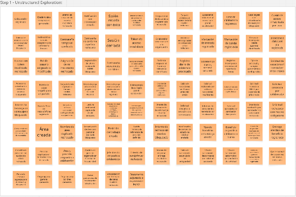**

**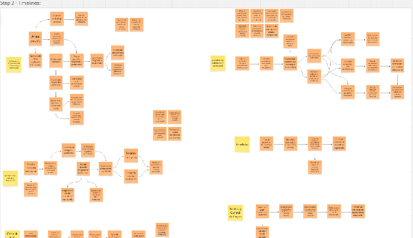**

**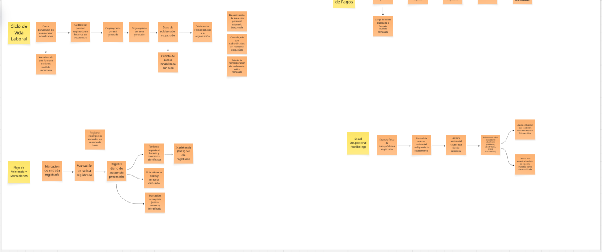**

**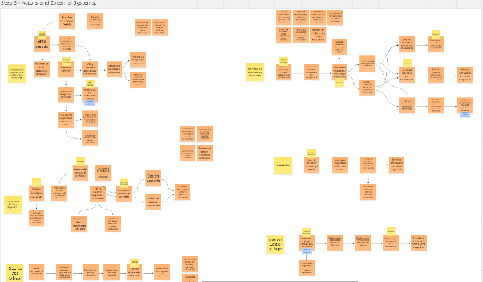**

**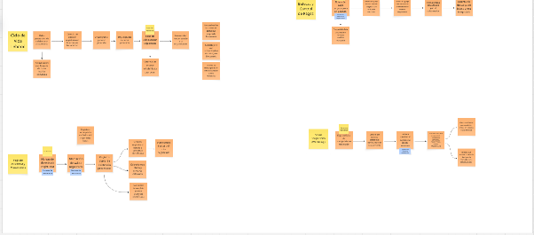**
Enlace de la figura: https://miro.com/app/board/uXjVHpKyn4g=/?share_link_id=676576188275

### 2.3.6. Ubiquitous Language

El Ubiquitous Language, o lenguaje ubicuo, tiene como objetivo establecer un vocabulario común, claro y consistente entre todas las personas involucradas en el proyecto, como los usuarios, responsables de recursos humanos, desarrolladores y contribuidores.

Este lenguaje permite que los conceptos relacionados con la gestión de recursos humanos y el funcionamiento de la aplicación tengan el mismo significado para todos los contribuidores. De esta manera, se evitan ambigüedades y se facilita la comunicación durante el análisis, desarrollo, documentación y mantenimiento del sistema.

| Término | Definición |
| ----- | ----- |
| Organization (Organización) | Empresa o institución que utiliza la plataforma para gestionar a sus colaboradores. |
| Employee (Colaborador) | Persona que forma parte de la organización y cuya información laboral es gestionada en la plataforma. |
| Employee Profile (Perfil del colaborador) | Conjunto de datos personales, laborales y organizacionales asociados a un colaborador. |
| Position (Puesto) | Cargo que ocupa un colaborador dentro de la organización, con funciones y condiciones definidas. |
| Area (Área) | Unidad organizativa que agrupa a un conjunto de colaboradores bajo una misma función o departamento. |
| Organizational Hierarchy (Jerarquía organizacional) | Empresa o institución que utiliza la aplicación para gestionar a sus colaboradores. |
| Position (Puesto) | Cargo que ocupa un colaborador dentro de la organización, con funciones y condiciones definidas. |
| Area (Área) | Unidad organizativa que agrupa a un conjunto de colaboradores bajo una misma función o departamento. |
| Organizational Hierarchy (Jerarquía organizacional) | Relación de dependencia entre áreas y entre colaboradores, que determina quién supervisa a quién y quién autoriza sus solicitudes. |
| Manager (Jefe directo) | Colaborador responsable de supervisar a uno o más colaboradores y de aprobar o rechazar sus solicitudes. |
| HR Officer (Responsable de Recursos Humanos) | Persona encargada de administrar la información laboral y los procesos relacionados con los colaboradores de la organización. |
| Employment Contract (Contrato laboral) | Registro que establece las condiciones y la duración de la relación laboral entre el colaborador y la organización. |
| Contract Type (Tipo de contrato) | Modalidad bajo la cual se establece la relación laboral, por ejemplo plazo indeterminado, plazo fijo o locación de servicios. |
| Hire Date (Fecha de ingreso) | Fecha en que inicia formalmente la relación laboral y a partir de la cual se computan la antigüedad y los derechos del colaborador. |
| Employment Status (Estado del colaborador) | Situación vigente del vínculo laboral: activo, cesado o suspendido. |
| Attendance (Asistencia) | Registro de la presencia del colaborador durante las jornadas laborales programadas. |
| Work Schedule (Jornada laboral) | Tiempo establecido durante el cual el colaborador debe realizar sus actividades. |
| Worked Hours (Horas de trabajo) | Cantidad de horas efectivamente registradas para un colaborador en un período determinado. |
| Late Arrival (Tardanza) | Ingreso del colaborador después del horario establecido por la organización. |
| Absence (Falta) | Inasistencia del colaborador durante una jornada laboral programada. |
| Attendance Record (Registro de asistencia) | Anotación individual de asistencia, tardanza o falta correspondiente a una fecha específica. |
| Assigned Salary (Sueldo asignado) | Remuneración establecida para un colaborador según su puesto y su contrato, que la plataforma registra y muestra sin calcularla. |
| Position Minimum Wage (Sueldo mínimo por puesto) | Remuneración mínima de referencia definida por la organización para un puesto determinado. |
| Benefit (Beneficio) | Compensación adicional a la remuneración que la organización otorga al colaborador. |
| Statutory Bonus (Gratificación) | Beneficio de periodicidad establecida que la organización entrega al colaborador. |
| Food Basket (Canasta) | Beneficio en especie que la organización entrega al colaborador en fechas determinadas. |
| Vacation (Vacaciones) | Período de descanso remunerado al que tiene derecho un colaborador. |
| Vacation Balance (Saldo de vacaciones) | Días de vacaciones disponibles para un colaborador en un momento dado, resultado de los días acumulados menos los días usados. |
| Accrued Days (Días acumulados) | Días de vacaciones generados por el colaborador según su antigüedad y su régimen laboral. |
| Used Days (Días usados) | Días de vacaciones que el colaborador ya ha gozado. |
| Request (Solicitud) | Petición formal que un colaborador dirige a la organización para obtener una autorización relacionada con su vínculo laboral. |
| Vacation Request (Solicitud de vacaciones) | Petición del colaborador para gozar una cantidad determinada de días de su saldo de vacaciones. |
| Leave Request (Solicitud de licencia) | Petición del colaborador para ausentarse durante un período por una causa contemplada por la organización. |
| Time-Off Request (Solicitud de permiso) | Petición del colaborador para ausentarse durante una fracción de la jornada o por un período breve. |
| Request Status (Estado de la solicitud) | Situación en la que se encuentra una solicitud dentro de su flujo: pendiente, aprobada o rechazada. |
| Approver (Aprobador) | Colaborador que, según la jerarquía organizacional, tiene la facultad de aprobar o rechazar una solicitud determinada. |
| Approval Workflow (Flujo de aprobación) | Secuencia mediante la cual una solicitud es dirigida a su aprobador, revisada y resuelta, dejando registro de quién la resolvió y cuándo. |
| Notification (Notificación) | Aviso que la organización dirige al colaborador o al aprobador para informar sobre el estado de una solicitud.

## 2.4. Requirements specification

### 2.4.1. User Stories

En esta sección se presentan las user stories que definen lo que Flowboard debe permitir hacer a cada tipo de usuario. Están agrupadas en épicas según los procesos que identificamos en las entrevistas y en el Event Storming, incluyen la gestión de colaboradores, la asistencia, las solicitudes, los beneficios, las boletas y el bienestar. Cada user story sigue la estructura "Como, quiero, para" y tiene sus criterios de aceptación en formato Gherkin usando Given, When, Then, lo que permite saber de forma clara cuándo una funcionalidad está terminada. También se incluyen user stories con rol Developer para el RESTful API, que no tiene interacción directa con el usuario final, y technical stories para aspectos como el despliegue y la seguridad.

| Epic ID | EP01 |
| :---- | :---- |
| **Title** | Identidad y control de acceso |
| **User** | Organización |
| **Priority** | Low |
| **User Stories** | US01 – US07 |
| **Description** | **Como** organización que expone información laboral sensible, **queremos** un mecanismo de identidad y control de acceso por rol, **para** garantizar que cada persona vea únicamente la información que le corresponde. |

| Epic ID | EP02 |
| :---- | :---- |
| **Title** | Gestión del colaborador y estructura organizacional |
| **User** | Área de Recursos Humanos |
| **Priority** | High |
| **User Stories** | US08 – US20 |
| **Description** | **Como** área de Recursos Humanos, **queremos** administrar el ciclo de vida del colaborador y la estructura de la organización en un único registro, **para** eliminar los archivos paralelos y disponer de una fuente única de verdad. |

| Epic ID | EP03 |
| :---- | :---- |
| **Title** | Control de asistencia |
| **User** | Área de Recursos Humanos |
| **Priority** | High |
| **User Stories** | US21 – US25 |
| **Description** | **Como** área de Recursos Humanos, **queremos** convertir las marcaciones en registros de asistencia interpretados, **para** disponer de información confiable sobre puntualidad, horas trabajadas y sobretiempo. |

| Epic ID | EP04 |
| :---- | :---- |
| **Title** | Gestión de solicitudes |
| **User** | Organización |
| **Priority** | High |
| **User Stories** | US26 – US36 |
| **Description** | **Como** organización, **queremos** un flujo de solicitudes con estados visibles y ruteo automático al aprobador, **para** reducir el tiempo de resolución y dar trazabilidad completa a cada trámite. |

| Epic ID | EP05 |
| :---- | :---- |
| **Title** | Beneficios y saldo de vacaciones |
| **User** | Organización |
| **Priority** | Medium |
| **User Stories** | US37 – US42 |
| **Description** | **Como** organización, **queremos** que cada colaborador vea los beneficios que le corresponden y su saldo de vacaciones actualizado, **para** eliminar las omisiones de entrega y las disputas por días. |

| Epic ID | EP06 |
| :---- | :---- |
| **Title** | Boletas de pago y estado de pagos |
| **User** | Organización |
| **Priority** | Medium |
| **User Stories** | US43 – US46 |
| **Description** | **Como** organización, **queremos** centralizar las boletas de pago y el estado de los depósitos, **para** que el colaborador acceda a sus comprobantes y Recursos Humanos controle qué pagos siguen pendientes. |

| Epic ID | EP07 |
| :---- | :---- |
| **Title** | Bienestar laboral |
| **User** | Organización |
| **Priority** | Low |
| **User Stories** | US47 – US51 |
| **Description** | **Como** organización, **queremos** interpretar las condiciones ambientales de nuestros espacios de trabajo, **para** identificar y corregir situaciones que afecten la salud ocupacional. |

| Epic ID | EP08 |
| :---- | :---- |
| **Title** | Landing Page |
| **User** | Startup |
| **Priority** | Low |
| **User Stories** | US52 – US57 |
| **Description** | **Como** startup, **queremos** un sitio público que comunique la propuesta de valor por segmento, **para** convertir visitantes en usuarios de la plataforma. |

| Epic ID | EP09 |
| :---- | :---- |
| **Title** | Servicios y despliegue |
| **User** | Equipo de desarrollo |
| **Priority** | Medium |
| **User Stories** | TS01 – TS06 |
| **Description** | **Como** equipo de desarrollo, **queremos** un RESTful API documentado, seguro y desplegado, **para** sostener la experiencia web sobre una arquitectura orientada a servicios. |

| Story ID | US01 |
| :---- | :---- |
| **Title** | Generación automática de credenciales |
| **User** | Personal de RRHH |
| **Priority** | Low |
| **Epic** | EP01 |
| **Description** | **Como** personal de RRHH, **quiero** que el sistema genere las credenciales de acceso al registrar un colaborador, **para** que pueda ingresar sin un trámite adicional. |
| **Acceptance Criteria** | **Escenario 1:** Generación exitosa **Given** se registra con éxito a un colaborador con correo válido y sin cuenta asociada **When** el sistema procesa la creación de la cuenta **Then** se genera un nombre de usuario único **And** se genera una contraseña temporal almacenada como hash **And** la cuenta queda marcada con cambio de contraseña obligatorio.  **Escenario 2:** Nombre de usuario duplicado **Given** ya existe una cuenta con el mismo nombre de usuario **When** el sistema intenta crear la cuenta **Then** la operación es rechazada **And** se indica que el nombre de usuario ya está en uso.  **Escenario 3:** Colaborador con cuenta previa **Given** el colaborador ya tiene una cuenta activa **When** el sistema procesa nuevamente la creación **Then** la operación no genera credenciales nuevas **And** las credenciales existentes se conservan. |

| Story ID | US02 |
| :---- | :---- |
| **Title** | Inicio de sesión |
| **User** | Usuario (Personal de RRHH / Colaborador) |
| **Priority** | Low |
| **Epic** | EP01 |
| **Description** | **Como** usuario del sistema, **quiero** autenticarme con mis credenciales, **para** acceder a los módulos que corresponden a mi rol. |
| **Acceptance Criteria** | **Escenario 1:** Autenticación exitosa **Given** existe un usuario con credenciales válidas y cuenta activa **When** envía sus credenciales **Then** el sistema lo autentica **And** retorna un token de acceso con su rol.  **Escenario 2:** Credenciales inválidas **Given** un usuario envía una contraseña incorrecta **When** el sistema verifica las credenciales **Then** el acceso es denegado **And** el mensaje de error no revela si el error está en el usuario o en la contraseña.  **Escenario 3:** Cuenta de colaborador cesado **Given** un usuario cuyo colaborador asociado tiene estado cesado **When** envía credenciales correctas **Then** el acceso es denegado **And** se indica que la cuenta se encuentra inhabilitada. |

| Story ID | US03 |
| :---- | :---- |
| **Title** | Cambio obligatorio de contraseña temporal |
| **User** | Usuario (Personal de RRHH / Colaborador) |
| **Priority** | Low |
| **Epic** | EP01 |
| **Description** | **Como** colaborador que ingresa por primera vez, **quiero** definir mi propia contraseña, **para** que nadie más conozca mi clave de acceso. |
| **Acceptance Criteria** | **Escenario 1:** Redirección forzada **Given** existe una cuenta marcada con cambio de contraseña obligatorio **When** el usuario se autentica correctamente **Then** el sistema restringe el acceso a cualquier recurso distinto del cambio de contraseña.  **Escenario 2:** Cambio exitoso de contraseña **Given** un usuario està en el proceso de cambio obligatorio de contraseña **When** define una contraseña que cumple con los requisitos mìnimos de seguridad **Then** la contraseña se actualiza **And** la marca de cambio obligatorio de contraseña se elimina.  **Escenario 3:** Contraseña que no cumple los requisitos mínimos de seguridad **Given** un usuario está en el proceso de cambio obligatorio **When** define una contraseña que no cumple la longitud o complejidad mínima **Then** la operación es rechazada **And** se indican los requisitos incumplidos. |

| Story ID | US04 |
| :---- | :---- |
| **Title** | Cierre de sesión |
| **User** | Usuario (Personal de RRHH / Colaborador) |
| **Priority** | Low |
| **Epic** | EP01 |
| **Description** | **Como** usuario del sistema, **quiero** cerrar mi sesión, **para** evitar que otra persona acceda a mi información desde el mismo equipo. |
| **Acceptance Criteria** | **Escenario 1:** Cierre exitoso **Given** hay un usuario con sesión activa **When** solicita cerrar la sesión **Then** el token de acceso queda invalidado.  **Escenario 2:** Uso de token invalidado **Given** existe un token que ya fue invalidado **When** se utiliza para consultar un recurso protegido **Then** el sistema deniega la petición debido a que el usuario no cuenta con la autorización requerida. |

| Story ID | US05 |
| :---- | :---- |
| **Title** | Asignación y cambio de rol |
| **User** | Personal de RRHH |
| **Priority** | Low |
| **Epic** | EP01 |
| **Description** | **Como** personal de RRHH, **quiero** modificar el rol de una cuenta, **para** otorgar o retirar privilegios administrativos. |
| **Acceptance Criteria** | **Escenario 1:** Cambio exitoso **Given** existe una cuenta y un rol válido **When** se procesa el cambio de rol **Then** los permisos de la cuenta se actualizan.  **Escenario 2:** Rol inexistente **Given** un rol no definido en el sistema **When** se intenta asignarlo **Then** la operación es rechazada **And** se indica que el rol no es válido.  **Escenario 3:** Última cuenta administrativa **Given** existe una única cuenta activa con rol de RRHH **When** se intenta cambiar su rol a colaborador **Then** la operación es rechazada **And** se indica que debe existir al menos una cuenta con rol de RRHH. |

| Story ID | US06 |
| :---- | :---- |
| **Title** | Restablecimiento de contraseña |
| **User** | Personal de RRHH |
| **Priority** | Low |
| **Epic** | EP01 |
| **Description** | **Como** personal de RRHH, **quiero** restablecer la contraseña de un colaborador, **para** devolverle el acceso cuando la ha olvidado. |
| **Acceptance Criteria** | **Escenario 1:** Restablecimiento exitoso **Given** existe una cuenta activa **When** se solicita el restablecimiento de contraseña **Then** se genera una contraseña temporal **And** la cuenta queda marcada con cambio de contraseña obligatorio.  **Escenario 2:** Cuenta inhabilitada **Given** existe una cuenta asociada a un colaborador cesado **When** se solicita el restablecimiento de contraseña **Then** la operación es rechazada. **And** se indica que debe existir al menos una cuenta con rol de RRHH. |

| Story ID | US07 |
| :---- | :---- |
| **Title** | Restricción de acceso por rol |
| **User** | Personal de RRHH |
| **Priority** | Low |
| **Epic** | EP01 |
| **Description** | **Como** organización sujeta a la Ley de Protección de Datos Personales, **queremos** que cada consulta se restrinja según el rol del solicitante, **para** impedir que un colaborador acceda a información de terceros. |
| **Acceptance Criteria** | **Escenario 1:** Acceso a información propia **Given** un colaborador está autenticado **When** consulta su propia información **Then** el sistema retorna los datos solicitados.  **Escenario 2:** Acceso a información de terceros **Given** un colaborador autenticado con rol estándar está usando la aplicación **When** consulta información asociada a otro colaborador **Then** el sistema deniega la petición debido a que el usuario no cuenta con la autorización requerida.  **Escenario 3:** Acceso administrativo **Given** un usuario con rol de RRHH está usando la aplicación **When** consulta información de cualquier colaborador **Then** el sistema retorna los datos solicitados. |

| Story ID | US08 |
| :---- | :---- |
| **Title** | Registro de un nuevo colaborador |
| **User** | Personal de RRHH |
| **Priority** | High |
| **Epic** | EP02 |
| **Description** | **Como** personal de RRHH, **quiero** registrar el perfil completo de un colaborador, **para** iniciar su ciclo de vida en la organización. |
| **Acceptance Criteria** | **Escenario 1:** Registro exitoso **Given** se tiene los datos personales válidos con documento de identidad único del colaborador **When** se procesa el registro **Then** el colaborador es creado con estado activo **And** se emite el evento que da origen a sus credenciales de acceso.  **Escenario 2:** Campos obligatorios incompletos **Given** se tiene un registro con campos obligatorios vacíos **When** el sistema valida la solicitud **Then** la operación es rechazada **And** se detallan los campos faltantes.  **Escenario 3:** Documento de identidad duplicado **Given** se ingresa al formulario un documento de identidad que ya pertenece a un colaborador activo **When** se intenta registrar el nuevo perfil **Then** la operación es rechazada **And** se indica la duplicidad. |

| Story ID | US09 |
| :---- | :---- |
| **Title** | Gestión del catálogo de áreas |
| **User** | Personal de RRHH |
| **Priority** | High |
| **Epic** | EP02 |
| **Description** | **Como** personal de RRHH, **quiero** crear y actualizar las áreas de la organización, **para** reflejar su estructura sin depender de cambios en el sistema. |
| **Acceptance Criteria** | **Escenario 1:** Creación exitosa **Given** un nombre de área que no existe **When** se registra el área **Then** el área creada queda disponible para asignación del personal.  **Escenario 2:** Nombre duplicado **Given** se ingresa un nombre de área ya registrado **When** se intenta crear el área **Then** la operación es rechazada.  **Escenario 3:** Área con colaboradores asignados **Given** existe un área con al menos un colaborador activo **When** se intenta desactivarla **Then** la operación es rechazada **And** se indica que primero deben reasignarse los colaboradores que la integran. |

| Story ID | US10 |
| :---- | :---- |
| **Title** | Asignación de área y posición |
| **User** | Personal de RRHH |
| **Priority** | High |
| **Epic** | EP02 |
| **Description** | **Como** personal de RRHH, **quiero** asignar o actualizar el área y la posición de un colaborador, **para** reflejar sus responsabilidades dentro de la organización. |
| **Acceptance Criteria** | **Escenario 1:** Asignación exitosa **Given** un colaborador existente ya posee una combinación válida de área y posición **When** se ejecuta la nueva asignación **Then** el perfil laboral queda actualizado.  **Escenario 2:** Área o posición inexistente **Given** se proporciona un identificador de área o posición no registrado **When** se intenta la asignación **Then** la operación es rechazada.  **Escenario 3:** Trazabilidad del cambio **Given** un colaborador ya tenía una posición asignada **When** se le asigna una nueva **Then** se registra el cambio con su fecha para conservar la trazabilidad. |

| Story ID | US11 |
| :---- | :---- |
| **Title** | Asignación del jefe directo |
| **User** | Personal de RRHH |
| **Priority** | High |
| **Epic** | EP02 |
| **Description** | **Como** personal de RRHH, **quiero** asignar un jefe directo a cada colaborador, **para** definir las líneas de reporte y habilitar el ruteo de aprobaciones. |
| **Acceptance Criteria** | **Escenario 1:** Asignación válida **Given** dos colaboradores están activos en el sistema y son distintos **When** se establece la línea de reporte **Then** el perfil del colaborador queda referenciando a su jefe.  **Escenario 2:** Autojefatura **Given** existe un colaborador con status activo en el sistema **When** se intenta asignarlo como su propio jefe **Then** la operación es rechazada.  **Escenario 3:** Ciclo en la jerarquía **Given** un colaborador que ya figura como jefe directo o indirecto del designado **When** se intenta establecer la relación inversa **Then** la operación es rechazada **And** se indica que generaría un ciclo. |

| Story ID | US12 |
| :---- | :---- |
| **Title** | Consulta del organigrama general |
| **User** | Personal de RRHH / Colaborador |
| **Priority** | High |
| **Epic** | EP02 |
| **Description** | **Como** usuario del sistema, **quiero** visualizar el organigrama completo de la organización, **para** entender su estructura jerárquica. |
| **Acceptance Criteria** | **Escenario 1:** Construcción del árbol **Given** existen colaboradores activos con sus líneas de reporte definidas **When** se solicita el organigrama general **Then** se retorna una estructura jerárquica que parte de los colaboradores sin jefe directo.  **Escenario 2:** Colaborador sin jefe asignado **Given** un colaborador activo cuyo jefe fue cesado **When** se construye el organigrama **Then** el colaborador aparece bajo un nodo de pendiente de reasignación.  **Escenario 3:** Organización sin jerarquía definida **Given** ningún colaborador tiene jefe directo asignado **When** se solicita el organigrama **Then** se retorna una estructura plana con todos los colaboradores en el primer nivel. |

| Story ID | US13 |
| :---- | :---- |
| **Title** | Consulta del organigrama por área |
| **User** | Personal de RRHH / Colaborador |
| **Priority** | High |
| **Epic** | EP02 |
| **Description** | **Como** usuario del sistema, **quiero** visualizar el organigrama de un área específica, **para** entender cómo se organiza esa unidad. |
| **Acceptance Criteria** | **Escenario 1:** Rama del área **Given** existe un área con colaboradores y jerarquía definida **When** se solicita su organigrama **Then** se retorna únicamente la rama correspondiente a esa área.  **Escenario 2:** Área sin colaboradores **Given** existe un área sin colaboradores asignados **When** se solicita su organigrama **Then** se retorna una estructura vacía sin generar error. |

| Story ID | US14 |
| :---- | :---- |
| **Title** | Actualización de datos del colaborador |
| **User** | Personal de RRHH |
| **Priority** | High |
| **Epic** | EP02 |
| **Description** | **Como** personal de RRHH, **quiero** actualizar la información personal y de contacto de un colaborador, **para** mantener el registro al día. |
| **Acceptance Criteria** | **Escenario 1:** Actualización exitosa **Given** un colaborador existe y tiene todos sus datos válidos **When** se procesa la actualización con la nueva información **Then** los datos quedan modificados **And** se registra la fecha de la modificación.  **Escenario 2:** Formato de dato inválido **Given** se ingresa una fecha de nacimiento posterior a la fecha actual o un correo con formato incorrecto **When** se validan los datos **Then** la operación es rechazada **And** se indican los errores de validación.  **Escenario 3:** Colaborador inexistente **Given** se intenta registrar una actualización de datos con un identificador no registrado **When** se intenta la actualización **Then** la operación es rechazada. |

| Story ID | US15 |
| :---- | :---- |
| **Title** | Cese de un colaborador |
| **User** | Personal de RRHH |
| **Priority** | High |
| **Epic** | EP02 |
| **Description** | **Como** personal de RRHH, **quiero** registrar el cese de un colaborador con su motivo, **para** que su estado refleje su situación real. |
| **Acceptance Criteria** | **Escenario 1:** Cese exitoso **Given** existe un colaborador activo sin subordinados asignados **When** se registra el cese con motivo y fecha **Then** el estado cambia a cesado **And** se emite el evento que inhabilita su cuenta de acceso.  **Escenario 2:** Jefe con subordinados **Given** un colaborador que figura como jefe directo de otros **When** se intenta registrar su cese **Then** la operación es rechazada **And** se indica que debe reasignarse a sus subordinados.  **Escenario 3:** Colaborador ya cesado **Given** un colaborador con estado cesado **When** se intenta registrar nuevamente su cese **Then** la operación es rechazada. |

| Story ID | US16 |
| :---- | :---- |
| **Title** | Reincorporación de un colaborador |
| **User** | Personal de RRHH |
| **Priority** | High |
| **Epic** | EP02 |
| **Description** | **Como** personal de RRHH, **quiero** reincorporar a un colaborador cesado, **para** gestionar su retorno a la organización. |
| **Acceptance Criteria** | **Escenario 1:** Reincorporación exitosa **Given** se tiene un colaborador con estado cesado **When** se registra la reincorporación con su nueva asignación de área y posición **Then** el estado cambia a activo **And** se registra la fecha de reingreso.  **Escenario 2:** Estado no elegible **Given** un colaborador tiene como estado activo o suspendido **When** se intenta la reincorporación **Then** la operación es rechazada. |

| Story ID | US17 |
| :---- | :---- |
| **Title** | Carga de documentos del expediente |
| **User** | Personal de RRHH |
| **Priority** | High |
| **Epic** | EP02 |
| **Description** | **Como** personal de RRHH, **quiero** adjuntar documentos al expediente de un colaborador, **para** mantener su legajo digital completo. |
| **Acceptance Criteria** | **Escenario 1:** Carga exitosa **Given** un archivo válido con un tipo de documento del catálogo permitido **When** se asocia al colaborador **Then** el documento queda registrado y disponible para consulta.  **Escenario 2:** Tipo de documento no permitido **Given** un tipo de documento fuera del catálogo **When** se intenta la carga **Then** la operación es rechazada.  **Escenario 3:** Archivo que excede el tamaño permitido **Given** un archivo mayor al límite establecido **When** se intenta la carga **Then** la operación es rechazada **And** se indica el límite vigente. |

| Story ID | US18 |
| :---- | :---- |
| **Title** | Consulta del expediente documental |
| **User** | Colaborador |
| **Priority** | High |
| **Epic** | EP02 |
| **Description** | **Como** colaborador, **quiero** consultar y descargar los documentos de mi expediente, **para** disponer de mis contratos y constancias sin solicitarlos |
| **Acceptance Criteria** | **Escenario 1:** Consulta propia **Given** un colaborador autenticado con documentos registrados **When** consulta su expediente **Then** se retorna la lista de sus documentos con su tipo y fecha de carga.  **Escenario 2:** Expediente de terceros **Given** un colaborador con rol estándar **When** intenta consultar el expediente de otro colaborador **Then** el sistema deniega la petición debido a que el usuario no cuenta con la autorización requerida. |

| Story ID | US19 |
| :---- | :---- |
| **Title** | Consulta del perfil laboral propio |
| **User** | Colaborador |
| **Priority** | High |
| **Epic** | EP02 |
| **Description** | **Como** colaborador, **quiero** visualizar mi información personal, laboral y de jerarquía, **para** verificar que mis datos estén correctos. |
| **Acceptance Criteria** | **Escenario 1:** Lectura exitosa **Given** un colaborador autenticado **When** solicita su perfil **Then** se retornan sus datos personales, su área, su posición y el nombre de su jefe directo.  **Escenario 2:** Colaborador sin jefe asignado **Given** un colaborador sin línea de reporte definida **When** solicita su perfil **Then** se retorna el perfil **And** el campo de jefe directo se presenta como no asignado. |

| Story ID | US20 |
| :---- | :---- |
| **Title** | Búsqueda y filtrado de colaboradores |
| **User** | Personal de RRHH |
| **Priority** | High |
| **Epic** | EP02 |
| **Description** | **Como** personal de RRHH, **quiero** buscar colaboradores por distintos criterios, **para** localizar perfiles con rapidez. |
| **Acceptance Criteria** | **Escenario 1:** Búsqueda por texto **Given** un texto de búsqueda **When** se aplica el filtro **Then** se retornan los colaboradores cuyo nombre, apellido o documento coincidan con el filtro aplicado.  **Escenario 2:** Filtrado combinado **Given** se selecciona un área y un estado laboral **When** se aplica el filtro **Then** se retornan únicamente los colaboradores que cumplen ambos criterios.  **Escenario 3:** Sin coincidencias **Given** se ingresan criterios que ningún registro cumple **When** se procesa la consulta **Then** se retorna un conjunto vacío sin generar error. |

| Story ID | US21 |
| :---- | :---- |
| **Title** | Procesamiento de marcaciones |
| **User** | Personal de RRHH |
| **Priority** | High |
| **Epic** | EP03 |
| **Description** | **Como** personal de RRHH, **quiero** que el sistema convierta las marcaciones en registros de asistencia, **para** disponer de información interpretada sin cálculo manual. |
| **Acceptance Criteria** | **Escenario 1:** Jornada completa **Given** se registran una marcación de entrada y una de salida para un colaborador en una misma fecha **When** el sistema procesa las marcaciones **Then** se genera un registro con horas efectivas calculadas **And** se clasifica como puntual o tardanza según el horario de la posición.  **Escenario 2:** Marcación de salida ausente **Given** se registra una marcación de entrada sin su salida correspondiente **When** el sistema procesa la fecha **Then** el registro se clasifica como incompleto **And** las horas efectivas quedan sin calcular.  **Escenario 3:** Ausencia total **Given** es una fecha laborable sin marcaciones para un colaborador activo **When** el sistema procesa la fecha **Then** se genera un registro clasificado como inasistencia. |

| Story ID | US22 |
| :---- | :---- |
| **Title** | Consulta del historial de asistencia propio |
| **User** | Colaborador |
| **Priority** | High |
| **Epic** | EP03 |
| **Description** | **Como** colaborador, **quiero** revisar mi historial de asistencia, **para** verificar mis marcaciones y detectar discrepancias |
| **Acceptance Criteria** | **Escenario 1:** Consulta con datos **Given** un colaborador autenticado con registros en el período consultado **When** solicita su historial **Then** se retornan sus registros con fecha, hora de entrada, hora de salida y clasificación.  **Escenario 2:** Período sin registros **Given** un período sin registros para el colaborador **When** solicita su historial **Then** se retorna un conjunto vacío.  **Escenario 3:** Historial de terceros **Given** un colaborador con rol estándar **When** intenta consultar el historial de otro colaborador **Then** la petición es rechazada. |

| Story ID | US23 |
| :---- | :---- |
| **Title** | Consulta de asistencia por colaborador |
| **User** | Personal de RRHH |
| **Priority** | High |
| **Epic** | EP03 |
| **Description** | **Como** personal de RRHH, **quiero** consultar la asistencia de un colaborador en un rango de fechas, **para** revisar casos específicos. |
| **Acceptance Criteria** | **Escenario 1:** Consulta exitosa **Given** se ingresa al filtro un colaborador y un rango de fechas válido **When** se procesa la consulta **Then** se retornan sus registros del período con su clasificación.  **Escenario 2:** Rango de fechas inválido **Given** se ingresa una fecha de inicio posterior a la fecha de fin **When** se valida la consulta **Then** la operación es rechazada. |

| Story ID | US24 |
| :---- | :---- |
| **Title** | Reporte de asistencia por área |
| **User** | Personal de RRHH |
| **Priority** | High |
| **Epic** | EP03 |
| **Description** | **Como** personal de RRHH, **quiero** consultar la asistencia agregada por área, **para** identificar dónde se concentran las tardanzas e inasistencias. |
| **Acceptance Criteria** | **Escenario 1:** Reporte con datos **Given** un área y un período con registros **When** se genera el reporte **Then** se retorna el total de puntualidad, tardanzas e inasistencias del área.  **Escenario 2:** Área sin registros **Given** un área sin colaboradores con registros en el período **When** se genera el reporte **Then** se retornan totales en cero sin generar error. |

| Story ID | US25 |
| :---- | :---- |
| **Title** | Reporte de horas trabajadas y sobretiempo |
| **User** | Personal de RRHH |
| **Priority** | High |
| **Epic** | EP03 |
| **Description** | **Como** personal de RRHH, **quiero** consultar las horas trabajadas y el sobretiempo por colaborador y por área, **para** sustentar decisiones sobre carga de trabajo. |
| **Acceptance Criteria** | **Escenario 1:** Cálculo por colaborador **Given** un colaborador con registros completos en un período **When** se genera el reporte **Then** se retornan sus horas efectivas de trabajo y sus horas de sobretiempo acumuladas.  **Escenario 2:** Cálculo por área **Given** un área con varios colaboradores **When** se genera el reporte del período **Then** se retorna el total de horas y de sobretiempo del área. |

| Story ID | US26 |
| :---- | :---- |
| **Title** | Catálogo de tipos de solicitud |
| **User** | Personal de RRHH |
| **Priority** | High |
| **Epic** | EP04 |
| **Description** | **Como** personal de RRHH, **quiero** definir los tipos de solicitud y los campos que cada uno exige, **para** adaptar el sistema a los trámites de la organización. |
| **Acceptance Criteria** | **Escenario 1:** Creación exitosa **Given** se tiene un nombre de tipo no registrado **When** se crea el tipo con sus campos requeridos y su indicador de adjunto obligatorio **Then** el tipo queda disponible para su uso.  **Escenario 2:** Tipo duplicado **Given** un nombre de tipo ya registrado **When** se intenta crearlo **Then** la operación es rechazada.  **Escenario 3:** Tipo en uso **Given** existe un tipo de solicitud con solicitudes asociadas **When** se intenta eliminar **Then** la operación es rechazada **And** se ofrece desactivarlo en su lugar. |

| Story ID | US27 |
| :---- | :---- |
| **Title** | Creación de una solicitud |
| **User** | Colaborador |
| **Priority** | High |
| **Epic** | EP04 |
| **Description** | **Como** colaborador, **quiero** enviar una solicitud seleccionando su tipo, **para** tramitar vacaciones, licencias o permisos sin recurrir a canales informales. |
| **Acceptance Criteria** | **Escenario 1:** Creación exitosa **Given** un tipo de solicitud es seleccionado y todos sus campos requeridos están completos **When** se envía la solicitud **Then** queda registrada en estado en proceso **And** se asigna al aprobador correspondiente.  **Escenario 2:** Campos requeridos incompletos **Given** un tipo de solicitud con campos obligatorios tiene algunos campos sin completar **When** se intenta enviar **Then** la operación es rechazada **And** se detallan los campos faltantes.  **Escenario 3:** Adjunto obligatorio ausente **Given** un tipo de solicitud exige documento de sustento **When** se envía sin archivo adjunto **Then** la operación es rechazada. |

| Story ID | US28 |
| :---- | :---- |
| **Title** | Validación de saldo al solicitar vacaciones |
| **User** | Personal de RRHH |
| **Priority** | High |
| **Epic** | EP04 |
| **Description** | **Como** personal de RRHH, **quiero** que las solicitudes que descuentan un saldo lo validen antes de registrarse, **para** impedir que se aprueben días que el colaborador no tiene. |
| **Acceptance Criteria** | **Escenario 1:** Saldo suficiente **Given** un colaborador tiene saldo de vacaciones disponible mayor o igual a los días solicitados **When** se envía la solicitud **Then** la solicitud queda registrada.  **Escenario 2:** Saldo insuficiente **Given** un colaborador tiene saldo menor a los días solicitados **When** se intenta enviar la solicitud **Then** la operación es rechazada **And** se informa el saldo disponible. |

| Story ID | US29 |
| :---- | :---- |
| **Title** | Ruteo de la solicitud al aprobador |
| **User** | Personal de RRHH |
| **Priority** | High |
| **Epic** | EP04 |
| **Description** | **Como** personal de RRHH, **quiero** que cada solicitud se dirija automáticamente a quien corresponda, **para** que ninguna quede sin responsable asignado. |
| **Acceptance Criteria** | **Escenario 1:** Ruteo al jefe directo **Given** un colaborador tiene un jefe directo asignado **When** se crea su solicitud **Then** la solicitud queda asignada a ese jefe.  **Escenario 2:** Colaborador sin jefe asignado **Given** un colaborador no tiene línea de reporte definida **When** se crea su solicitud **Then** la solicitud queda asignada al área de Recursos Humanos. |

| Story ID | US30 |
| :---- | :---- |
| **Title** | Seguimiento de solicitudes propias |
| **User** | Colaborador |
| **Priority** | High |
| **Epic** | EP04 |
| **Description** | **Como** colaborador, **quiero** consultar el estado de mis solicitudes, **para** saber en qué punto se encuentran sin preguntar a nadie. |
| **Acceptance Criteria** | **Escenario 1:** Consulta con resultados **Given** un colaborador tiene solicitudes registradas **When** consulta su listado **Then** se retornan sus solicitudes con tipo, fecha, estado y aprobador asignado.  **Escenario 2:** Filtrado por estado **Given** se selecciona un estado de el filtro por estado **When** se aplica el filtro **Then** se retornan únicamente las solicitudes en ese estado.  **Escenario 3:** Sin solicitudes **Given** un colaborador no tiene solicitudes registradas **When** consulta su listado **Then** se retorna un conjunto vacío. |

| Story ID | US31 |
| :---- | :---- |
| **Title** | Cancelación de una solicitud propia |
| **User** | Colaborador |
| **Priority** | High |
| **Epic** | EP04 |
| **Description** | **Como** colaborador, **quiero** cancelar una solicitud que aún no ha sido resuelta, **para** corregir un envío equivocado. |
| **Acceptance Criteria** | **Escenario 1:** Cancelación exitosa **Given** el colaborador tiene una solicitud propia en estado en proceso **When** se solicita su cancelación **Then** la solicitud cambia su estado a cancelada **And** el movimiento queda registrado en su historial.  **Escenario 2:** Solicitud ya resuelta **Given** una solicitud es aprobada o rechazada **When** se intenta cancelar **Then** la operación es rechazada. |

| Story ID | US32 |
| :---- | :---- |
| **Title** | Bandeja de solicitudes por atender |
| **User** | Aprobador |
| **Priority** | High |
| **Epic** | EP04 |
| **Description** | **Como** encargado de aprobar determinadas solicitudes, **quiero** consultar las solicitudes que me corresponde resolver, **para** priorizar mi atención. |
| **Acceptance Criteria** | **Escenario 1:** Listado con filtros **Given** un aprobador tiene solicitudes asignadas **When** consulta su bandeja filtrando por tipo o por antigüedad **Then** se retornan las solicitudes pendientes que cumplen los criterios.  **Escenario 2:** Bandeja vacía **Given** un aprobador sin solicitudes pendientes **When** consulta su bandeja **Then** se retorna un conjunto vacío. |

| Story ID | US33 |
| :---- | :---- |
| **Title** | Aprobación de una solicitud |
| **User** | Aprobador |
| **Priority** | High |
| **Epic** | EP04 |
| **Description** | **Como** encargado de aprobar determinadas solicitudes, **quiero** aprobar una solicitud, **para** autorizar el trámite del colaborador. |
| **Acceptance Criteria** | **Escenario 1:** Aprobación exitosa **Given** una solicitud asignada al aprobador en estado en proceso **When** se registra la aprobación **Then** el estado cambia a aprobado **And** el movimiento queda registrado con su autor y su fecha.  **Escenario 2:** Solicitud ya resuelta **Given** una solicitud ya está en estado aprobado o rechazado **When** se intenta aprobar **Then** la operación es rechazada.  **Escenario 3:** Aprobador no autorizado **Given** una solicitud es asignada a otro aprobador **When** se intenta resolver **Then** la petición es rechazada por falta de autorización. |

| Story ID | US34 |
| :---- | :---- |
| **Title** | Rechazo con motivo obligatorio |
| **User** | Aprobador |
| **Priority** | High |
| **Epic** | EP04 |
| **Description** | **Como** encargado de aprobar determinadas solicitudes, **quiero** rechazar una solicitud indicando el motivo, **para** que el colaborador entienda la decisión. |
| **Acceptance Criteria** | **Escenario 1:** Rechazo exitoso **Given** una solicitud tiene como estado en proceso y un motivo de rechazo **When** se registra el rechazo **Then** el estado cambia a rechazado **And** el motivo queda almacenado y visible para el solicitante.  **Escenario 2:** Rechazo sin motivo **Given** una solicitud en estado en proceso **When** se intenta rechazar sin indicar motivo **Then** la operación es rechazada **And** se indica que el motivo es obligatorio. |

| Story ID | US35 |
| :---- | :---- |
| **Title** | Devolución a revisión |
| **User** | Aprobador |
| **Priority** | High |
| **Epic** | EP04 |
| **Description** | **Como** aprobador, **quiero** devolver una solicitud al colaborador pidiéndole información adicional, **para** poder resolverla con sustento suficiente. |
| **Acceptance Criteria** | **Escenario 1:** Devolución exitosa **Given** una solicitud se encuentra en estado en proceso **And** tiene un comentario del aprobador **When** se registra la devolución **Then** el estado cambia a en revisión **And** el comentario queda visible para el solicitante.  **Escenario 2:** Reenvío por el colaborador **Given** una solicitud tiene el estado en revisión **When** el solicitante adjunta la información pedida y reenvía **Then** el estado vuelve a en proceso **And** la solicitud regresa a la bandeja del aprobador. |

| Story ID | US36 |
| :---- | :---- |
| **Title** | Notificación de cambio de estado |
| **User** | Colaborador |
| **Priority** | High |
| **Epic** | EP04 |
| **Description** | **Como** colaborador, **quiero** recibir un aviso cuando cambia el estado de mi solicitud, **para** enterarme sin tener que revisar la plataforma. |
| **Acceptance Criteria** | **Escenario 1:** Notificación al resolver **Given** una solicitud que cambia su estado a aprobado, rechazado o en revisión **When** se registra el cambio de estado **Then** el sistema emite una notificación dirigida al solicitante con el nuevo estado.  **Escenario 2:** Notificación al aprobador **Given** una solicitud es enviada por un colaborador **When** se asigna a su aprobador **Then** el sistema emite una notificación dirigida a ese aprobador. |

| Story ID | US37 |
| :---- | :---- |
| **Title** | Catálogo de beneficios |
| **User** | Personal de RRHH |
| **Priority** | Medium |
| **Epic** | EP05 |
| **Description** | **Como** personal de RRHH, **quiero** definir los tipos de beneficio que otorga la organización, **para** administrarlos de forma uniforme. |
| **Acceptance Criteria** | **Escenario 1:** Creación exitosa **Given** un nombre de beneficio no registrado **When** se crea el tipo indicando si maneja saldo y en qué unidad se mide **Then** el tipo queda disponible para asignación.  **Escenario 2:** Nombre duplicado **Given** un nombre de beneficio ya registrado **When** se intenta crear **Then** la operación es rechazada. |

| Story ID | US38 |
| :---- | :---- |
| **Title** | Asignación de beneficios |
| **User** | Personal de RRHH |
| **Priority** | Medium |
| **Epic** | EP05 |
| **Description** | **Como** personal de RRHH, **quiero** asignar beneficios a un colaborador o a un área completa, **para** registrar a quién le corresponde cada incentivo. |
| **Acceptance Criteria** | **Escenario 1:** Asignación individual **Given** hay un colaborador activo y un tipo de beneficio vigente **When** se registra la asignación con su período **Then** el beneficio queda asociado al colaborador.  **Escenario 2:** Asignación por área **Given** un área tiene colaboradores activos **When** se registra la asignación del beneficio al área **Then** el beneficio queda asociado a todos sus colaboradores activos.  **Escenario 3:** Asignación duplicada en el mismo período **Given** un colaborador ya tiene ese beneficio asignado en el período **When** se intenta asignar nuevamente **Then** la operación es rechazada. |

| Story ID | US39 |
| :---- | :---- |
| **Title** | Registro de entrega de beneficio |
| **User** | Personal de RRHH |
| **Priority** | Medium |
| **Epic** | EP05 |
| **Description** | **Como** personal de RRHH, **quiero** registrar la entrega efectiva de un beneficio, **para** llevar control de lo que ya se otorgó. |
| **Acceptance Criteria** | **Escenario 1:** Registro exitoso **Given** hay un beneficio asignado y aún no entregado **When** se registra la entrega con su fecha **Then** el beneficio queda marcado como entregado.  **Escenario 2:** Beneficio ya entregado **Given** un beneficio con entrega registrada **When** se intenta registrar nuevamente **Then** la operación es rechazada. |

| Story ID | US40 |
| :---- | :---- |
| **Title** | Consulta de beneficios propios |
| **User** | Colaborador |
| **Priority** | Medium |
| **Epic** | EP05 |
| **Description** | **Como** colaborador, **quiero** ver en un solo lugar los beneficios que me corresponden, **para** saber a qué tengo derecho sin preguntar. |
| **Acceptance Criteria** | **Escenario 1:** Consulta con beneficios **Given** un colaborador tiene beneficios asignados **When** consulta su panel **Then** se retornan sus beneficios vigentes y los ya entregados, con su período.  **Escenario 2:** Sin beneficios asignados **Given** un colaborador aparece sin beneficios registrados **When** consulta su panel **Then** se retorna un conjunto vacío. |

| Story ID | US41 |
| :---- | :---- |
| **Title** | Cálculo del saldo de vacaciones |
| **User** | Personal de RRHH |
| **Priority** | Medium |
| **Epic** | EP05 |
| **Description** | **Como** personal de RRHH, **quiero** mantener actualizado el saldo de vacaciones de cada colaborador, **para** eliminar el cálculo manual y las discrepancias. |
| **Acceptance Criteria** | **Escenario 1:** Consulta del saldo **Given** un colaborador activo tiene antigüedad registrada **When** se consulta su saldo de vacaciones **Then** se retornan sus días acumulados, sus días usados y sus días disponibles.  **Escenario 2:** Descuento por aprobación **Given** una solicitud de vacaciones cambia a estado aprobado **When** se procesa el cambio **Then** los días de la solicitud se suman a los días usados del colaborador.  **Escenario 3:** Reversión por cancelación **Given** una solicitud de vacaciones aprobada que posteriormente se anula **When** se procesa la anulación **Then** los días se descuentan de los días usados. |

| Story ID | US42 |
| :---- | :---- |
| **Title** | Ajuste manual del saldo de vacaciones |
| **User** | Personal de RRHH |
| **Priority** | Medium |
| **Epic** | EP05 |
| **Description** | **Como** personal de RRHH, **quiero** ajustar el saldo de vacaciones de un colaborador registrando el motivo, **para** corregir casos que el cálculo automático no contempla |
| **Acceptance Criteria** | **Escenario 1:** Ajuste exitoso **Given** un colaborador con saldo registrado de vacaciones y un motivo de ajuste **When** se registra el ajuste **Then** el saldo se modifica **And** el movimiento queda en el historial con su autor y su motivo de cambio.  **Escenario 2:** Ajuste sin motivo **Given** un ajuste sin motivo indicado **When** se intenta registrar **Then** la operación es rechazada. |

| Story ID | US43 |
| :---- | :---- |
| **Title** | Carga de boletas de pago |
| **User** | Personal de RRHH |
| **Priority** | Medium |
| **Epic** | EP06 |
| **Description** | **Como** personal de RRHH, **quiero** cargar las boletas de pago de un período, **para** ponerlas a disposición de los colaboradores. |
| **Acceptance Criteria** | **Escenario 1:** Carga y revisión exitosa **Given** el área de planillas ha enviado un archivo válido de boletas para un período **When** el personal de RRHH procesa la carga y validación **Then** las boletas quedan registradas en estado "En revisión" y listas para ser publicadas.  **Escenario 2:** Publicación de boletas a los colaboradores **Given** un lote de boletas previamente cargadas y en estado "En revisión" **When** el personal de RRHH autoriza la publicación masiva o individual **Then** la vista del sistema se actualiza y las boletas quedan disponibles para que los colaboradores puedan consultarlas y descargarlas.  **Escenario 3:** Formato de archivo no permitido **Given** un archivo enviado por planillas con un formato distinto al permitido **When** el personal de RRHH intenta procesarlo en el sistema **Then** la operación es rechazada y se muestra un mensaje de error con el formato correcto.  **Escenario 4:** Boleta duplicada **Given** ya existe una boleta registrada para un colaborador en el mismo período **When** se intenta cargar una nueva versión para el mismo período **Then** la operación advierte la duplicidad, es rechazada temporalmente **And** el sistema ofrece la opción de reemplazar la existente o cancelar la acción. |

| Story ID | US44 |
| :---- | :---- |
| **Title** | Consulta de boletas propias |
| **User** | Colaborador |
| **Priority** | Medium |
| **Epic** | EP06 |
| **Description** | **Como** colaborador, **quiero** consultar y descargar mis boletas de pago filtrando por período, **para** disponer de mis comprobantes cuando los necesito. |
| **Acceptance Criteria** | **Escenario 1:** Consulta con resultados **Given** un colaborador tiene boletas registradas **When** consulta filtrando por período **Then** se retornan sus boletas con su fecha de emisión.  **Escenario 2:** Descarga de boleta propia **Given** una boleta perteneciente al colaborador autenticado **When** solicita su descarga **Then** el sistema entrega el archivo. |

| Story ID | US45 |
| :---- | :---- |
| **Title** | Control del estado de pago |
| **User** | Personal de RRHH |
| **Priority** | Medium |
| **Epic** | EP06 |
| **Description** | **Como** personal de RRHH, **quiero** registrar y actualizar el estado de pago de cada boleta, **para** saber qué depósitos siguen pendientes. |
| **Acceptance Criteria** | **Escenario 1:** Actualización exitosa **Given** una boleta tiene estado pendiente **When** se registra el pago con su fecha **Then** el estado cambia a pagado.  **Escenario 2:** Estado observado **Given** una boleta tiene una incidencia en el depósito **When** se registra el estado observado con su motivo **Then** el motivo queda almacenado y visible para Recursos Humanos. |

| Story ID | US46 |
| :---- | :---- |
| **Title** | Reporte de pagos por área y período |
| **User** | Personal de RRHH |
| **Priority** | Medium |
| **Epic** | EP06 |
| **Description** | **Como** personal de RRHH, **quiero** consultar el estado de los pagos filtrando por área y período, **para** identificar rápidamente los depósitos pendientes. |
| **Acceptance Criteria** | **Escenario 1:** Consulta con filtros **Given** un área y un período son seleccionados **When** se genera el reporte **Then** se retornan las boletas del período con su estado de pago.  **Escenario 2:** Filtrado por estado pendiente **Given** el estado pendiente es seleccionado como filtro **When** se genera el reporte **Then** se retornan únicamente las boletas cuyo depósito no se ha registrado. |

| Story ID | US47 |
| :---- | :---- |
| **Title** | Registro de espacios de trabajo |
| **User** | Personal de RRHH |
| **Priority** | Low |
| **Epic** | EP07 |
| **Description** | **Como** personal de RRHH, **quiero** registrar los espacios y oficinas de la organización, **para** asociar sus mediciones ambientales. |
| **Acceptance Criteria** | **Escenario 1:** Registro exitoso **Given** se ingresa un nombre de espacio no registrado y su ubicación **When** se crea el espacio **Then** queda disponible para registrar dispositivos para la medición de su ambiente.  **Escenario 2:** Nombre duplicado **Given** un nombre de espacio ya está registrado **When** se intenta crear **Then** la operación es rechazada. |

| Story ID | US48 |
| :---- | :---- |
| **Title** | Registro y asociación de dispositivos ambientales |
| **User** | Personal de RRHH |
| **Priority** | Low |
| **Epic** | EP07 |
| **Description** | **Como** personal de RRHH, **quiero** registrar y asociar dispositivos de medición a un espacio de trabajo, **para** comenzar a capturar los datos ambientales de la oficina. |
| **Acceptance Criteria** | **Escenario 1:** Asociación exitosa de dispositivos **Given** un espacio de trabajo previamente registrado y un dispositivo con código/identificador válido y sin asignar **When** se vinculan ambos en el sistema **Then** el dispositivo queda asociado al espacio y habilitado para enviar lecturas.  **Escenario 2:** Dispositivo ya registrado o en uso **Given** un dispositivo que ya se encuentra vinculado a otro espacio de la organización **When** se intenta registrar o asignar nuevamente **Then** la operación es rechazada y se muestra un mensaje de advertencia.  **Escenario 3:** Dispositivo inexistente o inválido **Given** un código de dispositivo que no existe en el inventario del sistema **When** se intenta asociar al espacio **Then** la operación es rechazada. |

| Story ID | US49 |
| :---- | :---- |
| **Title** | Definición de umbrales por métrica |
| **User** | Personal de RRHH |
| **Priority** | Low |
| **Epic** | EP07 |
| **Description** | **Como** personal de RRHH, **quiero** definir los rangos de cada métrica ambiental, **para** que el sistema clasifique las lecturas según criterios propios de la organización. |
| **Acceptance Criteria** | **Escenario 1:** Definición exitosa **Given** que el usuario selecciona una métrica ambiental y define rangos numéricos continuos sin vacíos ni superposiciones para cada nivel de indicador (por ejemplo: óptimo, moderado, crítico) **When** se confirma el registro de los umbrales **Then** el sistema almacena la configuración y quedan vigentes de manera inmediata para clasificar las lecturas entrantes.  **Escenario 2:** Rangos solapados o superpuestos **Given** que al definir los niveles de una métrica se ingresan valores numéricos que se superponen entre dos categorías (por ejemplo, Nivel A de 0 a 20 y Nivel B de 15 a 30\) **When** el sistema ejecuta la validación de los rangos **Then** la operación es rechazada y se muestra una alerta indicando el conflicto de solapamiento.  **Escenario 3:** Vacíos o discontinuidad entre rangos **Given** que al establecer los umbrales de una métrica quedan espacios numéricos sin cubrir entre un nivel y otro **When** se intenta guardar la configuración **Then** la operación es rechazada y se solicita completar los intervalos faltantes. |

| Story ID | US50 |
| :---- | :---- |
| **Title** | Consulta de indicadores ambientales |
| **User** | Personal de RRHH |
| **Priority** | Low |
| **Epic** | EP07 |
| **Description** | **Como** personal de RRHH, **quiero** consultar el estado ambiental de un espacio, **para** detectar condiciones que afecten a los colaboradores. |
| **Acceptance Criteria** | **Escenario 1:** Consulta con lecturas vigentes **Given** un espacio con lecturas recientes de temperatura, iluminación y calidad del aire **When** se consulta su estado **Then** se retorna un indicador de salud por cada métrica según los umbrales definidos.  **Escenario 2:** Espacio sin lecturas recientes **Given** un espacio cuya última lectura excede el período de vigencia **When** se consulta su estado **Then** se informa que la información no está actualizada **And** no se emite un indicador.  **Escenario 3:** Condición crítica **Given** una lectura que cae en el rango de peligro **When** se consulta el estado del espacio **Then** el indicador correspondiente se retorna en nivel de peligro. |

| Story ID | US51 |
| :---- | :---- |
| **Title** | Histórico y tendencia por métrica |
| **User** | Personal de RRHH |
| **Priority** | Low |
| **Epic** | EP07 |
| **Description** | **Como** personal de RRHH, **quiero** revisar la evolución de una métrica ambiental en el tiempo, **para** distinguir un episodio puntual de un problema persistente. |
| **Acceptance Criteria** | **Escenario 1:** Consulta exitosa de datos históricos **Given** que se selecciona un espacio de trabajo específico, una métrica ambiental y un rango de fechas que contiene registros almacenados **When** el usuario solicita el reporte histórico **Then** el sistema procesa la consulta y retorna la serie cronológica completa de lecturas correspondientes a dicho período.  **Escenario 2:** Período sin lecturas registradas **Given** un espacio y una métrica donde el rango de fechas consultado no posee datos guardados **When** se solicita la consulta histórica **Then** el sistema retorna una serie vacía acompañada de un aviso indicando la ausencia de registros en el intervalo seleccionado.  **Escenario 3:** Rango de fechas inválido o futuras **Given** que se ingresa un rango de fechas con una fecha de inicio posterior a la fecha final o que abarca un período futuro **When** se intenta consultar el histórico **Then** la operación es rechazada y se muestra un mensaje de error solicitando corregir los límites del intervalo. |

| Story ID | US52 |
| :---- | :---- |
| **Title** | Sección principal con propuesta de valor |
| **User** | Visitante |
| **Priority** | High |
| **Epic** | EP08 |
| **Description** | **Como** visitante, **quiero** entender en pocos segundos qué resuelve Flowboard, **para** decidir si me interesa seguir leyendo. |
| **Acceptance Criteria** | **Escenario 1:** Carga de la sección principal **Given** un visitante que accede al sitio **When** se carga la página **Then** se presenta el nombre del producto, su propuesta de valor y una acción principal visible sin desplazamiento.  **Escenario 2:** Visualización en dispositivo móvil **Given** un visitante que accede desde un viewport menor a 600 píxeles **When** se carga la página **Then** el contenido se presenta en una sola columna sin desplazamiento horizontal. |

| Story ID | US53 |
| :---- | :---- |
| **Title** | Llamados a la acción por segmento |
| **User** | Visitante |
| **Priority** | High |
| **Epic** | EP08 |
| **Description** | **Como** visitante, **quiero** acceder directamente a la vista que corresponde a mi perfil, **para** no perder tiempo navegando. |
| **Acceptance Criteria** | **Escenario 1:** Acceso del segmento de Recursos Humanos **Given** un visitante en la sección dirigida a Recursos Humanos **When** activa su llamado a la acción **Then** el sistema lo dirige a la vista de acceso del panel de administración.  **Escenario 2:** Acceso del segmento de colaboradores **Given** un visitante en la sección dirigida a colaboradores **When** activa su llamado a la acción **Then** el sistema lo dirige a la vista de acceso del portal de autogestión. |

| Story ID | US54 |
| :---- | :---- |
| **Title** | Presentación de funcionalidades |
| **User** | Visitante |
| **Priority** | High |
| **Epic** | EP08 |
| **Description** | **Como** visitante, **quiero** conocer qué hace la plataforma, **para** evaluar si cubre lo que mi organización necesita. |
| **Acceptance Criteria** | **Escenario 1:** Listado de funcionalidades **Given** un visitante que recorre el sitio **When** llega a la sección de funcionalidades **Then** se presentan los módulos de la plataforma con una descripción breve de cada uno.  **Escenario 2:** Coherencia con el alcance **Given** la sección de funcionalidades **When** se revisa su contenido **Then** ninguna funcionalidad descrita excede el alcance declarado del producto. |

| Story ID | US55 |
| :---- | :---- |
| **Title** | Cambio de idioma del sitio |
| **User** | Visitante |
| **Priority** | High |
| **Epic** | EP08 |
| **Description** | **Como** visitante, **quiero** leer el sitio en mi idioma, **para** comprender la propuesta sin barreras. |
| **Acceptance Criteria** | **Escenario 1:** Cambio a español **Given** el sitio presentado en inglés **When** el visitante selecciona el español latinoamericano **Then** todo el contenido textual se presenta en ese idioma.  **Escenario 2:** Persistencia de la preferencia **Given** un visitante que seleccionó un idioma **When** navega a otra página del sitio **Then** el idioma seleccionado se conserva |

| Story ID | US56 |
| :---- | :---- |
| **Title** | Acceso a términos y política de privacidad |
| **User** | Visitante |
| **Priority** | High |
| **Epic** | EP08 |
| **Description** | **Como** visitante, **quiero** consultar los términos del servicio y la política de privacidad, **para** conocer cómo se tratarán los datos de mi organización. |
| **Acceptance Criteria** | **Escenario 1:** Acceso desde el pie de página **Given** un visitante en cualquier página del sitio **When** activa el enlace correspondiente en el pie de página **Then** se presenta el documento solicitado.  **Escenario 2:** Contenido del tratamiento de datos **Given** la política de privacidad **When** se consulta su contenido **Then** incluye la referencia al marco legal de protección de datos personales aplicable. |

| Story ID | US57 |
| :---- | :---- |
| **Title** | Navegación accesible del sitio |
| **User** | Visitante |
| **Priority** | High |
| **Epic** | EP08 |
| **Description** | **Como** visitante que usa lector de pantalla o navega con teclado, **quiero** recorrer el sitio sin obstáculos, **para** acceder a la misma información que el resto. |
| **Acceptance Criteria** | **Escenario 1:** Navegación por teclado **Given** un visitante que navega usando el teclado **When** recorre los elementos interactivos **Then** cada uno recibe un foco visible en un orden lógico.  **Escenario 2:** Estructura semántica **Given** el sitio cargado **When** se inspecciona su estructura **Then** las regiones principales están identificadas con atributos ARIA **And** las imágenes informativas cuentan con texto alternativo. |

| Story ID | TS01 |
| :---- | :---- |
| **Title** | Documentación del API con OpenAPI |
| **User** | Developer |
| **Priority** | Medium |
| **Epic** | EP09 |
| **Description** | **Como** Developer, **quiero** que el API exponga su documentación bajo OpenAPI, **para** que el equipo de frontend conozca los contratos sin consultar el código. |
| **Acceptance Criteria** | **Escenario 1:** Documentación disponible **Given** el API está en ejecución **When** se solicita el recurso de documentación **Then** la respuesta retorna la especificación OpenAPI con todos los endpoints publicados.  **Escenario 2:** Contrato de un endpoint **Given** la especificación publicada **When** se consulta un endpoint específico **Then** se describen sus parámetros, su cuerpo de petición, sus códigos de respuesta y sus esquemas. |

| Story ID | TS02 |
| :---- | :---- |
| **Title** | Autenticación y autorización del API |
| **User** | Developer |
| **Priority** | Medium |
| **Epic** | EP09 |
| **Description** | **Como** Developer, **quiero** proteger los endpoints mediante token, **para** impedir el acceso no autorizado a los recursos. |
| **Acceptance Criteria** | **Escenario 1:** Petición autenticada **Given** una petición con un token válido en la cabecera de autorización **When** se invoca un endpoint protegido **Then** la respuesta retorna el código 200 con el recurso solicitado.  **Escenario 2:** Petición sin token **Given** una petición sin cabecera de autorización **When** se invoca un endpoint protegido **Then** la respuesta retorna el código 401.  **Escenario 3:** Rol sin privilegios **Given** una petición con token de rol colaborador **When** se invoca un endpoint restringido a Recursos Humanos **Then** la respuesta retorna el código 403. |

| Story ID | TS03 |
| :---- | :---- |
| **Title** | Respuesta de error estandarizada |
| **User** | Developer |
| **Priority** | Medium |
| **Epic** | EP09 |
| **Description** | **Como** Developer, **quiero** que todos los errores del API tengan la misma estructura, **para** manejarlos de forma uniforme desde el frontend. |
| **Acceptance Criteria** | **Escenario 1:** Error de validación **Given** una petición con datos que no cumplen las reglas de validación **When** el API la procesa **Then** la respuesta retorna el código 400 con un cuerpo que incluye marca de tiempo, código, mensaje y la lista de campos con error.  **Escenario 2:** Recurso inexistente **Given** una petición sobre un identificador no registrado **When** el API la procesa **Then** la respuesta retorna el código 404 con la misma estructura de error. |

| Story ID | TS04 |
| :---- | :---- |
| **Title** | Paginación, filtrado y ordenamiento |
| **User** | Developer |
| **Priority** | Medium |
| **Epic** | EP09 |
| **Description** | **Como** Developer, **quiero** que los endpoints de listado admitan paginación, filtros y ordenamiento, **para** evitar respuestas de gran volumen y sostener el rendimiento. |
| **Acceptance Criteria** | **Escenario 1:** Paginación **Given** una petición de listado con parámetros de página y tamaño **When** el API la procesa **Then** la respuesta retorna el subconjunto solicitado junto con el total de elementos y de páginas.  **Escenario 2:** Parámetro inválido **Given** una petición con un tamaño de página negativo **When** el API la valida **Then** la respuesta retorna el código 400.  **Escenario 3:** Ordenamiento **Given** una petición que indica un campo de ordenamiento y su dirección **When** el API la procesa **Then** los elementos se retornan en el orden solicitado. |

| Story ID | TS05 |
| :---- | :---- |
| **Title** | Internacionalización de los mensajes del API |
| **User** | Developer |
| **Priority** | Medium |
| **Epic** | EP09 |
| **Description** | **Como** Developer, **quiero** que los mensajes del API respeten el idioma solicitado, **para** que la interfaz los presente en el idioma del usuario. |
| **Acceptance Criteria** | **Escenario 1:** Idioma inglés **Given** una petición con la cabecera de idioma en en_US **When** el API retorna un mensaje de error **Then** el mensaje se entrega en inglés.  **Escenario 2:** Idioma español **Given** una petición con la cabecera de idioma en es_419 **When** el API retorna un mensaje de error **Then** el mensaje se entrega en español.  **Escenario 3:** Idioma no soportado **Given** una petición con un idioma no contemplado **When** el API retorna un mensaje **Then** se entrega en el idioma por defecto del sistema. |

| Story ID | TS06 |
| :---- | :---- |
| **Title** | Despliegue de los productos digitales |
| **User** | Developer |
| **Priority** | Medium |
| **Epic** | EP09 |
| **Description** | **Como** Developer, **quiero** desplegar el Landing Page, la Web Application y el API en un entorno accesible, **para** que la solución pueda evaluarse en operación. |
| **Acceptance Criteria** | **Escenario 1:** Landing Page accesible **Given** el despliegue completado **When** se accede a la dirección pública del sitio **Then** el Landing Page se presenta correctamente.  **Escenario 2:** Comunicación entre la aplicación y el API **Given** la Web Application desplegada **When** ejecuta una petición al API **Then** la respuesta se recibe sin errores de origen cruzado.  **Escenario 3:** Persistencia de datos **Given** el API desplegado **When** se registra información y se consulta posteriormente **Then** los datos persisten entre reinicios del servicio. |

| Story ID | SP01 |
| :---- | :---- |
| **Title** | Investigar el formato de las marcaciones de los relojes de asistencia |
| **User** | Developer |
| **Priority** | High |
| **Epic** | EP03 |
| **Description** | **Como** Developer, **quiero** investigar en qué formato llegan las marcaciones de los relojes de asistencia más usados, **para** definir cómo el sistema las convierte en registros de asistencia. |
| **Acceptance Criteria** | **Escenario 1:** Formatos identificados **Given** el equipo revisa la documentación de al menos dos marcas de relojes de asistencia **When** se termina la investigación **Then** queda documentado el formato de exportación de cada una **And** se indica cuál se va a soportar primero.  **Escenario 2:** Prueba de lectura **Given** se tiene un archivo de marcaciones de ejemplo **When** se ejecuta un prototipo de lectura **Then** el prototipo obtiene el colaborador, la fecha y la hora de cada marcación **And** los resultados quedan registrados en el repositorio. |

| Story ID | SP02 |
| :---- | :---- |
| **Title** | Investigar el envío de mediciones desde dispositivos ambientales |
| **User** | Developer |
| **Priority** | Low |
| **Epic** | EP07 |
| **Description** | **Como** Developer, **quiero** investigar cómo los dispositivos de medición ambiental envían sus datos al API, **para** elegir la forma de recibirlos antes de implementar los indicadores. |
| **Acceptance Criteria** | **Escenario 1:** Comparación de opciones **Given** el equipo evalua el envío por HTTP y por MQTT **When** se termina la investigación **Then** queda documentada una comparación de ambas opciones **And** se indica cuál se va a usar y por qué.  **Escenario 2:** Prototipo de recepción **Given** se tiene un dispositivo simulado que genera mediciones **When** envía una medición al endpoint de prueba **Then** el API la recibe y la almacena asociada a un espacio de trabajo. |

| Story ID | SP03 |
| :---- | :---- |
| **Title** | Evaluar el almacenamiento de documentos y boletas de pago |
| **User** | Developer |
| **Priority** | High |
| **Epic** | EP02 |
| **Description** | **Como** Developer, **quiero** evaluar dónde guardar los documentos del expediente y las boletas de pago, **para** asegurar que los archivos se almacenan de forma segura y sin afectar el rendimiento del API. |
| **Acceptance Criteria** | **Escenario 1:** Alternativas evaluadas **Given** el equipo comparó el almacenamiento en base de datos, en el servidor y en un servicio en la nube **When** se termina la investigación **Then** queda documentada la alternativa elegida con sus ventajas y limitaciones.  **Escenario 2:** Prueba de carga y descarga **Given** se tiene un prototipo con la alternativa elegida **When** se sube y se descarga un archivo PDF **Then** el archivo se recupera sin alteraciones **And** solo un usuario autorizado puede descargarlo. |

| Story ID | SP04 |
| :---- | :---- |
| **Title** | Analizar las reglas de cálculo del saldo de vacaciones |
| **User** | Developer |
| **Priority** | Medium |
| **Epic** | EP05 |
| **Description** | **Como** Developer, **quiero** analizar las reglas legales para calcular las vacaciones en Perú, **para** implementar el cálculo del saldo sin errores. |
| **Acceptance Criteria** | **Escenario 1:** Reglas documentadas **Given** el equipo revisó la normativa laboral peruana sobre vacaciones **When** se termina el análisis **Then** quedan documentadas las reglas de acumulación y descuento de días.  **Escenario 2:** Casos de prueba definidos **Given** las reglas ya están documentadas **When** se preparan los casos de prueba **Then** existen al menos tres casos con su resultado esperado (ingreso reciente, año completo y vacaciones ya gozadas). |

| Story ID | SP05 |
| :---- | :---- |
| **Title** | Evaluar plataformas para el despliegue de los productos digitales |
| **User** | Developer |
| **Priority** | High |
| **Epic** | EP09 |
| **Description** | **Como** Developer, **quiero** evaluar plataformas gratuitas o de bajo costo para desplegar el Landing Page, la Web Application y el API, **para** elegir la opción que se ajuste al proyecto. |
| **Acceptance Criteria** | **Escenario 1:** Comparación de plataformas **Given** el equipo revisó al menos tres plataformas de despliegue **When** se termina la investigación **Then** queda documentada una comparación de costo, límites y facilidad de uso **And** se indica la plataforma elegida.  **Escenario 2:** Despliegue de prueba **Given** se tiene una versión mínima del API **When** se despliega en la plataforma elegida **Then** el endpoint de prueba responde desde una URL pública. |

### 2.4.3. Product Backlog

En esta sección se presenta la lista priorizada de todo el trabajo necesario para construir la solución. Para ordenar los ítems tomamos en cuenta el valor que aportan al usuario y las dependencias entre ellos. Por ejemplo, primero van las historias relacionadas al registro de colaboradores y el orden de la organización, porque casi todos los demás procesos dependen de ellos, también consideramos a las historias relacionadas al landing page ya que nos permite hacer conocer a nuestro público los beneficios de nuestra solución. A cada user story le asignamos Story Points según la serie de Fibonacci para estimar su complejidad y así poder planificar los sprints. El backlog se gestiona en Trello y se irá actualizando durante el proyecto.

| # Orden | User Story Id | Título | Descripción | Story Points (1 / 2 / 3 / 5 / 8\) |
| :---- | :---- | :---- | :---- | :---- |
| 1 | US52 | Sección principal con propuesta de valor | **Como** visitante, **quiero** entender en pocos segundos qué resuelve Flowboard, **para** decidir si me interesa seguir leyendo. | 2 |
| 2 | US54 | Presentación de funcionalidades | **Como** visitante, **quiero** conocer qué hace la plataforma, **para** evaluar si cubre lo que mi organización necesita. | 2 |
| 3 | US53 | Llamados a la acción por segmento | **Como** visitante, **quiero** acceder directamente a la vista que corresponde a mi perfil, **para** no perder tiempo navegando. | 3 |
| 4 | US57 | Navegación accesible del sitio | **Como** visitante que usa lector de pantalla o navega con teclado, **quiero** recorrer el sitio sin obstáculos, **para** acceder a la misma información que el resto. | 3 |
| 5 | US55 | Cambio de idioma del sitio | **Como** visitante, **quiero** leer el sitio en mi idioma, **para** comprender la propuesta sin barreras. | 3 |
| 6 | US56 | Acceso a términos y política de privacidad | **Como** visitante, **quiero** consultar los términos del servicio y la política de privacidad, **para** conocer cómo se tratarán los datos de mi organización. | 2 |
| 7 | SP05 | Evaluar plataformas para el despliegue de los productos digitales | **Como** Developer, **quiero** evaluar plataformas gratuitas o de bajo costo **para** desplegar el Landing Page, la Web Application y el API, para elegir la opción que se ajuste al proyecto | 1 |
| 8 | TS06 | Despliegue de los productos digitales | **Como** Developer, **quiero** desplegar el Landing Page, la Web Application y el API en un entorno accesible, **para** que la solución pueda evaluarse en operación. | 5 |
| 9 | SP03 | Evaluar el almacenamiento de documentos y boletas de pago | **Como** Developer, **quiero** evaluar dónde guardar los documentos del expediente y las boletas de pago, **para** asegurar que los archivos se almacenan de forma segura y sin afectar el rendimiento del API | 1 |
| 10 | US08 | Registro de un nuevo colaborador | **Como** personal de RRHH, **quiero** registrar el perfil completo de un colaborador, **para** iniciar su ciclo de vida en la organización. | 5 |
| 11 | US09 | Gestión del catálogo de áreas | **Como** personal de RRHH, **quiero** crear y actualizar las áreas de la organización, **para** reflejar su estructura sin depender de cambios en el sistema. | 3 |
| 12 | US10 | Asignación de área y posición | **Como** personal de RRHH, **quiero** asignar o actualizar el área y la posición de un colaborador, **para** reflejar sus responsabilidades dentro de la organización. | 3 |
| 13 | US11 | Asignación del jefe directo | **Como** personal de RRHH, **quiero** asignar un jefe directo a cada colaborador, **para** definir las líneas de reporte y habilitar el ruteo de aprobaciones. | 3 |
| 14 | US14 | Actualización de datos del colaborador | **Como** personal de RRHH, **quiero** actualizar la información personal y de contacto de un colaborador, **para** mantener el registro al día. | 3 |
| 15 | US20 | Búsqueda y filtrado de colaboradores | **Como** personal de RRHH, **quiero** buscar colaboradores por distintos criterios, **para** localizar perfiles con rapidez. | 3 |
| 16 | US12 | Consulta del organigrama general | **Como** usuario del sistema, **quiero** visualizar el organigrama completo de la organización, **para** entender su estructura jerárquica. | 5 |
| 17 | US13 | Consulta del organigrama por área | **Como** usuario del sistema, **quiero** visualizar el organigrama de un área específica, **para** entender cómo se organiza esa unidad. | 3 |
| 18 | US17 | Carga de documentos del expediente | **Como** personal de RRHH, **quiero** adjuntar documentos al expediente de un colaborador, **para** mantener su legajo digital completo. | 3 |
| 19 | US18 | Consulta del expediente documental | **Como** colaborador, **quiero** consultar y descargar los documentos de mi expediente, **para** disponer de mis contratos y constancias sin solicitarlos | 2 |
| 20 | US15 | Cese de un colaborador | **Como** personal de RRHH, **quiero** registrar el cese de un colaborador con su motivo, **para** que su estado refleje su situación real. | 3 |
| 21 | US16 | Reincorporación de un colaborador | **Como** personal de RRHH, **quiero** reincorporar a un colaborador cesado, **para** gestionar su retorno a la organización. | 2 |
| 22 | US19 | Consulta del perfil laboral propio | **Como** colaborador, **quiero** visualizar mi información personal, laboral y de jerarquía, **para** verificar que mis datos estén correctos. | 2 |
| 23 | SP01 | Investigar el formato de las marcaciones de los relojes de asistencia | **Como** Developer, **quiero** investigar en qué formato llegan las marcaciones de los relojes de asistencia más usados, **para** definir cómo el sistema las convierte en registros de asistencia | 1 |
| 24 | US21 | Procesamiento de marcaciones | **Como** personal de RRHH, **quiero** que el sistema convierta las marcaciones en registros de asistencia, **para** disponer de información interpretada sin cálculo manual. | 5 |
| 25 | US23 | Consulta de asistencia por colaborador | **Como** personal de RRHH, **quiero** consultar la asistencia de un colaborador en un rango de fechas, **para** revisar casos específicos. | 3 |
| 26 | US22 | Consulta del historial de asistencia propio | **Como** colaborador, **quiero** revisar mi historial de asistencia, **para** verificar mis marcaciones y detectar discrepancias | 2 |
| 27 | US24 | Reporte de asistencia por área | **Como** personal de RRHH, **quiero** consultar la asistencia agregada por área, **para** identificar dónde se concentran las tardanzas e inasistencias. | 3 |
| 28 | US25 | Reporte de horas trabajadas y sobretiempo | **Como** personal de RRHH, **quiero** consultar las horas trabajadas y el sobretiempo por colaborador y por área, **para** sustentar decisiones sobre carga de trabajo. | 5 |
| 29 | US26 | Catálogo de tipos de solicitud | **Como** personal de RRHH, **quiero** definir los tipos de solicitud y los campos que cada uno exige, **para** adaptar el sistema a los trámites de la organización. | 3 |
| 30 | US27 | Creación de una solicitud | **Como** colaborador, **quiero** enviar una solicitud seleccionando su tipo, **para** tramitar vacaciones, licencias o permisos sin recurrir a canales informales. | 5 |
| 31 | US29 | Ruteo de la solicitud al aprobador | **Como** personal de RRHH, **quiero** que cada solicitud se dirija automáticamente a quien corresponda, **para** que ninguna quede sin responsable asignado. | 3 |
| 32 | US32 | Bandeja de solicitudes por atender | **Como** encargado de aprobar determinadas solicitudes, **quiero** consultar las solicitudes que me corresponde resolver, **para** priorizar mi atención. | 3 |
| 33 | US33 | Aprobación de una solicitud | **Como** encargado de aprobar determinadas solicitudes, **quiero** aprobar una solicitud, **para** autorizar el trámite del colaborador. | 3 |
| 34 | US34 | Rechazo con motivo obligatorio | **Como** encargado de aprobar determinadas solicitudes, **quiero** rechazar una solicitud indicando el motivo, **para** que el colaborador entienda la decisión. | 2 |
| 35 | US30 | Seguimiento de solicitudes propias | **Como** colaborador, **quiero** consultar el estado de mis solicitudes, **para** saber en qué punto se encuentran sin preguntar a nadie. | 3 |
| 36 | SP04 | Analizar las reglas de cálculo del saldo de vacaciones | **Como** Developer, **quiero** analizar las reglas legales **para** calcular las vacaciones en Perú, para implementar el cálculo del saldo sin errores. | 1 |
| 37 | US41 | Cálculo del saldo de vacaciones | **Como** personal de RRHH, **quiero** mantener actualizado el saldo de vacaciones de cada colaborador, **para** eliminar el cálculo manual y las discrepancias. | 5 |
| 38 | US28 | Validación de saldo al solicitar vacaciones | **Como** personal de RRHH, **quiero** que las solicitudes que descuentan un saldo lo validen antes de registrarse, **para** impedir que se aprueben días que el colaborador no tiene. | 3 |
| 39 | US36 | Notificación de cambio de estado | **Como** colaborador, **quiero** recibir un aviso cuando cambia el estado de mi solicitud, **para** enterarme sin tener que revisar la plataforma. | 3 |
| 40 | US35 | Devolución a revisión | **Como** aprobador, **quiero** devolver una solicitud al colaborador pidiéndole información adicional, **para** poder resolverla con sustento suficiente. | 3 |
| 41 | US31 | Cancelación de una solicitud propia | **Como** colaborador, **quiero** cancelar una solicitud que aún no ha sido resuelta, **para** corregir un envío equivocado. | 2 |
| 42 | TS03 | Respuesta de error estandarizada | **Como** Developer, **quiero** que todos los errores del API tengan la misma estructura, **para** manejarlos de forma uniforme desde el frontend. | 2 |
| 43 | TS04 | Paginación, filtrado y ordenamiento | **Como** Developer, **quiero** que los endpoints de listado admitan paginación, filtros y ordenamiento, **para** evitar respuestas de gran volumen y sostener el rendimiento. | 3 |
| 44 | TS01 | Documentación del API con OpenAPI | **Como** Developer, **quiero** que el API exponga su documentación bajo OpenAPI, **para** que el equipo de frontend conozca los contratos sin consultar el código. | 3 |
| 45 | US01 | Generación automática de credenciales | **Como** personal de RRHH, **quiero** que el sistema genere las credenciales de acceso al registrar un colaborador, **para** que pueda ingresar sin un trámite adicional. | 3 |
| 46 | US02 | Inicio de sesión | **Como** usuario del sistema, **quiero** autenticarme con mis credenciales, **para** acceder a los módulos que corresponden a mi rol. | 3 |
| 47 | US03 | Cambio obligatorio de contraseña temporal | **Como** colaborador que ingresa por primera vez, **quiero** definir mi propia contraseña, **para** que nadie más conozca mi clave de acceso. | 3 |
| 48 | US05 | Asignación y cambio de rol | **Como** personal de RRHH, **quiero** modificar el rol de una cuenta, **para** otorgar o retirar privilegios administrativos. | 3 |
| 49 | US07 | Restricción de acceso por rol | **Como** organización sujeta a la Ley de Protección de Datos Personales, **queremos** que cada consulta se restrinja según el rol del solicitante, **para** impedir que un colaborador acceda a información de terceros. | 3 |
| 50 | TS02 | Autenticación y autorización del API | **Como** Developer, **quiero** proteger los endpoints mediante token, **para** impedir el acceso no autorizado a los recursos. | 5 |
| 51 | US04 | Cierre de sesión | **Como** usuario del sistema, **quiero** cerrar mi sesión, **para** evitar que otra persona acceda a mi información desde el mismo equipo. | 2 |
| 52 | US06 | Restablecimiento de contraseña | **Como** personal de RRHH, **quiero** restablecer la contraseña de un colaborador, **para** devolverle el acceso cuando la ha olvidado. | 2 |
| 53 | US37 | Catálogo de beneficios | **Como** personal de RRHH, **quiero** definir los tipos de beneficio que otorga la organización, **para** administrarlos de forma uniforme. | 3 |
| 54 | US38 | Asignación de beneficios | **Como** personal de RRHH, **quiero** asignar beneficios a un colaborador o a un área completa, **para** registrar a quién le corresponde cada incentivo. | 3 |
| 55 | US39 | Registro de entrega de beneficio | **Como** personal de RRHH, **quiero** registrar la entrega efectiva de un beneficio, **para** llevar control de lo que ya se otorgó. | 2 |
| 56 | US40 | Consulta de beneficios propios | **Como** colaborador, **quiero** ver en un solo lugar los beneficios que me corresponden, **para** saber a qué tengo derecho sin preguntar. | 3 |
| 57 | US42 | Ajuste manual del saldo de vacaciones | **Como** personal de RRHH, **quiero** ajustar el saldo de vacaciones de un colaborador registrando el motivo, **para** corregir casos que el cálculo automático no contempla | 3 |
| 58 | US43 | Carga de boletas de pago | **Como** personal de RRHH, **quiero** cargar las boletas de pago de un período, **para** ponerlas a disposición de los colaboradores. | 3 |
| 59 | US44 | Consulta de boletas propias | **Como** colaborador, **quiero** consultar y descargar mis boletas de pago filtrando por período, **para** disponer de mis comprobantes cuando los necesito. | 3 |
| 60 | US45 | Control del estado de pago | **Como** personal de RRHH, **quiero** registrar y actualizar el estado de pago de cada boleta, **para** saber qué depósitos siguen pendientes. | 3 |
| 61 | US46 | Reporte de pagos por área y período | **Como** personal de RRHH, **quiero** consultar el estado de los pagos filtrando por área y período, **para** identificar rápidamente los depósitos pendientes. | 3 |
| 62 | SP02 | Investigar el envío de mediciones desde dispositivos ambientales | **Como** Developer, **quiero** investigar cómo los dispositivos de medición ambiental envían sus datos al API, **para** elegir la forma de recibirlos antes de implementar los indicadores | 1 |
| 63 | US47 | Registro de espacios de trabajo | **Como** personal de RRHH, **quiero** registrar los espacios y oficinas de la organización, **para** asociar sus mediciones ambientales. | 2 |
| 64 | US48 | Registro y asociación de dispositivos ambientales | **Como** personal de RRHH, **quiero** registrar y asociar dispositivos de medición a un espacio de trabajo, **para** comenzar a capturar los datos ambientales de la oficina. | 3 |
| 65 | US49 | Definición de umbrales por métrica | **Como** personal de RRHH, **quiero** definir los rangos de cada métrica ambiental, **para** que el sistema clasifique las lecturas según criterios propios de la organización. | 3 |
| 66 | US50 | Consulta de indicadores ambientales | **Como** personal de RRHH, **quiero** consultar el estado ambiental de un espacio, **para** detectar condiciones que afecten a los colaboradores. | 5 |
| 67 | US51 | Histórico y tendencia por métrica | **Como** personal de RRHH, **quiero** revisar la evolución de una métrica ambiental en el tiempo, **para** distinguir un episodio puntual de un problema persistente. | 3 |
| 68 | TS05 | Internacionalización de los mensajes del API | **Como** Developer, **quiero** que los mensajes del API respeten el idioma solicitado, **para** que la interfaz los presente en el idioma del usuario. | 3 |

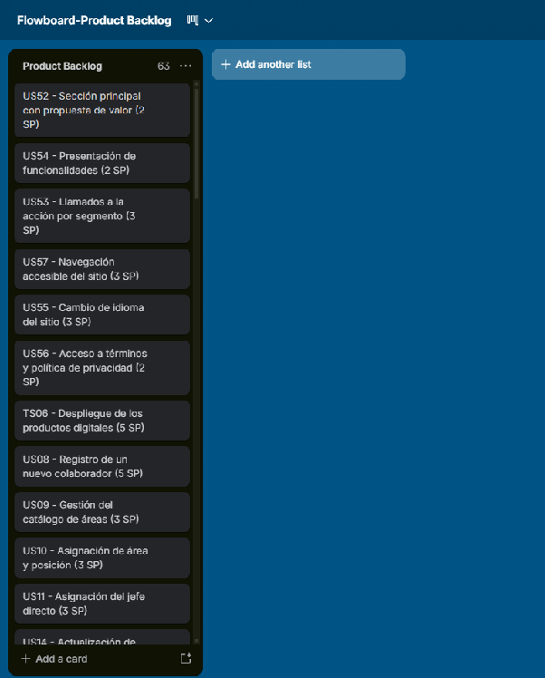

Enlace: https://trello.com/b/KZiuVfYX/flowboard-product-backlog

### 2.5.2. Context Mapping

En esta sección se explica cómo definimos las relaciones entre los siete bounded contexts de Flowboard. Partimos de los candidate bounded contexts, los Domain Message Flows y los Bounded Context Canvases, y probamos varias alternativas con las preguntas que propone la técnica antes de quedarnos con el diseño final.

La primera pregunta fue qué pasaría si movemos el saldo de vacaciones de Benefits a Request, ya que casi siempre se consulta al registrar una solicitud. Lo descartamos, porque el saldo también cambia por la acumulación mensual y por los ajustes manuales de RRHH, que no tienen nada que ver con una solicitud. Si lo colocamos en Request, ese contexto terminaba haciendo dos trabajos distintos.

La segunda fue qué pasaría si partimos Workspace en dos contextos, uno para colaboradores y otro para áreas y puestos. También lo descartamos, porque reglas como "el puesto debe pertenecer al área asignada" o "la jerarquía no puede tener ciclos" necesitan las dos partes a la vez. Separarlas nos obligaba a consultar entre contextos en casi todas las operaciones.

La tercera fue qué pasaría si duplicamos datos del colaborador en Request para romper la dependencia con Workspace. La aceptamos en parte. Request consulta a Workspace solo al registrar la solicitud para saber quién es el jefe directo, y luego guarda al aprobador dentro de la propia solicitud (value object Approver). Así, si después cambia la jerarquía, la solicitud sigue asignada a quien correspondía en ese momento.

La cuarta fue qué pasaría si creamos un shared service de notificaciones, ya que IAM, Request y Wellbeing envían avisos. Decidimos no crear un bounded context para eso, porque las notificaciones no tienen reglas de negocio propias. Cada contexto usa un adaptador de infraestructura hacia Brevo o Firebase Cloud Messaging.

Finalmente, nos preguntamos qué pasaría si aislamos las capacidades core y movemos las demás a contextos aparte. Esa es justamente la división final: Workspace y Request quedan como Core Domain, IAM como subdominio genérico, y Attendance, Benefits, Payroll y Wellbeing como subdominios de soporte. También descartamos juntar IAM con Workspace, porque la Ley N.° 29733 obliga a controlar el acceso por rol de forma estricta, y eso justifica que la seguridad tenga su propio modelo.

Con esas decisiones, las relaciones del context map quedan así:

* Workspace → IAM: Workspace publica los eventos EmployeeRegistered, EmployeeTerminated y EmployeeReinstated, e IAM crea, deshabilita o rehabilita la cuenta.
* IAM → demás contexto: IAM expone la validación de tokens a todos por medio de su facade.
* Workspace → Request, Attendance y Benefits: Workspace es upstream porque les da los colaboradores activos, el puesto y el jefe directo. Request y Attendance usan un Anti-corruption Layer para traducir esos datos a su propio modelo.
* Request ↔ Benefits: Request consulta el saldo antes de registrar la solicitud y Benefits descuenta los días cuando la solicitud se aprueba, así que cualquier cambio en ese flujo se tiene que coordinar entre los dos.
* Workspace → Payroll: Payroll solo necesita la identidad del colaborador y la toma tal como la define Workspace.
* Workspace y Wellbeing: Wellbeing trabaja con oficinas y dispositivos, sin referencias a colaboradores.
* Shared Kernel: todos los contextos, menos Wellbeing, comparten los identificadores y value objects básicos.
* Sistemas externos: el sistema biométrico, el sistema de planilla, los sensores y la API de feriados entran con un ACL para que sus formatos no afecten el modelo.
* Brevo y Firebase Cloud Messaging: nos adaptamos a sus APIs tal como vienen. Firebase solo aplica a la solución móvil.

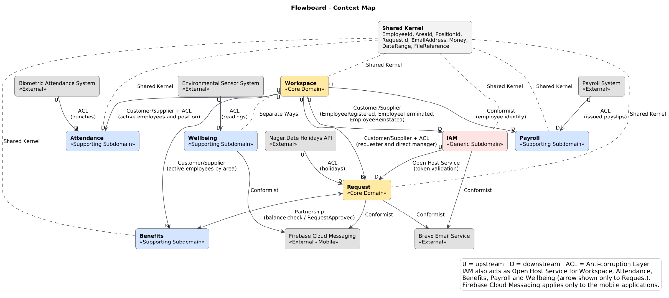
Enlace de la figura: https://drive.google.com/file/d/1ktD7dv_auK9fwaGuWSyiViH8veNReKWw/view?usp=sharing 

### 2.5.3. Software Architecture

#### 2.5.3.1. Software Architecture Context Level Diagrams

El diagrama de contexto muestra a Flowboard como un solo sistema y su relación con los usuarios y los sistemas externos. Los usuarios son el colaborador y el personal de Recursos Humanos. Los sistemas externos son el sistema de asistencia biométrica, el sistema de planilla, los sensores ambientales, el servicio de correo Brevo y la API de feriados Nager.Date. Este nivel permite entender el alcance de la solución sin entrar en detalles técnicos.

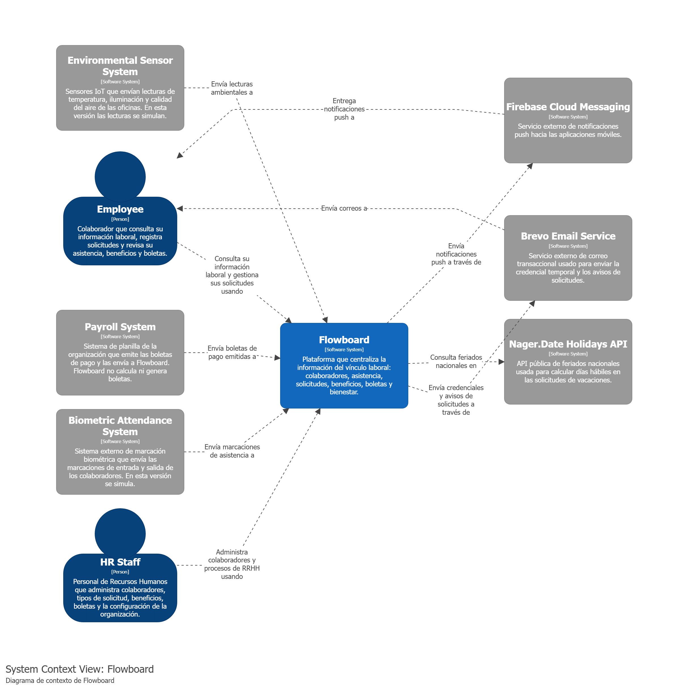
Enlace de la figura: https://drive.google.com/file/d/1QT5xYU1oC38IbX-a20IhVlGOF0NnrZki/view?usp=sharing

#### 2.5.3.2. Software Architecture Container Level Diagrams

El diagrama de contenedores muestra las partes que conforman Flowboard y las tecnologías con las que se construye cada una. La solución está formada por el Landing Page, [la aplicación web en Angular / la aplicación nativa en Kotlin y la aplicación multiplataforma en Flutter, cada una con su base de datos local], el RESTful API desarrollado en Spring Boot y la base de datos MySQL. En el diagrama también se ve cómo se comunican los contenedores entre sí y con los sistemas externos.

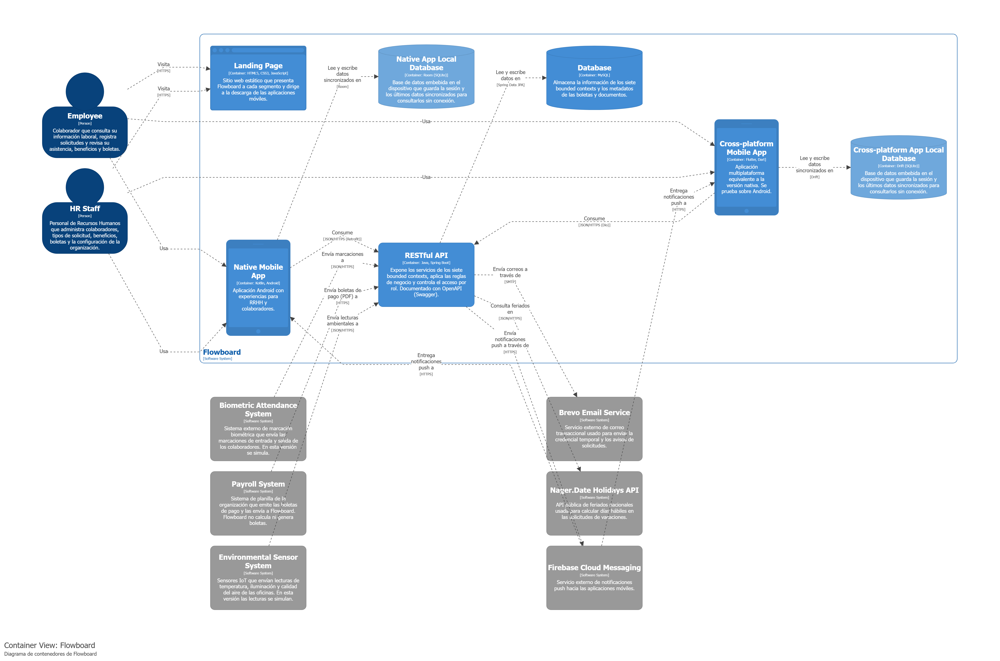
Enlace de la figura: https://drive.google.com/file/d/1pGQclKd26a_jyMMc7pBYe4HJlgBSRqWp/view?usp=sharing

#### 2.5.3.3. Software Architecture Deployment Diagrams

El diagrama de componentes muestra cómo está organizado internamente el RESTful API. Cada componente corresponde a uno de los siete bounded contexts: IAM, Workspace, Attendance, Request, Benefits, Payroll y Wellbeing. Además de lo que consume cada [aplicación web / aplicación móvil], el diagrama muestra las relaciones entre bounded contexts. Por ejemplo, Request consulta a Workspace para saber quién aprueba una solicitud y a Benefits para verificar el saldo de vacaciones.

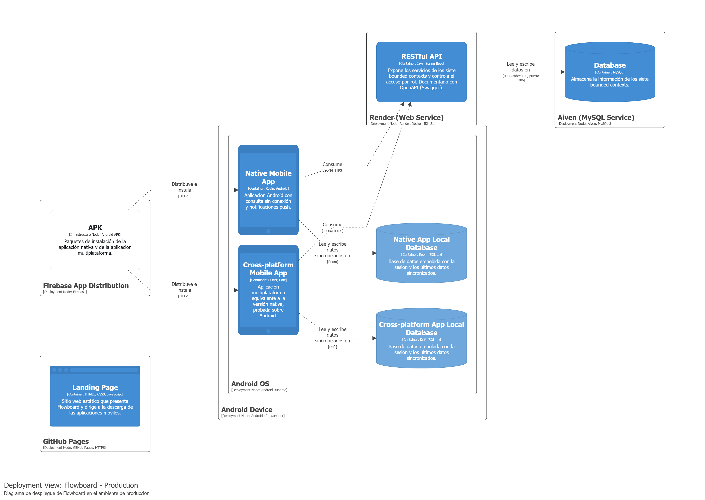
Enlace de la figura: https://drive.google.com/file/d/15bMEiFodiW55TJcYOEIEAN_k1F9tzFDc/view?usp=sharing

## 2.6. Tactical-Level Domain-Driven Design

### 2.6.1. Bounded Context: IAM

Contexto genérico que administra la identidad, las credenciales y el control de acceso por rol. Da soporte a la restricción legal declarada en el Capítulo I, según la cual cada colaborador visualiza únicamente su propia información.

#### 2.6.1.1. Domain Layer

En esta capa se define el núcleo del dominio de autenticación y seguridad, estableciendo las reglas de negocio, agregados, comandos, consultas y contratos de persistencia.

Sub-capa Model \- Aggregates, Entities, Value Objects y Enumerations :

| Tipo | Nombre | Descripción yresponsabilidad | Miembros principales | Relación con otroselementos |
| :---- | :---- | :---- | :---- | :---- |
| AggregateRoot | UserAccount | Cuenta de acceso de una persona a la plataforma.Encapsula las credenciales,el rol y el estado, y custodia las invariantes de seguridad del contexto. | Atributos: id, employeeId, credentials, role, status, mustChangePassword, lastSignInAt. Métodos: changePassword(), resetPassword(), changeRole(), disable(), enable(), registerSignIn(), canSignIn(), isHrStaff(). | Compuesto por Credentials . Referencia Role y AccountStatus .Referencia EmployeeId del Shared Kernel. Publica loseventos del contexto. |
| Entity | Role | Rol institucional asignadoa la cuenta. Se modelacomo entidad porque sepersiste en catálogo ypuede ampliarse sinrecompilar. | Atributos: id, name : RoleType. Métodos: getStringName(), getDefaultRole(). Regla: el aprobador no es un rol, se deriva detener subordinados en Workspace | Referenciado por UserAccount . Tipado por RoleType. |
| Value Object | Credentials | Par de nombre de usuarioy hash de contraseña. Suinmutabilidad obliga areemplazar el objetocompleto en cada cambiode clave. | Atributos: username , passwordHash . Método: withPasswordHash() | Componente de UserAccount |
| Value Object | Username | Nombre de usuario con elque se inicia sesión. | Atributo: value . Invariantes: no vacío, entre 3 y 120 caracteres, enminúsculas, correo corporativo o número de documento cuando nohay correo | Componente de Credentials |
| Value Object | PasswordHash | Hash de la contraseña.Nunca conserva la clave enclaro. | Atributo: value . Invariantes: formato BCrypt de 60 caracteres conprefijo $2a$, $2b$ o $2y$ | Componente de Credentials . Producidopor HashingService |
| Value Object | PlainPassword | Contraseña en claro, devida transitoria y nuncapersistida. Concentra lapolítica de complejidad. | Atributo: value . Método: unmetRequirements() . Invariantes:mínimo 8 caracteres, con mayúscula, minúscula, dígito y símbolo | Transformado en PasswordHash medianteBCrypt |
| Enumeration | RoleType | Perfiles autorizados: HR_STAFF y EMPLOYEE | Valores enumerados | Tipa a Role |
| Enumeration | AccountStatus | Estado de la cuenta: ACTIVE y DISABLED. | Valores enumerados | Propiedad de UserAccount |

Sub-capa Model — Commands, Queries y Events

| Tipo | Nombre | Descripción yresponsabilidad | Miembros principales | Relación con otroselementos |
| :---- | :---- | :---- | :---- | :---- |
| Command | CreateUserAccountCommand | Da de alta una cuenta con contraseña temporal para un colaborador recién registrado. | employeeId, username , roleName | Emitido por EmployeeRegisteredEventHandler |
| Command | SignInCommand | Encapsula las credenciales presentadas para autenticar. | username , password | Procesado por UserAccountCommandServiceImpl |
| Command | SignOutCommand | Cierra la sesión activa y revoca el token vigente. | userAccountId , token | Procesado por UserAccountCommandServiceImpl |
| Command | ChangePasswordCommand | Cambia la contraseña, incluido el cambio obligatorio del primer ingreso. | userAccountId , currentPassword, newPassword | Procesado por UserAccountCommandServiceImpl |
| Command | ResetPasswordCommand | Restablece la contraseña con una nueva clave temporal, a solicitud del rol HR_STAFF. | userAccountId | Rechazado si la cuenta está deshabilitada. |
| Command | ChangeRoleCommand | Cambia el rol de una cuenta. | userAccountId , roleName | Rechazado si deja a la organización cincuentas HR_STAFF activas |
| Command | DisableUserAccountCommand | Deshabilita la cuenta de uncolaborador cesado. | employeeId , reason | Emitido por EmployeeTerminatedEventHandler |
| Query | GetUserAccountByIdQuery | Recupera una cuenta por su identificador. | userAccountId | Procesada por UserAccountQueryServiceImpl |
| Query | GetUserAccountByUsernameQuery | Verifica la existencia de una cuenta con su nombre de usuario. | username | Usada en la autenticación y para impedir duplicados. |
| Query | GetUserAccountByEmployeeIdQuery | Recupera la cuenta asociada a un colaborador. | employeeId | Usada por los event handlers del contexto |
| DomainEvent | UserAccountCreated | Notifica el alta de una cuenta con su contraseña temporal. | userAccountId , employeeId , username , occurredOn | Consumido por el servicio de notificaciones para entregar la credencial inicial. |
| DomainEvent | UserSignedIn | Notifica un inicio de sesión exitoso. | userAccountId , occurredOn | Registro de auditoría de accesos |
| DomainEvent | UserAccountDisabled | Notifica la inhabilitación de una cuenta | userAccountId , reason, occurredOn | Consumido por el registro de auditoría |

Sub-capa Services y Repositories

| Tipo | Nombre | Descripción y responsabilidad | Miembros principales | Relación con otros elementos |
| :---- | :---- | :---- | :---- | :---- |
| Interface | UserAccountCommandService | Contrato de las operaciones de escritura sobre cuentas. | handle() sobrecargado para los siete comandos del contexto | Implementado en Application. |
| Interface | UserAccountQueryService | Contrato de las operaciones de lectura sobre cuentas. | handle() sobrecargado para las tres queries del contexto | Implementado en Application. |
| Interface | UserAccountRepository | Contrato de persistencia del agregado UserAccount | handle() sobrecargado para las tres queries del contexto | Implementado en Infrastructure |
| Interface | RoleRepository | Contrato de persistencia del catálogo de roles. | handle() sobrecargado para las tres queries del contexto | Implementado en Infrastructure |

#### 2.6.1.2. Interface Layer

Esta capa gestiona la interacción con los clientes externos (frontend o clientes REST), exponiendo recursos HTTP, transformadores de datos y controladores de entrada.

| Tipo | Nombre | Descripción y responsabilidad | Miembros principales | Relación con otros elementos |
| :---- | :---- | :---- | :---- | :---- |
| Resource | SignInResource, ChangePasswordResource,ResetPasswordResource, ChangeRoleResource | Estructuras de entrada de las peticiones HTTP del contexto. | Campos correspondientes a cada comando | Recibidos por los controladores. |
| Resource | AuthenticatedUserResource | Respuesta de una autenticación exitosa.Expone el token y los datos mínimos del perfil, incluido mustChangePassword para que la aplicación redirige al cambio obligatorio. | id , username , role , mustChangePassword , token | Producido por su assembler |
| Resource | UserAccountResource | Representación de una desacoplada del agregado. Nunca Expone el hash de contraseña. | id , username , role , status , employeeId , lastSignInAt | Producido por su assembler. |
| Assembler | SignInCommandFromResourceAssembler,AuthenticatedUserResourceFromEntityAssembler,UserAccountResourceFromEntityAssembler | Transforman entre recursos REST y objetos de dominio. | toCommandFromResource() , toResourceFromEntity() | Usados por los controladores |
| Controller | AuthenticationController | Endpoints de acceso y seguridad. | POST/api/v1/authentication/sign-in , POST/api/v1/authentication/sign-out , POST/api/v1/authentication/change-password | Invoca UserAccountCommandService |
| Controller | UserAccountsController | Endpoints de administración y consulta de cuentas. | GET /api/v1/user-accounts/{id} , GET/api/v1/user-accounts , POST/api/v1/user-accounts/{id}/reset-password, PATCH /api/v1/user-accounts/{id}/role | Restringido al rol HR STAFF,salvo la consulta de la propia cuenta. |
| Facade | IamContextFacade | Fachada que expone a los demás contextos las capacidades de identidad sin revelar el modelo interno. | createUserAccount(employeeId,username, roleName) : Long , disableUserAccount(employeeId): void , fetchRoleByUserAccountId(id) :String , isTokenValid(token) :boolean | Consumido por Workspace,Request, Payroll y los demás contextos |

#### 2.6.1.3. Application Layer

| Tipo | Nombre | Descripción y responsabilidad | Miembros principales | Relación con otros elementos |
| :---- | :---- | :---- | :---- | :---- |
| CommandHandler | UserAccountCommandServiceImpl | Implementa el alta, laautenticación, el cierre de sesión, elcambio y el restablecimiento decontraseña, el cambio de rol y lainhabilitación. Genera lacontraseña temporal, verifica lacomplejidad mediante PlainPassword y hace cumplir lainvariante de la última cuentaHR_STAFF activa. | Depende de UserAccountRepository , RoleRepository , HashingService , TokenService | Implementa UserAccountCommandService . |
| QueryHandler | UserAccountQueryServiceImpl | Implementa la recuperación decuentas según los criterios de lasqueries del dominio. | Depende de UserAccountRepository | Implementa UserAccountQueryService . |
| EventHandler | EmployeeRegisteredEventHandler | Reacciona al alta de uncolaborador en Workspacecreando su cuenta con contraseñatemporal. Materializa el Escenario01 del Domain Message Flow. | on(event : EmployeeRegistered): void | Emite CreateUserAccountCommand |
| EventHandler | EmployeeTerminatedEventHandler | Reacciona al cese en Workspacedeshabilitando de inmediato lacuenta. Materializa el Escenario 06y la regla de negocio del canvas. | on(event : EmployeeTerminated): void | Emite DisableUserAccountCommand |
| EventHandler | EmployeeReinstatedEventHandler | Reacciona a la reincorporación deun colaborador rehabilitando sucuenta con una nueva contraseñatemporal. | on(event : EmployeeReinstated): void | Emite ResetPasswordCommand yhabilita la cuenta |
| Interface | HashingService | Contrato para el cifrado y laverificación de contraseñas. | encode(password :PlainPassword) : PasswordHash , matches(raw, hash) : boolean | Implementado en Infrastructure |
| Interface | TokenService | Contrato para la emisión,validación y revocación de tokensde sesión. | generateToken() , getUserAccountIdFromToken() , validateToken() , revokeToken() | Implementado en Infrastructure |

#### 2.6.1.4. Infrastructure Layer

| Tipo | Nombre | Descripción y responsabilidad | Miembros principales | Relación con otros elementos |
| :---- | :---- | :---- | :---- | :---- |
| RepositoryImpl | JpaUserAccountRepository | Implementación de UserAccountRepository con Spring DataJPA sobre la tabla user_accounts | Extiende JpaRepository<UserAccount,Long> y la interfaz del dominio | Persistencia del agregado |
| RepositoryImpl | JpaRoleRepository, JpaRevokedTokenRepository | Persistencia del catálogo roles y de lalista de revocación revoked_tokens | Métodos derivados de Spring DataJPA | Sostienen el cierre de sesión efectivo. |
| ServiceImpl | BCryptHashingService | Implementación de HashingService sobre BCrypt de Spring Security. Garantizael formato que exige el Value Object PasswordHash | encode() , matches() | Inyectado en el commandservice |
| ServiceImpl | JwtTokenService | Implementación de TokenService sobreJSON Web Tokens, con revocaciónpersistida | generateToken() , validateToken() , revokeToken() | Consulta JpaRevokedTokenRepository |
| Filter | BearerAuthorizationRequestFilter | Intercepta cada petición, extrae el tokendel encabezado Authorization yestablece el contexto de seguridad.Sostiene el control de acceso por rol queexige la Ley N.° 29733 | doFilterInternal() | Usa TokenService |
| Adapter(móvil) | BiometricAuthenticator | Accede al sensor biométrico deldispositivo para verificar la identidad deforma local. Componente de aprendizaje autónomo del proyecto. En Kotlin se implementa sobre androidx.biometric.BiometricPrompt ;en Flutter, sobre el paquete local_auth .La plantilla biométrica nunca sale de hardware seguro del dispositivo ni se transmite al API, por lo que no aparece enel modelo de dominio del servidor | isBiometricAvailable() , authenticate(reason) , authenticateForSensitiveData() | Invocado por UnlockSessionUseCase yantes de mostrar boletas en Payroll |
| Adapter(móvil) | SecureTokenStorage | Resguarda cifrado el token de sesión en eldispositivo. En Kotlin con EncryptedSharedPreferences sobreAndroid Keystore; en Flutter con flutter_secure_storage . Cumple loscontroles MASVS-STORAGE-1 y MASVS-STORAGE-2 de OWASP | saveToken() , readToken() , clearToken() | Desbloqueado por BiometricAuthenticator |
| DataSource(móvil) | AuthRemoteDataSource | Cliente HTTP de los endpoints de autenticación. Retrofit en Kotlin, Dio enFlutter | signIn() , signOut() , changePassword() | Consumido por SignInUseCase |
| DAO(móvil) | SessionDao | Acceso a la tabla local session , que conserva los datos mínimos del perfil para abrir la aplicación sin conectividad. No Almacena el token ni el hash de contraseña. | upsertSession() , getActiveSession() , clearSession() | Room en Kotlin, Drift en Flutter |
| Use Case(móvil) | SignInUseCase,UnlockSessionUseCase | Coordinan el ingreso con credenciales y el desbloqueo biométrico sin reingresar la contraseña | invoke() | Consumidos por LoginViewModel |
| View Model(móvil) | LoginViewModel | Gestiona el estado del acceso y decide entre credenciales y biometría según la disponibilidad del sensor y la existencia de un token resguardado. Redirige al cambio obligatorio cuando mustChangePassword está activo | onSignInClicked() , onBiometricUnlockRequested() | Observado por LoginScreen |

#### 2.6.1.5. Bounded Context Software Architecture Component Level Diagrams

En esta sección se presenta el Component Diagram del bounded context IAM, mostrando cómo sus componentes se distribuyen entre la aplicación móvil y el API Backend de Flowboard.

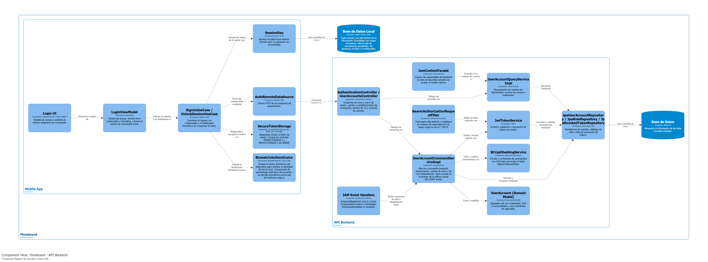
Enlace de la figura: https://drive.google.com/file/d/1gcdgO-cC5cpBQgW-5ptXY4vbpGzktU2E/view?usp=sharing

En la Mobile App, el flujo de autenticación comienza en **Login UI**, cuya lógica de presentación es gestionada por **LoginViewModel**. Este delega las operaciones de inicio de sesión y desbloqueo en SignInUseCase / UnlockSessionUseCase, que coordina el acceso remoto mediante AuthRemoteDataSource, el almacenamiento seguro del token mediante **SecureTokenStorage** y la autenticación local mediante **BiometricAuthenticator**.

Para soportar el funcionamiento con conectividad limitada, **SessionDao** administra la información local necesaria para recuperar la sesión y acceder a información previamente sincronizada.

En el API Backend, **AuthenticationController** y **UserAccountsController** reciben las solicitudes provenientes de la aplicación y delegan las operaciones correspondientes a **UserAccountCommandServiceImpl** y **UserAccountQueryServiceImpl**. Las operaciones de autenticación utilizan **BCryptHashingService** para verificar credenciales y **JwtTokenService** para generar y validar tokens.

El acceso a la persistencia se realiza mediante los repositorios JPA del contexto IAM, mientras que **BearerAuthorizationRequestFilter** intercepta las solicitudes protegidas para validar el token recibido. Finalmente, **IamContextFacade** funciona como punto de integración controlado para que otros bounded contexts puedan consultar capacidades de identidad sin depender directamente del modelo interno de IAM.

#### 2.6.1.6. Bounded Context Software Architecture Code Level Diagrams

##### 2.6.1.6.1. Bounded Context Domain Layer Class Diagrams

En esta sección se presenta el diagrama de clases UML correspondiente al Domain Layer de IAM.

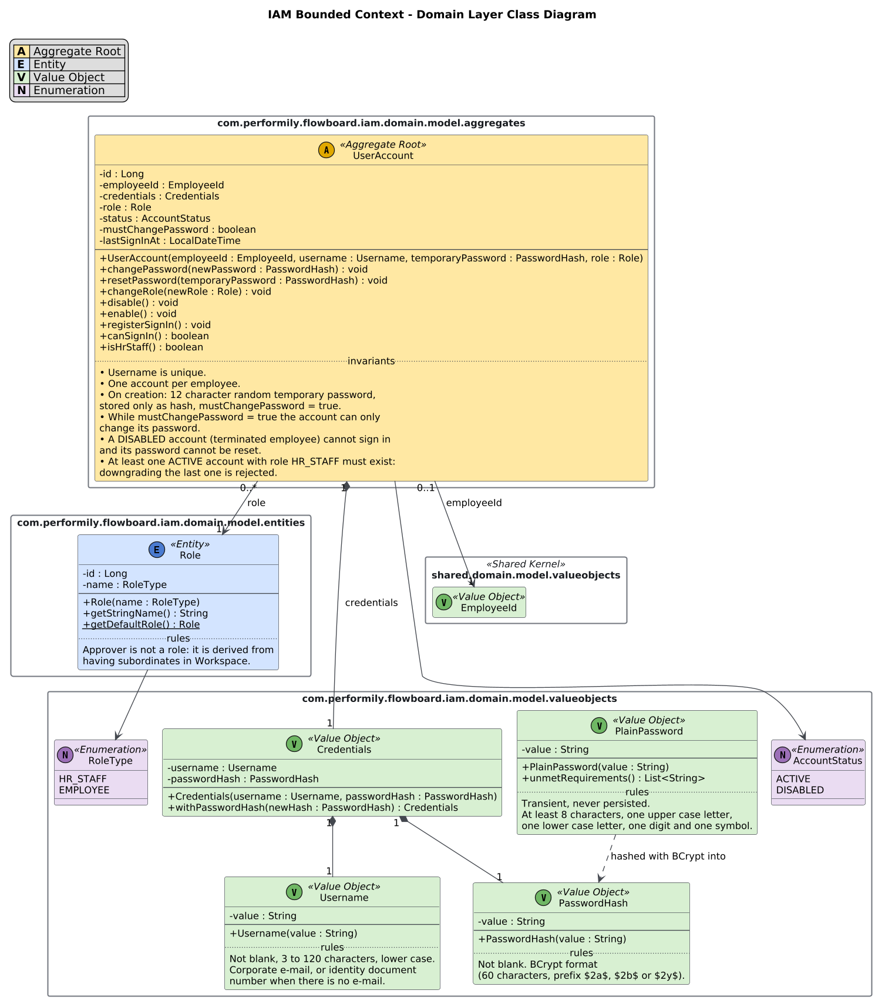
Enlace de la figura: https://drive.google.com/file/d/1J62k1rAa5mILgF6E-m6QOc13bLvpoAYJ/view?usp=sharing

**UserAccount** constituye el Aggregate Root del contexto y concentra el estado y comportamiento de una cuenta de acceso. Mantiene la referencia al colaborador mediante **EmployeeId**, sus **Credentials**, el Role, el **AccountStatus** y las propiedades necesarias para controlar el acceso y cambio de contraseña.

Las credenciales se encapsulan mediante el Value Object **Credentials**, compuesto por **Username** y **PasswordHash**. **PlainPassword** representa temporalmente una contraseña antes de ser procesada mediante BCrypt y contiene las reglas de complejidad necesarias para aceptar una contraseña válida.

**Role** representa el rol institucional asociado a una cuenta y se restringe mediante **RoleType** a los valores **HR_STAFF** y **EMPLOYEE**. Por otro lado, **AccountStatus** permite distinguir entre cuentas **ACTIVE** y **DISABLED**.

El agregado también concentra reglas como la existencia de una única cuenta por colaborador, la imposibilidad de autenticación para cuentas deshabilitadas y la obligación de realizar un cambio de contraseña cuando la cuenta ha sido creada con credenciales temporales.

##### 2.6.1.6.2. Bounded Context Database Design Diagram

En esta sección se presenta el diagrama de base de datos para la persistencia correspondiente al bounded context IAM.

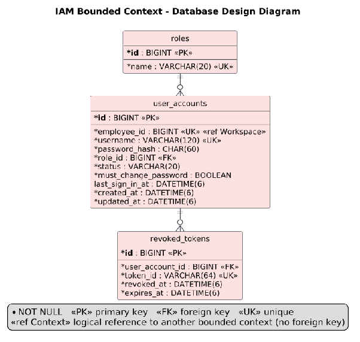
Enlace de la figura: https://drive.google.com/file/d/1Pa3Ak4XGjTBNyrgEEYFkQsJQbhgfV5oD/view?usp=sharing

La tabla principal es **user_accounts**, donde se almacena la información persistente del Aggregate Root **UserAccount**, incluyendo el identificador del colaborador, nombre de usuario, hash de contraseña, rol, estado de la cuenta y datos relacionados con el último acceso.

La tabla **roles** contiene los roles disponibles dentro de IAM y mantiene una relación de uno a muchos con **user_accounts**. La tabla **revoked_tokens**, por su parte, registra los tokens JWT invalidados antes de su expiración, permitiendo que el backend rechace sesiones que hayan sido cerradas o revocadas.

El campo **employee_id** funciona como una **referencia lógica hacia el bounded context Workspace**, en lugar de una clave foránea directa entre las bases de datos de ambos contextos. De esta manera, IAM conserva su independencia y únicamente almacena el identificador necesario para relacionar una cuenta de acceso con su colaborador.

### 2.6.2. Bounded Context: Workspace

Contexto principal y upstream del ecosistema. Gobierna el ciclo de vida del colaborador, la estructura departamental de áreas y puestos, el historial de asignaciones laborales y las líneas de reporte jerárquico. Es el contexto que habilita el ruteo correcto de las aprobaciones, porque es donde se declara quién es el jefe directo de quién, y el que custodia el sueldo de referencia de cada puesto.

#### 2.6.2.1. Domain Layer

Sub-capa Model — Aggregates, Entities, Value Objects y Enumerations

| Tipo | Nombre | Descripción y responsabilidad | Miembros principales | Relación con otros elementos |
| :---- | :---- | :---- | :---- | :---- |
| AggregateRoot | Employee | Ficha única del colaborador.Consolida su informaciónpersonal, laboral, documental yjerárquica, y custodia lasinvariantes estructurales delcontexto. | Atributos: id, name, identityDocument, birthDate, contactInfo, address, contractType, employmentPeriod, status, termination, area, position, directManagerId, jobAssignmen ts, documents. Métodos: updatePersonalData(), assignJob() , assignDirectManager(), removeDirectManager(), terminate(), reinstate(), suspend(), attachDocument(), isActive(), hasDirectManager(). Invariantes: documento de identidad no repetible entre colaboradores activos, un colaborador no puede ser su propio jefe directo, la jerarquía no admite ciclos, un colaborador con subordinados no puede cesarse hasta reasignarlos, solo los cesados pueden reincorporarse, el puesto debe pertenecer al área asignada, y todo cambio de área o puesto cierra la asignación vigente y abre una nueva | Compuesto por JobAssignment y EmployeeDocument .Referencia Area , Position y EmployeeId del SharedKernel. El organigrama es unaconsulta construida sobre directManagerId , no unaentidad. |
| Entity | Area | Unidad organizativa que agrupacolaboradores bajo una mismafunción. | Atributos: id , name , description , active .Métodos: rename() , activate() , deactivate() . Reglas: nombre único, y un áreacon colaboradores activos no puede desactivarse | Referenciada por Employee , Position y JobAssignment |
| Entity | Position | Cargo que ocupa uncolaborador, con su sueldo dereferencia. | Atributos: id , title , area , referenceSalary :Money , active . Métodos: updateReferenceSalary() , belongsTo() , deactivate() | Referenciada por Employee .El sueldo mínimo por puestovive aquí, no en Payroll |
| Entity | JobAssignment | Registro histórico de cadaasignación de área y puesto deun colaborador, con su motivo ysu vigencia. | Atributos: id , area , position , changeType , startDate , endDate . Métodos: close() , isCurrent() | Entidad interna del agregado Employee . Tipada por AssignmentChangeType |
| Entity | EmployeeDocument | Documento del expediente delcolaborador. | Atributos: id , documentType , file :FileReference , uploadedAt . Reglas: solovalores del catálogo, y formatos PDF, JPG o PNGhasta el tamaño configurado | Entidad interna del agregado Employee |
| Value Objects | PersonName,IdentityDocument,BirthDate, ContactInfo,PhoneNumber, Address,EmploymentPeriod,TerminationDetails | Encapsulan y validan los datospersonales y laborales delcolaborador, evitando laproliferación de atributosprimitivos en el agregado. | Cada uno con su valor y sus reglas de validación. EmploymentPeriod define el inicio y el fin delvínculo; TerminationDetails registra la fecha yel motivo del cese | Componentes inmutables de Employee |
| Enumerations | EmploymentStatus,ContractType,IdentityDocumentType,DocumentType,AssignmentChangeType | Catálogos cerrados delcontexto. EmploymentStatus :ACTIVE, SUSPENDED,TERMINATED. ContractType :INDEFINITE, FIXED_TERM,PART_TIME, INTERNSHIP. AssignmentChangeType : HIRE,REASSIGNMENT,REINSTATEMENT. DocumentType reúne los nuevetipos de documento delexpediente | Valores enumerados | Tipan a los agregados yentidades del contexto |

Sub-capa Model — Commands, Queries y Events

| Tipo | Nombre | Descripción y responsabilidad | Miembros principales | Relación con otros elementos |
| :---- | :---- | :---- | :---- | :---- |
| Command | RegisterEmployeeCommand | Alta de un colaborador con su primera asignación de área y puesto. | Datos personales, contacto,dirección, tipo de contrato,fecha de ingreso, areaId, positionId | Desencadena EmployeeRegistered |
| Command | UpdateEmployeePersonalDataCommand | Actualiza los datos personales y de contacto. | employeeId y los ValueObjects correspondientes | Procesado por EmployeeCommandServiceImpl |
| Command | AssignJobCommand | Reasigna área y puesto,cerrando la asignación vigente. | employeeId, areaId, positionId, effectiveDate | Valida que el puesto pertenezca al área |
| Command | AssignDirectManagerCommand | Asigna o reasigna el jefe directo. | employeeId , managerId | Valida la autojefatura y la ausencia deciclos. Desencadena DirectManagerAssigned |
| Command | TerminateEmployeeCommand | Registra el cese del colaborador. | employeeId , terminationDate , reason | Rechazado si conserva subordinados sinreasignar. Desencadena EmployeeTerminated |
| Command | ReinstateEmployeeCommand | Reincorpora a un colaborador cesado abriendo un nuevo período de empleo. | employeeId, areaId, positionId, reinstatementDate | Desencadena EmployeeReinstated |
| Command | AttachEmployeeDocumentCommand | Adjunta un documento al expediente. | employeeId , documentType , file | Valida tipo y tamaño de archivo |
| Command | CreateAreaCommand, UpdateAreaCommand,CreatePositionCommand,UpdatePositionSalaryCommand | Administran el catálogo de áreas y puestos. | Campos de cada operación | Procesados por OrganizationCommandServiceImpl |
| Query | GetEmployeeByIdQuery | Recupera la ficha completa de un colaborador | employeeId | Procesada por EmployeeQueryServiceImpl |
| Query | GetAllEmployeesByAreaQuery | Recupera los colaboradores de un área. | areaId, onlyActive | Alimenta el directorio y los indicadores operativos |
| Query | GetDirectManagerByEmployeeIdQuery | Resuelve el jefe directo de un colaborador. | employeeId | Consumida por Request a través de la fachada |
| Query | GetOrganizationChartQuery | Construye el organigrama recorriendo las relaciones directManagerId | rootEmployeeId | Alimenta la vista de organigrama de laaplicación móvil |
| Query | GetJobAssignmentHistoryQuery | Recupera el historial de asignaciones de uncolaborador | employeeId | Alimenta la vista de trayectoria laboral |
| Domain Event | EmployeeRegistered | Notifica el alta de un colaborador.Corresponde al evento Colaborador Registrado Del canvas | employeeId, username, areaId, contractType, hireDate, occurredOn | Consumido por IAM, que crea la cuenta, ypor Benefits, que inicializa el saldo devacaciones |
| Domain Event | DirectManagerAssigned | Notifica un cambio en la línea de reporte | employeeId, managerId, occurredOn | Consumido por Request para actualizar elruteo de aprobaciones |
| Domain Event | EmployeeTerminated | Notifica el cese.Corresponde al evento Cese Registrado | employeeId, terminationDate, occurredOn | Consumido por IAM, Request, Attendancey Benefits. |
| Domain Event | EmployeeReinstated | Notifica la reincorporación de un colaborador cesado | employeeId, reinstatementDate, occurredOn | Consumido por IAM y Benefits |
| Domain Event | AreaCreated | Notifica la creación de un área | areaId, name, occurredOn | Consumido por Wellbeing para asociaroficinas a áreas |

Sub-capa Services y Repositories

| Tipo | Nombre | Descripción y responsabilidad | Miembros principales | Relación con otros elementos |
| :---- | :---- | :---- | :---- | :---- |
| Interface | EmployeeCommandService,EmployeeQueryService | Contratos de escritura y lectura sobre colaboradores. | handle() sobrecargado por comando y consulta | Implementados enApplication. |
| Interface | OrganizationCommandService,OrganizationQueryService | Contratos sobre el catálogo de áreas y puestos. | handle() sobrecargado | Implementados enApplication. |
| Interface | EmployeeRepository | Persistencia del agregado Employee | findByIdentityDocument(), findAllByAreaId(), findAllByDirectManagerId(), existsActiveByIdentityDocument(), countActiveSubordinates() | Implementado enInfrastructure. |
| Interface | AreaRepository, PositionRepository | Persistencia de las entidades de catálogo | findByName(), existsByName(), findAllByAreaId() | Implementado enInfrastructure. |

#### 2.6.2.2. Interface Layer

| Tipo | Nombre | Descripción y responsabilidad | Miembros principales | Relación con otros elementos |
| :---- | :---- | :---- | :---- | :---- |
| Resource | RegisterEmployeeResource,UpdateEmployeeResource, AssignJobResource,TerminateEmployeeResource,AttachDocumentResource | Estructuras de entrada de las operaciones sobre colaboradores. | Campos de cada comando | Recibidos por EmployeesController |
| Resource | EmployeeResource, EmployeeSummaryResource | Respuestas con la ficha completa y con la versión reducida para listados. | id, fullName ,identityDocument, position, area, contractType, status, directManagerName, hireDate | Producidos por sus assemblers |
| Resource | AreaResource, PositionResource,JobAssignmentResource, OrganizationChartResource | Respuestas del catálogo organizativo, del historial de asignaciones y del organigrama en árbol. | Campos de cada entidad | Producidos por susassemblers |
| Assembler | EmployeeResourceFromEntityAssembler,RegisterEmployeeCommandFromResourceAssembler,OrganizationChartResourceFromEntityAssembler ysus equivalentes | Transforman Entre recursos REST y objetos de dominio | toResourceFromEntity() , toCommandFromResource() | Usados por loscontroladores |
| Controller | EmployeesController | Endpoints de gestión y consulta de colaboradores | POST /api/v1/employees, GET/api/v1/employees/{id}, GET/api/v1/employees/me, PUT/api/v1/employees/{id}/personal-data, PUT /api/v1/employees/{id}/job, PUT/api/v1/employees/{id}/direct-manager, POST/api/v1/employees/{id}/termination, POST/api/v1/employees/{id}/reinstatement, POST /api/v1/employees/{id}/documents | Restringido al rolHR_STAFF, salvo laconsulta de la propiaficha |
| Controller | AreasController, PositionsController | Endpoints de administración del catálogo organizativo. | POST /api/v1/areas, GET /api/v1/areas, POST /api/v1/positions, PATCH/api/v1/positions/{id}/reference-salary | Restringidos al rolHR_STAFF |
| Controller | OrganizationChartController | Expone el organigrama construido sobre las líneas de reporte | GET /api/v1/organization-chart | Disponible para ambosroles. |
| Facade | WorkspaceContextFacade | Fachada que expone a los demás contextos las capacidades de estructura organizacional. | fetchDirectManagerIdByEmployeeId(), fetchEmployeeFullName(), isEmployeeActive(), fetchContractTypeByEmployeeId(), fetchHireDateByEmployeeId(), fetchPositionReferenceSalary() | Consumida porRequest, Benefits,Attendance y Payroll. |

#### 2.6.2.3. Application Layer

| Tipo | Nombre | Descripción y responsabilidad | Miembros principales | Relación con otros elementos |
| :---- | :---- | :---- | :---- | :---- |
| CommandHandler | EmployeeCommandServiceImpl | Implementa el alta, la actualización, la reasignación, el cese y la reincorporación. Verifica la unicidad del documento entre activos, impide la auto jefatura, detecta ciclos en la jerarquía, bloquea el cese de jefes y subordinados y cierra la asignación vigente en cada cambio. | Depende de EmployeeRepository , AreaRepository , PositionRepository y elpublicador de eventos | Implementa EmployeeCommandService . Publicalos cinco eventos del contexto |
| CommandHandler | OrganizationCommandServiceImpl | Implementa la administración de áreas y puestos, validando nombres únicos y la desactivación solo de áreas sin colaboradores activos. | Depende de AreaRepository y PositionRepository | Implementa OrganizationCommandService |
| QueryHandler | EmployeeQueryServiceImpl,OrganizationQueryServiceImpl | Implementan las consultas del contexto, incluida la construcción recursiva del organigrama. | Dependen de los repositorios del contexto | Implementan las interfaces del dominio. |

#### 2.6.2.4. Infrastructure Layer

| Tipo | Nombre | Descripción y responsabilidad | Miembros principales | Relación con otros elementos |
| :---- | :---- | :---- | :---- | :---- |
| RepositoryImpl | JpaEmployeeRepository,JpaAreaRepository,JpaPositionRepository | Implementaciones con Spring Data JPA sobre las tablas employees , areas, positions, job_assignments y employee_documents. | Extienden JpaRepository y la interfazdel dominio | Persistencia del contexto |
| ServiceImpl | ObjectStorageFileService | Almacena los documentos del expediente fuera de la base de datos y resuelve el FileReference del Share Kernel, emitiendo enlaces temporales de descarga. | store() , generateTemporaryDownloadUrl() , delete() | Compartido con Request y Payroll |
| Publisher | SpringDomainEventPublisher | Publica los eventos de dominio mediante el mecanismo de eventos de Spring. | publish(event : DomainEvent) | Compartido por los siete contextos |
| DAO(móvil) | EmployeeDao | Acceso a la copia local de la ficha propia y del directorio del área,para su consulta sin conectividad. | upsertEmployee() , getMyEmployee() , getEmployeesByArea() , clearAll() | Room en Kotlin, Drift enFlutter |
| DataSource(móvil) | EmployeeRemoteDataSource | Cliente HTTP de los endpoints de colaboradores y organigrama. | fetchMyProfile() , fetchEmployeesByArea() , fetchOrganizationChart() | Consumido por EmployeeRepositoryImpl |
| Repository(móvil) | EmployeeRepositoryImpl | Coordina la fuente remota y la copia local, devolviendo los datos almacenados cuando no hay conectividad e informando la fecha de última sincronización. | observeMyProfile() , refresh() , getLastSyncAt() | Consumido por losViewModels |
| ViewModel(móvil) | MyProfileViewModel,EmployeeDirectoryViewModel,OrganizationChartViewModel | Gestionan el estado de la ficha personal, el directorio del área y el organigrama. | load() , refresh() , search(query) | Observados por sus pantallas |

#### 2.6.2.5. Bounded Context Software Architecture Component Level Diagrams

En esta sección se presenta el Component Diagram correspondiente al bounded context Workspace. El diagrama muestra los componentes de la aplicación móvil y del API Backend responsables de la gestión de colaboradores, áreas, puestos, documentos y estructura organizacional.

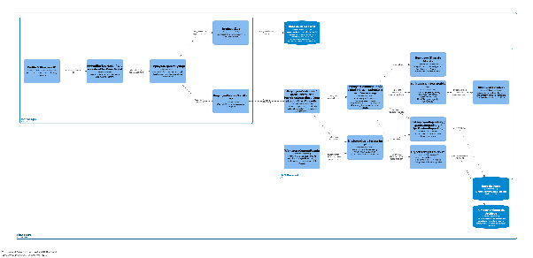
Enlace de la figura: https://drive.google.com/file/d/1snu8Q_Bu7WsscwNjeOy5MF9ciJHw9bFP/view?usp=sharing

En la Mobile App, **Profile & Directory UI** permite consultar la ficha personal, el directorio y la información organizacional. La lógica de presentación es gestionada por **MyProfileViewModel** y **OrganizationChartViewModel**, los cuales utilizan **EmployeeRepositoryImpl** para coordinar el acceso a información local y remota.

**EmployeeRemoteDataSource** consume los endpoints REST de Workspace, mientras que **EmployeeDao** mantiene localmente una copia de la ficha del colaborador y de la información relevante del área y puesto. Esta separación permite consultar información previamente sincronizada incluso cuando la conexión no está disponible.

En el API Backend, **EmployeesController**, **AreasController**, **PositionsController** y **OrganizationChartController** reciben las solicitudes relacionadas con colaboradores y estructura organizacional. Las operaciones de modificación se delegan a **EmployeeCommandServiceImpl** y **OrganizationCommandServiceImpl**, mientras que **EmployeeQueryServiceImpl** resuelve consultas de colaboradores, estructura y organigrama.

El modelo de dominio está representado principalmente por **Employee**, y la persistencia se realiza mediante los repositorios JPA correspondientes. **WorkspaceContextFacade** expone las capacidades necesarias para que otros bounded contexts consulten información organizacional sin depender directamente del modelo interno de Workspace.

Por último, **SpringDomainEventPublisher** publica eventos como **EmployeeRegistered**, **EmployeeTerminated**, **EmployeeReinstated** y **DirectManagerAssigned**, permitiendo que otros contextos reaccionen a cambios relevantes. En particular, IAM puede crear, deshabilitar o rehabilitar cuentas a partir de los eventos asociados al ciclo de vida del colaborador.

#### 2.6.2.6. Bounded Context Software Architecture Code Level Diagrams

##### 2.6.2.6.1. Bounded Context Domain Layer Class Diagrams

En esta sección se presenta el diagrama de clases UML correspondiente al Domain Layer del bounded context Workspace.

**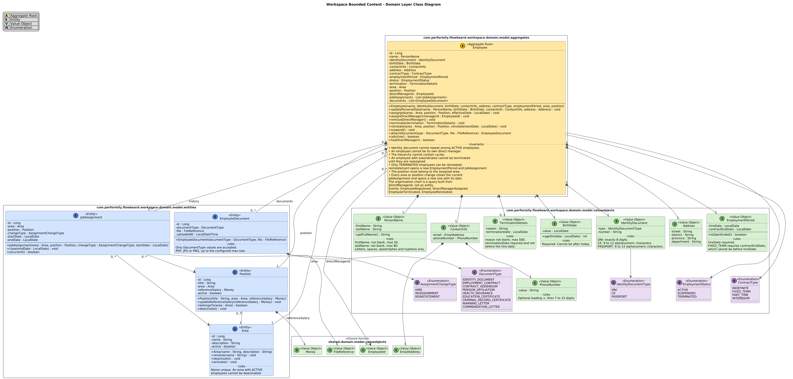**
Enlace de la figura: https://drive.google.com/file/d/1u8sNJ3E3Mw8CjqBuFX0wjLQ5Fi-nZGcA/view?usp=sharing

El elemento central del modelo es **Employee**, definido como **Aggregate Root**. Esta clase concentra la información personal y laboral del colaborador, incluyendo nombre, documento de identidad, fecha de nacimiento, datos de contacto, dirección, tipo y periodo contractual, estado laboral, área, puesto, jefe directo, historial de asignaciones y documentos asociados.

La información personal se encapsula mediante Value Objects como **PersonName**, **ContactInfo**, **IdentityDocument**, **BirthDate**, **Address** y **EmploymentPeriod**. Estos objetos concentran reglas de validación específicas y evitan que datos relevantes del colaborador sean tratados únicamente como valores primitivos.

**Area** y **Position** son entidades del contexto organizacional. **Area** representa una unidad organizativa de la empresa, mientras que **Position** representa un puesto perteneciente a un área y contiene la remuneración referencial mediante el Value Object **Money**.

La entidad **JobAssignment** conserva el historial de movimientos del colaborador entre áreas y puestos, identificando el tipo de cambio mediante **AssignmentChangeType** y las fechas de inicio y término de cada asignación.

**EmployeeDocument** representa los documentos asociados a un colaborador e incluye la referencia al archivo almacenado externamente mediante FileReference. El tipo de documento se restringe a través de **DocumentType**.

El Aggregate Root mantiene además reglas como la unicidad del documento de identidad entre colaboradores activos, la imposibilidad de que un colaborador sea su propio jefe directo y la restricción de terminar el vínculo de un colaborador mientras mantenga subordinados asignados. Asimismo, cambios de área o puesto generan nuevas entradas en el historial de **JobAssignment**.

##### 2.6.2.6.2. Bounded Context Database Design Diagram

En esta sección se presenta el Database Design Diagram correspondiente al bounded context Workspace.

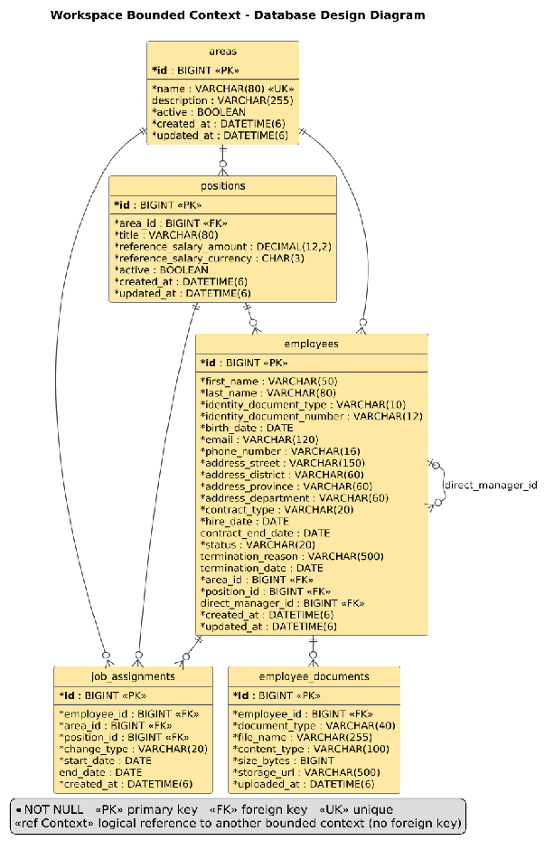
Enlace de la figura: https://drive.google.com/file/d/1yczRTCR5K1A8NS5KYfTFhkmCg0iTq5Ys/view?usp=sharing

La tabla principal es **employees**, donde se persiste la información personal y laboral del colaborador. Incluye sus datos de identificación, contacto, dirección, fechas contractuales, estado laboral y las referencias al área, puesto y jefe directo.

La relación jerárquica entre colaboradores se representa mediante **direct_manager_id**, una clave foránea autorreferenciada sobre **employees**. De esta manera, un colaborador puede estar asociado opcionalmente a otro colaborador que actúe como su jefe directo.

La tabla **areas** almacena las unidades organizacionales de la empresa, mientras que **positions** registra los puestos disponibles dentro de cada área. Cada puesto referencia a su área mediante **area_id** e incluye la remuneración referencial y su moneda.

**job_assignments** conserva el historial de cambios de área y puesto de cada colaborador. Cada registro hace referencia al empleado, área y posición correspondientes, e incluye el tipo de cambio y su periodo de vigencia.

Finalmente, **employee_documents** almacena los metadatos de los documentos asociados al colaborador, como tipo, nombre, formato, tamaño, ubicación del archivo y fecha de carga. El archivo físico no se guarda directamente en la base de datos, sino en el servicio de almacenamiento externo representado en el Component Diagram.

### 2.6.3. Bounded Context: Attendance

Contexto de soporte operativo que recibe las marcaciones de entrada y salida del personal y las consolida, según la jornada del puesto, en un registro diario depurado con sus horas efectivas y su clasificación. Es de registro y consulta: no deriva descuentos ni pagos, y para el colaborador los registros son de solo lectura.

#### 2.6.3.1. Domain Layer

Sub-capa Model — Aggregates, Entities, Value Objects y Enumerations

| Tipo | Nombre | Descripción y responsabilidad | Miembros principales | Relación con otros elementos |
| :---- | :---- | :---- | :---- | :---- |
| AggregateRoot | AttendanceRecord | Registro consolidado de la asistencia de un colaborador en una fecha. Se construye a partir de las marcaciones del día y de la jornada del puesto | Atributos: id, employeeId , workDate , checkInTime, checkOutTime , workedHours , status . Métodos de fábrica: fromPunches(), absence() . Métodos: justify(), isComplete() . Invariantes: un registro por colaborador y fecha,con entrada y salida se calculan las horas efectivas y el estado resulta ON_TIME o LATE según la jornada, con entrada sin salida el estado es INCOMPLETE y las horas quedan vacías, y un día laborable sin marcaciones de un colaborador activo genera ABSENT | Construido desde Punch y WorkSchedule .Referencia EmployeeId. |
| Entity | Punch | Marcación individual de entrada o de salida. | Atributos: id, employeeId, punchedAt, type : PunchType .Método: occurredOn(date) | Insumo del método de fábrica del agregado. |
| Entity | WorkSchedule | Jornada laboral esperada,asociada al puesto, con sus días, su horario y su tolerancia | Atributos: id, positionId, days, timeRange : TimeRange, tolerance : LateTolerance | Referenciada por el cálculo del estado.Tipada sobre PositionId del Shared Kernel. |
| Value Object | TimeRange | Rango horario de la jornada | startTime, endTime, \+ contains(), \+durationInMinutes() | Componente de WorkSchedule |
| Value Object | WorkedHours | Horas efectivamente registradas en la fecha | value : Duration, \+toDecimalHours(), \+ isEmpty() | Derivado por el método de fábrica |
| Value Object | LateTolerance | Minutos de tolerancia antes de considerar tardanza | minutes, \+ allows(delayInMinutes) : boolean | Componente de WorkSchedule |
| Enumerations | AttendanceStatus,PunchType | AttendanceStatus : ON_TIME,LATE, INCOMPLETE, ABSENT,JUSTIFIED. PunchType :CHECK_IN, CHECK_OUT | Valores enumerados | Tipan al agregado ya la entidad |

Sub-capa Model — Commands, Queries y Events

| Tipo | Nombre | Descripción y responsabilidad | Miembros principales | Relación con otros elementos |
| :---- | :---- | :---- | :---- | :---- |
| Command | RegisterPunchCommand | Registra una marcación de entrada o de salida enviada desde la aplicación móvil. | employeeId, punchedAt, type | Procesado por AttendanceCommandServiceImpl |
| Command | BuildDailyAttendanceCommand | Consolida las marcaciones de una fecha en el registro diario | workDate, employeeId | Ejecutado también por la tarea programada de cierre diario |
| Command | JustifyAttendanceCommand | Registra la justificación de una falta o una tardanza | attendanceRecordId, reason, evidenceUrl | Reservado al rol HR STAFF |
| Command | CreateWorkScheduleCommand,AssignWorkScheduleToPositionCommand | Administran las jornadas laborales y su asignación a los puestos | Campos de cada operación | Restringidos al rol HR STAFF |
| Query | GetAttendanceRecordsByEmployeeIdQuery | Historial de asistencia de un colaborador en un rango de fechas | employeeId, fromDate, toDate | Alimenta la pantalla Mi Asistencia |
| Query | GetDailyAttendanceByAreaQuery | Asistencia de una fecha para los colaboradores de un área | areaId, workDate | Alimenta los indicadores operativos |
| DomainEvent | AttendanceRecordBuilt | Notifica la consolidación del registro diario. Corresponde Al evento Marcación Registrada del canvas | employeeId, workDate, status, occurredOn | Consumido por los indicadoresoperativos |
| DomainEvent | LateArrivalDetected | Notifica una tardanza.Corresponde al evento Tardanza Identificada | employeeId, workDate, delayInMinutes, occurredOn | Consumido por el handler denotificaciones |
| DomainEvent | AbsenceDetected | Notifica una falta de un colaborador activo | employeeId, workDate, occurredOn | Consumido por el handler de notificaciones |
| DomainEvent | OvertimeCalculated | Notifica el sobretiempo respecto de la jornada esperada. Corresponde al evento Sobretiempo Calculado | employeeId, workDate, minutes, occurredOn | Consumido por los indicadores operativos |

Sub-capa Services y Repositories

| Tipo | Nombre | Descripción y responsabilidad | Miembros principales | Relación con otros elementos |
| :---- | :---- | :---- | :---- | :---- |
| Interface | AttendanceCommandService,AttendanceQueryService | Contratos de escritura y lectura del contexto | handle() sobrecargado | Implementados en Application |
| Interface | AttendanceRecordRepository | Persistencia del agregado | findByEmployeeIdAndWorkDate(), findAllByEmployeeIdAndWorkDateBetween(), existsByEmployeeIdAndWorkDate() | Implementado en Infrastructure. |
| Interface | PunchRepository,WorkScheduleRepository | Persistencia de las marcaciones crudas y de las jornadas | findAllByEmployeeIdAndPunchedAtBetween(), findByPositionId() | Implementado en Infrastructure. |

#### 2.6.3.2. Interface Layer

| Tipo | Nombre | Descripción y responsabilidad | Miembros principales | Relación con otros elementos |
| :---- | :---- | :---- | :---- | :---- |
| Resource | RegisterPunchResource, JustifyAttendanceResource,CreateWorkScheduleResource | Estructuras de entrada del contexto | Campos de cada comando | Recibidos por los controladores |
| Resource | AttendanceRecordResource,WorkScheduleResource | Respuestas con el registro diario y la jornada del puesto | workDate, checkInTime, checkOutTime, workedHours , status | Producidos por sus assemblers |
| Assembler | AttendanceRecordResourceFromEntityAssembler,RegisterPunchCommandFromResourceAssembler | Transforman entre recursos REST y objetos de dominio | toResourceFromEntity() , toCommandFromResource() | Usados por los controladores |
| Controller | AttendanceController | Endpoints demarcación,consulta y justificación | POST /api/v1/attendance/punches, GET/api/v1/attendance/me, GET/api/v1/attendance/areas/{areaId}, POST/api/v1/attendance/{id}/justification | La consulta por área y la justificación quedan restringidas al rol HR STAFF. |
| Controller | WorkSchedulesController | Endpoints de administración de jornadas | POST /api/v1/work-schedules, GET/api/v1/work-schedules, PUT/api/v1/positions/{id}/work-schedule | Restringido al rol HR STAFF. |

#### 2.6.3.3. Application Layer

| Tipo | Nombre | Descripción y responsabilidad | Miembros principales | Relación con otros elementos |
| :---- | :---- | :---- | :---- | :---- |
| CommandHandler | AttendanceCommandServiceImpl | Implementa el registro demarcaciones y la consolidación diaria.Recupera la jornada del puesto mediante WorkspaceContextFacade, aplica la tolerancia y clasifica el día. Genera Faltas para los colaboradores activos sin marcación. | Depende de AttendanceRecordRepository, PunchRepository, WorkScheduleRepository, WorkspaceContextFacade y el publicador de eventos | Implementa AttendanceCommandService |
| QueryHandler | AttendanceQueryServiceImpl | Implementa las consultas de historial por colaborador y por área. | Depende de AttendanceRecordRepository | Implementa AttendanceQueryService |
| EventHandler | EmployeeTerminatedEventHandler | Cierra el registro de asistencia a partir de la fecha de baja y deja de generar faltas. | on(event : EmployeeTerminated) | Escucha el evento de Workspace |

#### 2.6.3.4. Infrastructure Layer

| Tipo | Nombre | Descripción y responsabilidad | Miembros principales | Relación con otros elementos |
| :---- | :---- | :---- | :---- | :---- |
| RepositoryImpl | JpaAttendanceRecordRepository,JpaPunchRepository,JpaWorkScheduleRepository | Implementaciones con SpringData JPA sobre las tablas attendance_records, punches, work_schedules y work_schedule_days. | Extienden JpaRepository y la interfaz del dominio | Persistencia del contexto |
| Scheduler | DailyAttendanceClosingScheduler | Tarea programada que al finalde cada jornada consolida lasmarcaciones del día y genera lasfaltas correspondientes. | runDailyClosing() anotado con @Scheduled | Emite BuildDailyAttendanceCommand |
| DAO(móvil) | AttendanceDao | Copia local del historial de asistencia y cola de marcaciones pendientes de sincronizar cuando el dispositivo está sin conexión. | upsertRecords(), getRecords(), enqueuePendingPunch(), getPendingPunches(), clearPendingPunch() | Room en Kotlin, Drift en Flutter |
| DataSource(móvil) | AttendanceRemoteDataSource | Cliente HTTP de los endpointsde asistencia. | registerPunch(), fetchMyAttendance() | Consumido por AttendanceRepositoryImpl |
| Worker(móvil) | PendingPunchSyncWorker | Trabajo en segundo plano que reenvía las marcaciones encoladas al restablecerse la conectividad. WorkManager enKotlin, workmanager en Flutter | doWork() | Consume el DAO y el data source del contexto. |
| ViewModel(móvil) | CheckInViewModel,MyAttendanceViewModel | Gestionan la pantalla demarcación y el historial de asistencia, indicando cuándo una marcación quedó encolada por falta de conexión. | onPunchRequested(type), load(from, to) | Observados por sus pantallas. |

#### 2.6.3.5. Bounded Context Software Architecture Component Level Diagrams

En esta sección se presenta el Component Diagram correspondiente al bounded context Attendance. El diagrama muestra los componentes que participan en el registro de marcaciones, consulta del historial de asistencia, administración de horarios y consolidación diaria de jornadas.

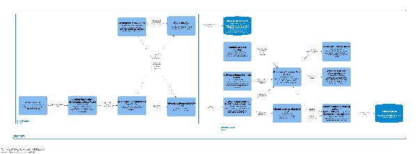
Enlace de la figura: https://drive.google.com/file/d/1J4t1ce5stv-HXrLSA2HhZdxnXsmLmtKm/view?usp=sharing

En la Mobile App, **Attendance UI** permite al colaborador registrar sus marcaciones y consultar su historial. **CheckInViewModel** y **MyAttendanceViewModel** gestionan el estado de estas operaciones y delegan el acceso a los datos en **AttendanceRepositoryImpl**.

El repositorio coordina **AttendanceRemoteDataSource**, utilizado para comunicarse con el API Backend, y **AttendanceDao**, encargado de la persistencia local. Cuando una marcación no puede ser enviada inmediatamente, queda pendiente y **PendingPunchSyncWorker** intenta sincronizarla posteriormente cuando se restablece la conexión.

En el **API Backend**, **AttendanceController** y **WorkSchedulesController** reciben las solicitudes relacionadas con asistencia y horarios. Las operaciones de modificación se delegan a **AttendanceCommandServiceImpl**, mientras que **AttendanceQueryServiceImpl** resuelve las consultas de historial de asistencia.

**AttendanceCommandServiceImpl** utiliza **WorkspaceContextFacade** para obtener información necesaria del colaborador y de su jornada laboral sin acceder directamente al modelo interno de Workspace. Asimismo, construye y actualiza el agregado **AttendanceRecord** y utiliza los repositorios JPA para persistir los cambios.

El contexto incorpora además **DailyAttendanceClosingScheduler**, encargado del cierre diario de jornadas, y **Attendance Event Handlers**, que reaccionan a eventos provenientes de otros contextos, como la baja de un colaborador.

#### 2.6.3.6. Bounded Context Software Architecture Code Level Diagrams

##### 2.6.3.6.1. Bounded Context Domain Layer Class Diagrams

En esta sección se presenta el diagrama de clases UML correspondiente al Domain Layer del bounded context Attendance.

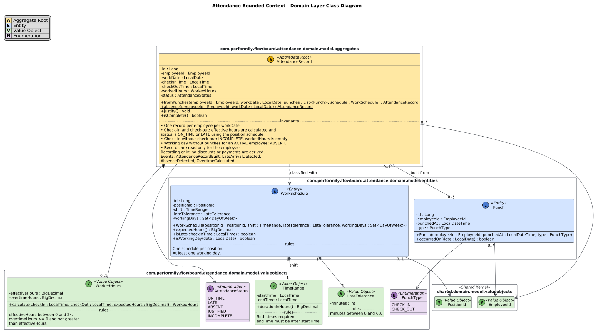
Enlace de la figura: https://drive.google.com/file/d/12dc4bxpE5hX4UZxYk3-CjdCB3XBWB8c2/view?usp=sharing

El elemento central del dominio es **AttendanceRecord**, definido como **Aggregate Root**. Representa el registro de asistencia de un colaborador para una fecha determinada y contiene la hora de entrada, hora de salida, horas trabajadas y estado de asistencia.

El agregado se construye a partir de las marcaciones **Punch** y del horario correspondiente mediante **fromPunches()**. También permite representar directamente una ausencia mediante **absence()** y registrar una justificación mediante **justify()**.

**Punch** representa cada marcación individual realizada por un colaborador y distingue entre entradas y salidas mediante la enumeración **PunchType**, cuyos valores son **CHECK_IN** y **CHECK_OUT**.

**WorkSchedule** representa el horario correspondiente a un puesto y contiene el rango horario de la jornada, la tolerancia permitida para tardanzas y los días de trabajo establecidos. Para ello utiliza los Value Objects **TimeRange** y **LateTolerance**.

Las horas procesadas se encapsulan mediante **WorkedHours**, que diferencia las horas efectivas y las horas de sobretiempo. Finalmente, **AttendanceStatus** clasifica cada jornada como **ON_TIME**, **LATE**, **ABSENT**, **JUSTIFIED** o **INCOMPLETE**.

##### 2.6.3.6.2. Bounded Context Database Design Diagram

En esta sección se presenta el Database Design Diagram correspondiente al bounded context Attendance.

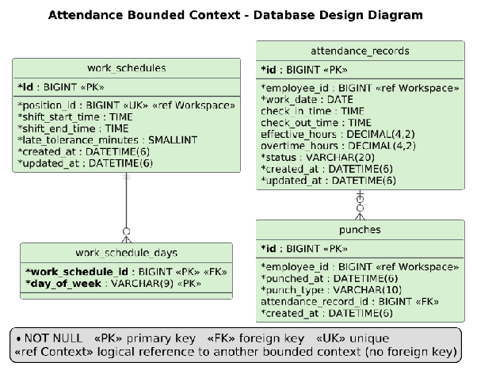
Enlace de la figura: https://drive.google.com/file/d/1e5BoZGv0-PWcaU-l0E1_U2KfwwL12Z8U/view?usp=sharing

La tabla **attendance_records** almacena el registro diario consolidado de cada colaborador. Contiene la fecha de trabajo, las horas de entrada y salida, las horas efectivas, el sobretiempo y el estado final de la jornada. **employee_id** funciona como una referencia lógica al colaborador administrado por el bounded context Workspace.

La tabla **punches** registra cada marcación individual realizada por el colaborador, almacenando el momento de la marcación, su tipo y, cuando corresponda, la referencia al **attendance_record** al que pertenece.

Los horarios laborales se almacenan en **work_schedules**. Cada registro se encuentra relacionado lógicamente con un **position_id** perteneciente a Workspace y define la hora de inicio, hora de término y tolerancia para tardanzas.

Finalmente, **work_schedule**_days complementa al horario almacenando los días de la semana en los que este resulta aplicable. Su clave compuesta por **work_schedule_id** y **day_of_week** permite asociar múltiples días laborales a un mismo horario.

### 2.6.4. Bounded Context: Request

Contexto principal que administra de punta a punta el ciclo de vida de los trámites del colaborador. Los tipos de solicitud son parametrizables: la organización define qué tipos existen, qué campos pide cada uno y si descuentan saldo, de modo que agregar un trámite nuevo no requiere modificar el código. Es el contexto que integra el servicio externo de notificaciones push.

#### 2.6.4.1. Domain Layer

Sub-capa Model — Aggregates, Entities, Value Objects y Enumerations

| Tipo | Nombre | Descripción y responsabilidad | Miembros principales | Relación con otros elementos |
| :---- | :---- | :---- | :---- | :---- |
| AggregateRoot | Request | Petición formal de un colaborador. Encapsula su tipo, período, valores de campos, adjuntos,aprobador, estado e historial, y custodia las transiciones válidas del flujo. | Atributos: id, requesterId, requestType, period, fieldValues, attachments, approver, status, submittedAt, history. Métodos: approve(), reject(), returnForReview() , resubmit(), cancel(), isAssignedTo(), requestedDays(), isResolved(). Invariantes: todos los campos obligatorios del tipo deben tener valor, el adjunto es obligatorio cuando el tipo lo exige, si el tipo descuenta saldo el disponible en Benefits Debe cubrir los días solicitados, el aprobador es el jefe directo declarado en Workspace y a falta de este el rol HR STAFF, solo el aprobador asignado puede resolverla, el motivo de rechazo y el comentario de revisión son obligatorios, y cada transición agrega una entrada al historial | Compuesto por FieldValue, RequestHistory y FileReference. Referencia RequestType y EmployeeId. |
| Entity | RequestType | Tipo de trámite parametrizable definido por la organización. Determina Los campos que solicita, y exige adjunto y si descuenta saldo. | Atributos: id, name, description, requiresAttachment, balanceDeduction: BalanceDeduction, fields :List<RequestField>, active. Métodos: addField(), deactivate(), deductsBalance() | Referenciada por Request .Compuesta por RequestField. |
| Entity | RequestField | Definición de un campo del formulario de un tipo de solicitud. | Atributos: id, key : FieldKey, label, dataType :FieldDataType, required, displayOrder | Entidad interna de RequestType. |
| Entity | RequestHistory | Anotación de cada transición de estado, con su autor, su comentario y su fecha. Es lo que da trazabilidad completa al flujo. | Atributos: id, actorId, previousStatus , newStatus, comment, occurredAt | Entidad interna de Request .Sostiene el criterio de éxito del100% de solicitudes trazables. |
| Value Object | RequestPeriod | Período solicitado,construido sobre DateRange del SharedKernel. | Atributos de rango de fechas. Métodos: countCalendarDays(), countBusinessDays(holidays) | Componente de Request .Recibe los feriados del servicio externo de calendario. |
| Value Object | Approver | Aprobador resuelto al momento de presentar la solicitud, con el criterio que lo determinó. | Atributos: employeeId , type : ApproverType | Componente de Request .Resuelto mediante WorkspaceContextFacade. |
| Value Object | FieldKey, FieldValue | Clave y valor de cada campo del formulario dinámico. FieldValue valida el contenido contra el FieldDataType declarado. | FieldKey: value. FieldValue: key, value, \+matches(dataType) : boolean | Componentes de Request y RequestField. |
| Enumerations | RequestStatus,ApproverType,BalanceDeduction,FieldDataType | Catálogos del contexto. RequestStatus :IN_PROGRESS,UNDER_REVIEW,APPROVED, REJECTED,CANCELLED. ApproverType :DIRECT_MANAGER,HR_STAFF. BalanceDeduction: NONE,VACATION_DAYS,BENEFIT_BALANCE | Valores enumerados | Tipan al agregado y a sus entidades. |

Sub-capa Model — Commands, Queries y Events

| Tipo | Nombre | Descripción y responsabilidad | Miembros principales | Relación con otros elementos |
| :---- | :---- | :---- | :---- | :---- |
| Command | CreateRequestTypeCommand,AddRequestFieldCommand,DeactivateRequestTypeCommand | Administran el catálogo de tipos de solicitud y sus campos. | Campos de cada operación | Restringidos al rol HR STAFF |
| Command | SubmitRequestCommand | Presenta una solicitud con sus valores de campos y sus adjuntos | requesterId, requestTypeId, startDate, endDate, fieldValues, attachments | Valida campos obligatorios, adjuntos y saldo. Desencadena RequestSubmitted. |
| Command | ApproveRequestCommand,RejectRequestCommand,ReturnRequestForReviewCommand,ResubmitRequestCommand,CancelRequestCommand | Ejecutan las transiciones del flujo. | requestId , actorId y el motivo o comentario según corresponda | Procesados por RequestCommandServiceImpl |
| Query | GetRequestByIdQuery | Recupera el detalle de una solicitud con su historial. | requestId , requesterId | Verifica la titularidad o la condición de aprobador |
| Query | GetRequestsByRequesterIdQuery | Historial de solicitudes de un colaborador | requesterId , status | Alimenta la bandeja Mis Solicitudes |
| Query | GetPendingRequestsByApproverIdQuery | Solicitudes pendientesde resolución de unaprobador. | approverId | Alimenta la bandeja de aprobación |
| Query | GetActiveRequestTypesQuery | Tipos de solicitud vigentes con sus campos, para construir el formulario en la aplicación | Sin parámetros | Permite que la app arme el formulario sin conocer los tipos de antemano |
| Domain Event | RequestSubmitted | Notifica la presentación de una solicitud.Corresponde al eventoSolicitud Creada del canvas | requestId, requesterId, approverId, requestTypeName, occurredOn | Consumido por el handler de notificaciones, que avisa al aprobador |
| Domain Event | RequestApproved | Notifica la aprobación.Corresponde al eventoSolicitud Aprobada | requestId, requesterId, requestedDays, balanceDeduction, occurredOn | Consumido por Benefits, que descuenta el saldo, y por el handler de notificaciones |
| Domain Event | RequestRejected, RequestReturnedForReview,RequestCancelled | Notifican las demásresoluciones del flujo | requestId , actorId ,motivo o comentario, occurredOn | Consumidos por el handler de notificaciones y, en el caso de la cancelación de una solicitud ya aprobada, por Benefits. |

Sub-capa Services y Repositories

| Tipo | Nombre | Descripción y responsabilidad | Miembros principales | Relación con otros elementos |
| :---- | :---- | :---- | :---- | :---- |
| Interface | RequestCommandService,RequestQueryService | Contratos de escritura y lectura sobre solicitudes | handle() sobrecargado | Implementados en Application. |
| Interface | RequestTypeCommandService,RequestTypeQueryService | Contratos sobre el catálogo de tipos de solicitud | handle() sobrecargado | Implementados en Application. |
| Interface | RequestRepository | Persistencia del agregado Request | findAllByRequesterId(), findAllByApproverEmployeeIdAndStatus(), existsOverlappingRequest() | Implementado en Infrastructure. |
| Interface | RequestTypeRepository | Persistencia de los tipos de solicitud y sus campos | findAllByActiveTrue(), existsByName() | Implementado en Infrastructure. |

#### 2.6.4.2. Interface Layer

| Tipo | Nombre | Descripción y responsabilidad | Miembros principales | Relación con otros elementos |
| :---- | :---- | :---- | :---- | :---- |
| Resource | SubmitRequestResource, ResolveRequestResource,ResubmitRequestResource | Estructuras de entrada del flujo de solicitudes. | Campos de cada comando, incluidos los pares clave y valor del formulario dinámico | Recibidos por RequestsController |
| Resource | RequestResource, RequestHistoryResource,RequestTypeResource, RequestFieldResource | Respuestas con el detalle de la solicitud, su historial y la definición de los tipos y sus campos | Campos de cada elemento | Producidos por sus assemblers |
| Assembler | SubmitRequestCommandFromResourceAssembler,RequestResourceFromEntityAssembler,RequestTypeResourceFromEntityAssembler | Transforman entre recursos REST y objetos de dominio. | toCommandFromResource(), toResourceFromEntity() | Usados por los controladores. |
| Controller | RequestsController | Endpoints representación,consulta y resolución de solicitudes. | POST /api/v1/requests, GET/api/v1/requests/me, GET/api/v1/requests/pending-approval, GET/api/v1/requests/{id}, POST/api/v1/requests/{id}/approve, POST/api/v1/requests/{id}/reject, POST/api/v1/requests/{id}/return-for-review, POST/api/v1/requests/{id}/resubmit, POST/api/v1/requests/{id}/cancel | Verifica mediante IamContextFacade que el actor sea el aprobado asignado. |
| Controller | RequestTypesController | Endpoints de administración del catálogo de tipos | POST /api/v1/request-types, GET/api/v1/request-types, POST/api/v1/request-types/{id}/fields | Restringido al rol HR STAFF, salvo la consulta de tipos vigentes |
| Controller | DeviceTokensController | Registra y da debaja el token de dispositivo del usuario para la entrega de notificaciones push | POST /api/v1/device-tokens, DELETE/api/v1/device-tokens/{token} | Consumido por la aplicación móvil al iniciar sesión y al cerrarla |

#### 2.6.4.3. Application Layer

| Tipo | Nombre | Descripción y responsabilidad | Miembros principales | Relación con otros elementos |
| :---- | :---- | :---- | :---- | :---- |
| CommandHandler | RequestCommandServiceImpl | Implementa el ciclo de vida de la solicitud. Al presentarla resuelve el aprobador con WorkspaceContextFacade , valida los campos obligatorios contra la definición del tipo, verifica de forma síncrona el saldo con BenefitsContextFacade Cuando el tipo descuenta días, calcula los días hábiles descontando feriados y comprueba que no exista un período superpuesto. Al resolverla exige motivo en el rechazo y comentario en la devolución. | Depende de RequestRepository, RequestTypeRepository, WorkspaceContextFacade, BenefitsContextFacade, HolidayCalendarService y el publicador de eventos | Implementa RequestCommandService |
| CommandHandler | RequestTypeCommandServiceImpl | Implementa la administración de tipos de solicitud y sus campos. | Depende de RequestTypeRepository | Implementa RequestTypeCommandService |
| QueryHandler | RequestQueryServiceImpl,RequestTypeQueryServiceImpl | Implementan las consultas del contexto aplicando la verificación de titularidad. | Dependen de los repositorios del contexto | Implementan las interfaces del dominio. |
| EventHandler | RequestNotificationEventHandler | Reacciona a los cinco eventos del contexto enviando la notificación push correspondiente al aprobador o al solicitante. Es el punto donde se integra el servicio externo de tercero declarado en el Capítulo I. | on() sobrecargado para cada evento | Usa NotificationService |
| EventHandler | EmployeeTerminatedEventHandler | Cancela las solicitudes pendientes de un colaborador cesado. | on(event :EmployeeTerminated) | Escucha el evento de Workspace |
| EventHandler | DirectManagerAssignedEventHandler | Reasigna el aprobador de las solicitudes aún no resueltas cuando cambia la línea de reporte | on(event :DirectManagerAssigned) | Escucha el evento de Workspace |
| Interface | NotificationService | Contrato para el envío de notificaciones a los dispositivos de los usuarios. | notifyApprover(), notifyRequester(), registerDeviceToken(), revokeDeviceToken() | Implementado en Infrastructure |
| Interface | HolidayCalendarService | Contrato para obtener los feriados nacionales del cómputo de días hábiles. | getHolidaysForYear(year,countryCode) :List<LocalDate> | Implementado en Infrastructure |

#### 2.6.4.4. Infrastructure Layer

| Tipo | Nombre | Descripción y responsabilidad | Miembros principales | Relación con otros elementos |
| :---- | :---- | :---- | :---- | :---- |
| RepositoryImpl | JpaRequestRepository,JpaRequestTypeRepository | Implementaciones con SpringData JPA sobre las tablas requests, request_field_values, request_attachments, request_history, request_types y request_fields | Extienden JpaRepository y la interfaz del dominio | Persistencia del contexto. |
| RepositoryImpl | JpaDeviceTokenRepository | Persistencia de los tokens de dispositivo registrados por cada usuario, necesarios para dirigir las notificaciones push | findAllByUserAccountId() , upsert() , deleteByToken() | Requiere agregar la tabla device_tokens al esquema. |
| ServiceImpl | FirebaseCloudMessagingNotificationService | Implementación de NotificationService sobre Firebase Cloud Messaging.Constituye la integración con un servicio externo de terceros exigida por el enunciado | notifyApprover(), notifyRequester(), sendToDevice(token,payload) | Consulta JpaDeviceTokenRepository |
| ServiceImpl | PublicHolidayApiAdapter | Implementación de HolidayCalendarService que consume una API pública de feriados nacionales del Perú, con copia en caché para tolerar la indisponibilidad del proveedor | getHolidaysForYear() | Integración externa adicionaldeclarada en el Capítulo I. |
| DAO(móvil) | RequestDao, RequestTypeDao | Copia local de las solicitudes propias, de la bandeja de aprobación y de la definición de los tipos vigentes, para consulta y armado del formulario sin conectividad | upsertAll(), getMyRequests(), getPendingApprovals(), getActiveTypes() | Room en Kotlin, Drift en Flutter. |
| DataSource(móvil) | RequestRemoteDataSource | Cliente HTTP de los endpoints de solicitudes y tipos | submit(), fetchMyRequests(), fetchPendingApprovals(), approve(), reject(), fetchActiveTypes() | Consumido por RequestRepositoryImpl |
| Adapter(móvil) | PushNotificationReceiver | Recibe los mensajes de Firebase Cloud Messaging, construye la notificación del sistema operativo y habilita resolver la solicitud desde la propia notificación. EnKotlin extiende FirebaseMessagingService ; en Flutter usa firebase_messaging .Constituye el acceso al sistema de notificaciones del dispositivo declarado en el Capítulo I. | onMessageReceived(), onNewToken(),buildApprovalAction() | Registra el token mediante DeviceTokensController |
| ViewModel(móvil) | MyRequestsViewModel,ApprovalInboxViewModel,NewRequestViewModel | Gestionan la bandeja personal, la bandeja de aprobación y el formulario dinámico, que se construye a partir de la definición de campos del tipo seleccionado | load(), selectType(), submit(), approve(), reject() | Observados por sus pantallas |

#### 2.6.4.5. Bounded Context Software Architecture Component Level Diagrams

En esta sección se presenta el Component Diagram correspondiente al bounded context Request. El diagrama muestra los componentes responsables de la creación, seguimiento, aprobación y notificación de solicitudes.

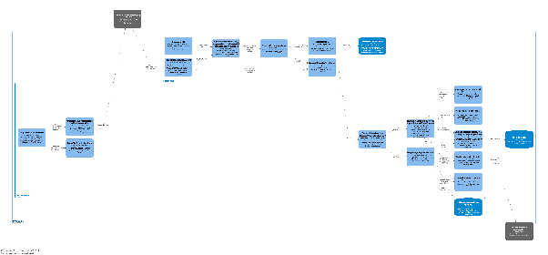
Enlace de la figura: https://drive.google.com/file/d/1N2LySDDv1rNeUwn2AUpTihYr5-i9wkFa/view?usp=sharing

En la **Mobile App**, **Requests UI** permite al usuario crear solicitudes y consultar su estado. **MyRequestsViewModel**, **ApprovalInboxViewModel** y **NewRequestViewModel** administran los flujos de consulta, aprobación y registro respectivamente.

**RequestRepositoryImpl** coordina el acceso local y remoto. Para ello utiliza **RequestDao**, encargado de la persistencia local, y **RequestRemoteDataSource**, que consume los endpoints expuestos por el API Backend.

**PushNotificationReceiver** procesa las notificaciones recibidas mediante Firebase Cloud Messaging y permite actualizar el estado mostrado en la aplicación cuando una solicitud cambia.

En el API Backend, **RequestsController**, **RequestTypesController** y **DeviceTokensController** reciben las peticiones relacionadas con solicitudes, tipos configurables y dispositivos registrados para notificaciones.

Las operaciones de modificación son gestionadas por **RommandequestCServiceImpl** y **RequestTypeCommandServiceImpl**, mientras que **RequestQueryServiceImpl** resuelve las consultas del contexto.

**WorkspaceContextFacade** permite obtener información del solicitante y del aprobador desde Workspace, mientras que **BenefitsContextFacade** se utiliza cuando una solicitud requiere validar o actualizar saldos de beneficios, como días de vacaciones.

Los cambios relevantes del flujo generan eventos que son procesados por **Request Event Handlers** y **Benefits Event Handlers**. Asimismo, **FirebaseCloudMessagingNotificationService** se encarga de enviar notificaciones push a los dispositivos correspondientes.

#### 2.6.4.6. Bounded Context Software Architecture Code Level Diagrams

##### 2.6.4.6.1. Bounded Context Domain Layer Class Diagrams

En esta sección se presenta el diagrama de clases UML correspondiente al Domain Layer del bounded context Request.

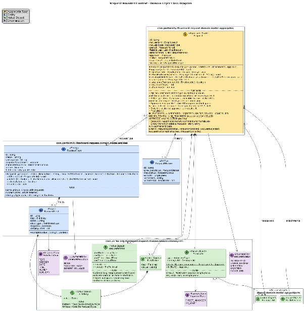
Enlace de la figura: https://drive.google.com/file/d/1Lk0D9DUH0DdP33kduoc0NmlrtiwCWX8l/view?usp=sharing

El elemento central del dominio es **Request**, definido como **Aggregate Root**. Representa una solicitud realizada por un colaborador y contiene el solicitante, tipo de solicitud, periodo solicitado, campos dinámicos, archivos adjuntos, aprobador, estado actual, fecha de envío e historial de cambios.

El agregado administra operaciones como **approve()**, **reject()**, **returnForReview()**, **resubmit()** y **cancel()**, controlando las transiciones permitidas entre los diferentes estados del flujo.

**RequestType** representa la configuración de cada tipo de solicitud y define propiedades como nombre, descripción, obligatoriedad de adjuntos, forma de afectación de saldos y los campos adicionales que deben ser completados.

**RequestField** permite definir dinámicamente los datos requeridos para cada tipo de solicitud, mientras que **FieldValue** conserva los valores introducidos por el usuario. El tipo de dato permitido se restringe mediante **FieldDataType**.

**RequestPeriod** encapsula el intervalo temporal de la solicitud, soportando fechas y, cuando corresponda, rangos de horas.

**Approver** representa al responsable de resolver la solicitud y distingue mediante **ApproverType** entre **DIRECT_MANAGER** y **HR_STAFF**.

Finalmente, **RequestStatus** controla el ciclo de vida de la solicitud mediante los estados **IN_PROGRESS**, **UNDER_REVIEW**, **APPROVED**, **REJECTED** y **CANCELLED**.

##### 2.6.4.6.2. Bounded Context Database Design Diagram

En esta sección se presenta el Database Design Diagram correspondiente al bounded context Request.

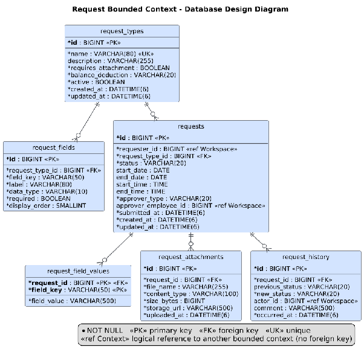
Enlace de la figura: https://drive.google.com/file/d/16NBJXgYZkB3oYzyT12GFBHEugMPOqqFa/view?usp=sharing

La tabla principal es **requests**, donde se almacena cada solicitud junto con el colaborador solicitante, el tipo de solicitud, periodo, aprobador, estado y fechas de creación y envío. Tanto **requester_id** como **approver_employee_id** funcionan como referencias lógicas hacia el bounded context Workspace.

La tabla **request_types** almacena la configuración de los tipos de solicitud disponibles, incluyendo si requieren adjuntos, si afectan algún saldo y si se encuentran activos.

**request_fields** define los campos configurables pertenecientes a cada tipo de solicitud, especificando su clave, etiqueta, tipo de dato, obligatoriedad y orden de presentación.

Los valores introducidos para esos campos se almacenan en **request_field_values**, utilizando una clave compuesta por **request_id** y **field_key**.

**request_attachments** conserva los metadatos de los archivos adjuntos asociados a una solicitud, incluyendo nombre, tipo de contenido, tamaño, ubicación de almacenamiento y fecha de carga.

Finalmente, **request_history** mantiene la trazabilidad de las transiciones de estado, registrando el estado anterior, el nuevo estado, el colaborador que realizó la acción, el comentario asociado y la fecha en que ocurrió.

### 2.6.5. Bounded Context: Benefits

Contexto de soporte que administra los incentivos corporativos y controla la acumulación, el uso y el saldo de los días de descanso vacacional. Modela el saldo como unagregado con historial de movimientos, de modo que toda variación quede explicada y sea reversible.

#### 2.6.5.1. Domain Layer

Sub-capa Model — Aggregates, Entities, Value Objects y Enumerations

| Tipo | Nombre | Descripción y responsabilidad | Miembros principales | Relación con otros elementos |
| :---- | :---- | :---- | :---- | :---- |
| AggregateRoot | VacationBalance | Saldo de vacaciones de un colaborador, con el historial de movimientos que lo explica.Garantiza que el saldo nunca quede negativo y que toda variación quede registrada | Atributos: id, employeeId, accruedDays, usedDays, movements :List<VacationMovement>, lastAccrualDate. Métodos: accrue(), use() , reverse(), adjust(), availableDays(), has Available(days) : boolean . Invariantes: el saldo disponible nunca es negativo, cada operación agrega un movimiento tipificado, y la reversión solo procede sobre un uso previamente registrado | Compuesto por VacationMovement .Referencia EmployeeId y RequestId del SharedKernel. |
| AggregateRoot | BenefitAssignment | Asignación de un beneficio a uncolaborador en un período, consus entregas. | Atributos: id, employeeId, benefitType , quantity, period : DateRange, status :AssignmentStatus, deliveries :List<BenefitDelivery>. Métodos: registerDelivery(), cancel() , isFullyDelivered(). Invariantes: no se duplica la asignación de un mismo tipo a un mismo colaborador en un mismo período, y una asignación cancelada no admite entregas | Compuesto por BenefitDelivery. Referencia BenefitType |
| Entity | BenefitType | Tipo de beneficio del catálogo de la organización, con su unidad de medida. | Atributos: id, name, description, unit :BenefitUnit, recurring, active. Métodos: activate(), desactivate() | Referenciada por BenefitAssignment |
| Entity | BenefitDelivery | Entrega concreta de un beneficio asignado, con su fecha y su constancia | Atributos: id, deliveredAt, quantity, remarks | Entidad interna de BenefitAssignment. Evita las omisiones de entrega declaradas como dolor en el Capítulo I. |
| Entity | VacationMovement | Movimiento que afecta el saldo de vacaciones, con su tipo, su cantidad y su origen. | Atributos: id, type : VacationMovementType, days, requestId : RequestId, occurredAt, remarks | Entidad interna de VacationBalance. Es la trazabilidad del saldo |
| Value Object | VacationDays | Cantidad de días de vacaciones,con su aritmética validada | value : int, \+ add(), \+ subtract(), \+isPositive() . Invariante: no admite valores negativos | Componente de VacationBalance y VacationMovement |
| Value Object | BenefitQuantity | Cantidad asignada de un beneficio, interpretada según la unidad del tipo. | value : BigDecimal , unit : BenefitUnit, \+isCompatibleWith(type) | Componente de BenefitAssignment . |
| Enumerations | BenefitUnit,AssignmentStatus,VacationMovementType | BenefitUnit : MONEY, DAYS,UNITS AssignmentStatus :ASSIGNED, DELIVERED,CANCELLED VacationMovementType :ACCRUAL, USAGE, REVERSAL,MANUAL_ADJUSTMENT | Valores enumerados | Tipan a los agregados y entidades del contexto. |

Sub-capa Model — Commands, Queries y Events

| Tipo | Nombre | Descripción y responsabilidad | Miembros principales | Relación con otros elementos |
| :---- | :---- | :---- | :---- | :---- |
| Command | CreateBenefitTypeCommand,DeactivateBenefitTypeCommand | Administran el catálogo de tipos de beneficio | Campos de cada operación | Restringidos al rol HR STAFF |
| Command | AssignBenefitCommand,RegisterBenefitDeliveryCommand,CancelBenefitAssignmentCommand | Administran la asignación y la entrega de beneficios. | employeeId, benefitTypeId, quantity, period, deliveredAt | Procesados por BenefitCommandServiceImpl |
| Command | AccrueVacationDaysCommand | Acredita los días generados en el período | employeeId, days, accrualDate | Emitido por la tarea programada de acumulación |
| Command | UseVacationDaysCommand | Descuenta días del saldo al aprobarse una solicitud. | employeeId , days , requestId | Emitido por RequestApprovedEventHandler |
| Command | ReverseVacationUsageCommand | Restituye días al cancelarse una solicitud ya aprobada. | employeeId , requestId | Emitido por RequestCancelledEventHandler |
| Command | AdjustVacationBalanceCommand | Ajuste manual del saldo,con motivo obligatorio | employeeId, days, remarks | Restringido al rol HR STAFF. Queda Registrado como MANUAL ADJUSTMENT |
| Query | GetVacationBalanceByEmployeeIdQuery | Saldo vigente de un colaborador. | employeeId | Alimenta la pantalla de saldo y la validación síncrona de Request |
| Query | GetVacationMovementsByEmployeeIdQuery | Historial de movimientos del saldo. | employeeId, fromDate, toDate | Permite al colaborador entender por qué su saldo cambió. |
| Query | GetBenefitAssignmentsByEmployeeIdQuery | Beneficios asignados a un colaborador | employeeId , year | Alimenta la pantalla Mis Beneficios |
| DomainEvent | VacationBalanceUpdated | Notifica la actualización del saldo. Corresponde al evento Saldo Actualizado Del canvas. | employeeId, availableDays, movementType, occurredOn | Consumido por los indicadores operativos |
| DomainEvent | BenefitAssigned | Notifica la asignación del beneficio.Corresponde al eventoBeneficio Asignado | assignmentId, employeeId, benefitTypeName, occurredOn | Consumido por el handler de notificaciones |
| DomainEvent | BenefitDelivered | Notifica la entrega efectiva de un beneficio | assignmentId, deliveredAt, occurredOn | Consumido por los indicadores operativos |

Sub-capa Services y Repositories

| Tipo | Nombre | Descripción y responsabilidad | Miembros principales | Relación con otros elementos |
| :---- | :---- | :---- | :---- | :---- |
| Interface | BenefitCommandService,VacationBalanceCommandService | Contratos de escritura sobre beneficios y saldos | handle() sobrecargado | Implementados en Application. |
| Interface | BenefitQueryService | Contrato de lectura sobre beneficios, saldos y movimientos. | handle() sobrecargado | Implementados en Application. |
| Interface | VacationBalanceRepository | Persistencia del agregado VacationBalance | findByEmployeeId() , existsByEmployeeId() | Implementado en Infrastructure. |
| Interface | BenefitAssignmentRepository,BenefitTypeRepository | Persistencia de las asignaciones y del catálogo. | findAllByEmployeeIdAndPeriod(), existsByEmployeeIdAndTypeAndPeriod(), findAllByActiveTrue() | Implementado en Infrastructure. |

#### 2.6.5.2. Interface Layer

| Tipo | Nombre | Descripción y responsabilidad | Miembros principales | Relación con otros elementos |
| :---- | :---- | :---- | :---- | :---- |
| Resource | CreateBenefitTypeResource,AssignBenefitResource, RegisterDeliveryResource,AdjustBalanceResource | Estructuras de entrada del contexto. | Campos de cada comando | Recibidos por los controladores. |
| Resource | VacationBalanceResource,VacationMovementResource,BenefitAssignmentResource,BenefitTypeResource | Respuestas con el saldo, sus movimientos, las asignaciones y el catálogo. | accruedDays , usedDays, availableDays, movements, benefitTypeName, status | Producidos por sus assemblers |
| Resource | VacationBalanceResourceFromEntityAssembler,BenefitAssignmentResourceFromEntityAssembler,AssignBenefitCommandFromResourceAssembler | Transforman entre recursos REST y objetos de dominio. | toResourceFromEntity(), toCommandFromResource() | Usados por los controladores |
| Controller | VacationBalancesController | Endpoints de consulta y ajuste del saldo de vacaciones. | GET /api/v1/vacation-balances/me, GET/api/v1/vacation-balances/me/movements, GET/api/v1/vacation-balances/{employeeId}, POST/api/v1/vacation-balances/{employeeId}/adjustments | Las rutas por identificador y elajuste quedan restringidos alrol HR STAFF |
| Controller | BenefitsController, BenefitTypesController | Endpoints de asignación,entrega y administración del catálogo. | POST /api/v1/benefits, GET/api/v1/benefits/me, POST/api/v1/benefits/{id}/deliveries, POST /api/v1/benefit-types, GET/api/v1/benefit-types | Restringidos según rol |
| Facade | BenefitsContextFacade | Fachada que expone a Request la verificación síncrona de saldo disponible. | hasAvailableVacationDays(employeeId,days) : boolean, fetchAvailableDays(employeeId) : int | Consumida por RequestCommandServiceImpl .Implementa la validación previa declarada en la invariante del agregado Request |

#### 2.6.5.3. Application Layer

| Tipo | Nombre | Descripción y responsabilidad | Miembros principales | Relación con otros elementos |
| :---- | :---- | :---- | :---- | :---- |
| CommandHandler | VacationBalanceCommandServiceImpl | Implementa laacumulación, el uso, lareversión y el ajuste manual, verificando que el saldo no quede negativo y registrando cada operación como movimiento tipificado | Depende de VacationBalanceRepository , WorkspaceContextFacade y el publicador de eventos | Implementa VacationBalanceCommandService |
| CommandHandler | BenefitCommandServiceImpl | Implementa la administración del catálogo, la asignación y la entrega, impidiendo duplicar la asignación de un tipo a un colaborador en un mismo período. | Depende de BenefitAssignmentRepository y BenefitTypeRepository | Implementa BenefitCommandService. |
| QueryHandler | BenefitQueryServiceImpl | Implementa las consultas de saldo, movimientos y beneficios asignados. | Depende de los repositorios del contexto | Implementa BenefitQueryService |
| EventHandler | RequestApprovedEventHandler | Reacciona a la aprobación de una solicitud que descuenta saldo,registrando el uso de días de forma automática e inmediata. Implementa la regla de negocio declarada en el Bounded Context Canvas. | on(event : RequestApproved) | Emite ReverseVacationUsageCommand |
| EventHandler | RequestCancelledEventHandler | Reacciona a la cancelación de una solicitud ya aprobada restituyendo los días. | on(event : RequestCancelled) | Emite ReverseVacationUsageCommand |
| EventHandler | EmployeeRegisteredEventHandler,EmployeeReinstatedEventHandler | Inicializan o reabren el saldo del colaborador y programan su acumulación según el tipo de contrato y la fecha de ingreso. | on() para cada evento | Escuchan los eventos de Workspace. |

#### 2.6.5.4. Infrastructure Layer

| Tipo | Nombre | Descripción y responsabilidad | Miembros principales | Relación con otros elementos |
| :---- | :---- | :---- | :---- | :---- |
| RepositoryImpl | JpaVacationBalanceRepository,JpaBenefitAssignmentRepository,JpaBenefitTypeRepository | Implementaciones con Spring DataJPA sobre las tablas vacation_balances, vacation_movements, benefit_assignments, benefit_deliveries y benefit_types. | Extienden JpaRepository y la interfaz del dominio | Persistencia del contexto. |
| Scheduler | VacationAccrualScheduler | Tarea programada que acredita de forma periódica los días generados por cada colaborador activo, según su fecha de ingreso y su tipo de contrato. | runMonthlyAccrual() anotado con @Scheduled | Emite AccrueVacationDaysCommand .Consulta WorkspaceContextFacade |
| DAO(móvil) | BenefitsDao | Copia local del saldo, sus movimientos recientes y los beneficios del colaborador. Es uno de los datos que la hipótesis del Capítulo I exige disponible sin conexión. | upsertBalance(), getBalance(), upsertBenefits(), getBenefits() | Room en Kotlin, Drift en Flutter |
| DataSource(móvil) | BenefitsRemoteDataSource | Cliente HTTP de los endpoints de saldo y beneficios. | fetchMyBalance(), fetchMyMovements(), fetchMyBenefits() | Consumido por BenefitsRepositoryImpl |
| Repository(móvil) | BenefitsRepositoryImpl | Coordina la fuente remota con la copia local y expone el saldo aunque el dispositivo esté sin conexión,indicando la fecha de la última sincronización. | observeBalance(), refresh(), getLastSyncAt() | Consumido por los ViewModels |
| ViewModel(móvil) | VacationBalanceViewModel,MyBenefitsViewModel | Gestionan las pantallas de saldo y de beneficios, incluida la indicación de datos sincronizados previamente cuando no hay conectividad. | load(), refresh() | Observados por sus pantallas. |

#### 2.6.5.5. Bounded Context Software Architecture Component Level Diagrams

En esta sección se presenta el Component Diagram correspondiente al bounded context Benefits. El diagrama muestra los componentes responsables de la consulta, asignación y administración de beneficios, así como de la gestión del saldo vacacional.

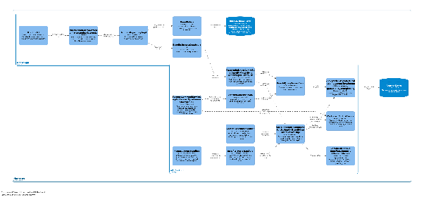
Enlace de la figura: https://drive.google.com/file/d/1FqwhOyFuLW2HtsZg15rZIalOnShbMzrB/view?usp=sharing

En la **Mobile App**, **Benefits UI** permite visualizar saldos de vacaciones, movimientos y beneficios asignados. **VacationBalanceViewModel** y **MyBenefitsViewModel** gestionan el estado mostrado al usuario y delegan el acceso a los datos en **BenefitsRepositoryImpl**.

**BenefitsRepositoryImpl** coordina la información obtenida mediante **BenefitsRemoteDataSource** con la copia local gestionada por **BenefitsDao**, permitiendo mantener disponibles los datos previamente sincronizados.

En el **API Backend**, **VacationBalancesController** y **BenefitsController** exponen los endpoints de consulta y gestión del contexto. Las consultas son procesadas por **BenefitQueryServiceImpl**, mientras que las operaciones que modifican saldos o asignaciones son gestionadas por **VacationBalanceCommandServiceImpl** y **BenefitCommandServiceImpl**.

**BenefitsContextFacade** expone capacidades relacionadas con la consulta de saldos hacia otros bounded contexts. En particular, Request puede utilizar esta fachada para validar la disponibilidad de días de vacaciones antes de continuar con una solicitud.

**VacationAccrualScheduler** ejecuta periódicamente el proceso de acumulación de vacaciones, mientras que **Benefits Event Handlers** reaccionan a eventos relevantes como solicitudes aprobadas o cambios en la situación laboral del colaborador.

#### 2.6.5.6. Bounded Context Software Architecture Code Level Diagrams

##### 2.6.5.6.1. Bounded Context Domain Layer Class Diagrams

En esta sección se presenta el diagrama de clases UML correspondiente al Domain Layer del bounded context Benefits.

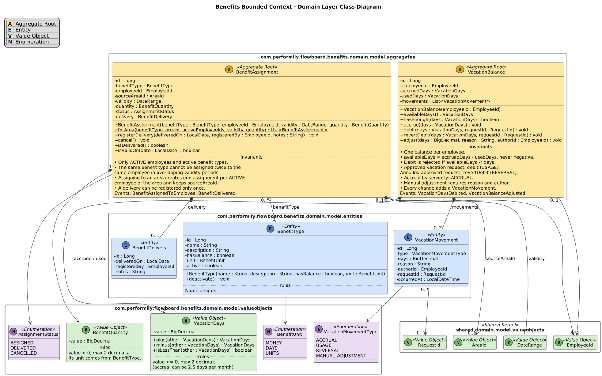
Enlace de la figura: https://drive.google.com/file/d/1FozKzdchcgiZcZdPwhldm1R0hLgv-YXg/view?usp=sharing

El dominio contiene dos Aggregate Roots principales: **BenefitAssignment** y **VacationBalance**.

**BenefitAssignment** representa la asignación de un beneficio a un colaborador o a un área determinada. Contiene el tipo de beneficio, el colaborador beneficiado, el área de origen, el periodo de validez, la cantidad asignada, su estado y, cuando corresponde, la información de entrega.

**BenefitType** representa el tipo de beneficio y define propiedades como nombre, descripción, unidad y si posee o no un saldo asociado. **BenefitDelivery** registra la entrega efectiva de un beneficio previamente asignado.

**VacationBalance** representa el saldo vacacional individual de un colaborador. Mantiene los días acumulados, usados y los movimientos que explican cada modificación del saldo.

Cada variación del saldo se representa mediante **VacationMovement**, el cual identifica el tipo de movimiento, cantidad de días, motivo, autor y, cuando corresponda, la solicitud que originó el cambio.

**VacationDays** encapsula la cantidad de días de vacaciones y permite operaciones de suma y resta controladas, mientras que **BenefitQuantity** representa la cantidad asignada de un beneficio.

##### 2.6.5.6.2. Bounded Context Database Design Diagram

En esta sección se presenta el Database Design Diagram correspondiente al bounded context Benefits.

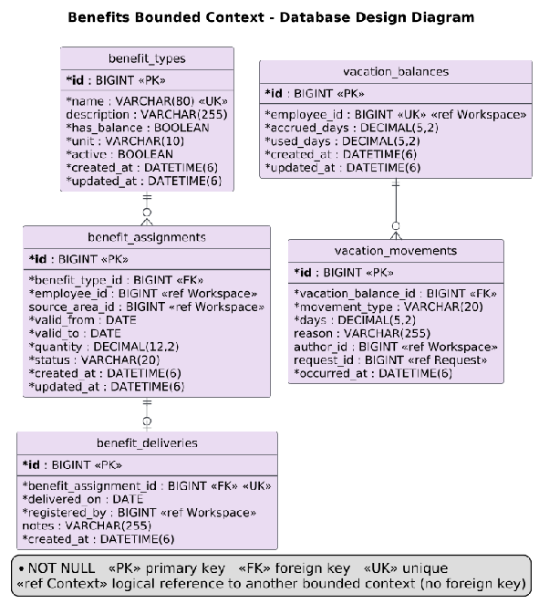
Enlace de la figura: https://drive.google.com/file/d/1ota4FWcYZmuB1wyYk0KBeMJAbUyxHYiB/view?usp=sharing

La tabla **benefit_types** almacena la definición de los tipos de beneficio disponibles, incluyendo su nombre, descripción, unidad, estado y si manejan saldo.

**benefit_assignments** registra la asignación concreta de un beneficio, relacionándolo con el tipo de beneficio, el colaborador y, cuando corresponde, el área de origen. También almacena el periodo de validez, la cantidad asignada y el estado de la asignación.

**benefit_deliveries** registra la entrega efectiva de un beneficio asociado a una asignación determinada, incluyendo la fecha, el colaborador que registró la entrega y observaciones adicionales.

La tabla **vacation_balances** mantiene un único saldo por colaborador y almacena los días acumulados y utilizados. **employee_id** funciona como referencia lógica hacia Workspace.

Finalmente, **vacation_movements** registra cada modificación del saldo vacacional, identificando el tipo de movimiento, cantidad de días, motivo, autor y, cuando corresponde, la solicitud de Request que originó la operación.

### 2.6.6. Bounded Context: Payroll

Contexto de soporte que actúa como repositorio centralizado y seguro de las boletas de pago. Es de consulta y no de cálculo: la boleta la emite el sistema de planilla de la organización y Flowboard la pública y controla el estado de su depósito. El sueldo de referencia por puesto vive en Workspace, no aquí.

#### 2.6.6.1. Domain Layer

Sub-capa Model — Aggregates, Entities, Value Objects y Enumerations

| Tipo | Nombre | Descripción y responsabilidad | Miembros principales | Relación con otros elementos |
| :---- | :---- | :---- | :---- | :---- |
| AggregateRoot | Payslip | Boleta de pago de un colaborador en un período,con su archivo, su estado de publicación y su estado de depósito. Custodiar la regla de seguridad a nivel de fila. | Atributos: id, employeeId , payrollPeriod ,file :FileReference , issueDate, netAmount : Money, publicationStatus, publishedAt, payment : PaymentDetails .Métodos: publish(), replaceFile(), markAsPaid(), markAsObserved(), isVisibleTo(employeeId) Invariantes:nada se calcula, la boleta la emite el sistema de planilla de la organización; una boleta por colaborador y período, con reemplazo explícito en lugar de duplicado; toda boleta nueva iniciaUNDER_REVIEW y PENDING; solo las boletas PUBLISHED son visibles y solo para su propio colaborador; y el archivo debe ser PDF dentro del tamaño configurado | Referencia PayrollPeriod, EmployeeId, Money y FileReference |
| Entity | PayrollPeriod | Período de planilla al que corresponden las boletas, consu ventana de vigencia | Atributos: id, period : PayPeriod, openedAt, closedAt. Métodos: close(), isOpen() | Referenciada por Payslip |
| Value Object | PayPeriod | Identificación del período, por año y mes | year, month, \+toDisplayString(),+ isBefore() | Componente de PayrollPeriod |
| Value Object | PaymentDetails | Estado y datos del depósito de haberes. | status : PaymentStatus, paidOn, observationReason, \+isSettled() | Componente de Payslip. Permite al área identificar los pagos pendientes sin revisar el sistema contable |
| Enumerations | PaymentStatus,PublicationStatus | PaymentStatus: PENDING,PAID, OBSERVED PublicationStatus :UNDER_REVIEW, PUBLISHED | Valores enumerados | Tipan al agregado |

Sub-capa Model — Commands, Queries y Events

| Tipo | Nombre | Descripción y responsabilidad | Miembros principales | Relación con otros elementos |
| :---- | :---- | :---- | :---- | :---- |
| Command | OpenPayrollPeriodCommand,ClosePayrollPeriodCommand | Abren y cierran el período de planilla | year, month | Restringidos al rol HR STAFF. |
| Command | UploadPayslipCommand | Carga la boleta emitida por el sistema de planilla | employeeId, payrollPeriodId, file, issueDate, netAmount | Rechazado si ya existe una boleta para ese colaborador y período. |
| Command | ReplacePayslipFileCommand | Reemplaza el archivo de una boleta ya cargada | payslipId, file, issueDate, netAmount | Deja constancia del reemplazo |
| Command | PublishPayslipCommand | Publica la boleta y la hace visible para su colaborador | payslipId | Desencadena PayslipPublished. |
| Command | MarkPaymentAsPaidCommand,MarkPaymentAsObservedCommand | Actualizan el estado del depósito | payslipId, paidOn o reason | Desencadenan los eventos de pago |
| Query | GetPayslipsByEmployeeIdQuery | Boletas publicadas de un colaborador, por período | employeeId, year | Alimenta la pantalla Mis Boletas |
| Query | GetPayslipDownloadUrlQuery | Resuelve el enlace temporal de descarga de una boleta | payslipId, requesterId | Verifica la titularidad antes de resolver |
| Query | GetPendingPaymentsByPeriodQuery | Boletas con depósito pendiente observado de un período. | payrollPeriodId | Alimenta los indicadores del área |
| DomainEvent | PayslipPublished | Notifica la publicación de una boleta. Corresponde al evento Boleta Cargada del canvas | payslipId, employeeId, period, occurredOn | Consumido por el handler de notificaciones |
| DomainEvent | PaymentMarkedAsPaid, PaymentObserved | Notifican el cambio de estado del depósito. Corresponden al evento Estado Actualizado | payslipId, paidOn o reason, occurredOn | Consumidos por los indicadores operativos |
| DomainEvent | PayslipDownloaded | Deja registro de auditoría del acceso a información remunerativa.Corresponde al evento Boleta Descargada. | payslipId, employeeId, occurredOn | Sostiene la trazabilidad que exige la Ley N.° 29733. |

Sub-capa Services y Repositories

| Tipo | Nombre | Descripción y responsabilidad | Miembros principales | Relación con otros elementos |
| :---- | :---- | :---- | :---- | :---- |
| Interface | PayrollCommandService,PayrollQueryService | Contratos de escritura y lectura del contexto | handle() sobrecargado | Implementados en Application. |
| Interface | PayslipRepository,PayrollPeriodRepository | Persistencia del agregado ydel período | findAllByEmployeeIdAndPublicationStatus() , existsByEmployeeIdAndPayrollPeriodId() , findAllByPaymentStatus() , findByPeriod() | Implementados en Infrastructure. |
| Interface | PayslipFileStorageService | Contrato para almacenar el archivo y emitir enlaces temporales de descarga | store(), generateTemporaryDownloadUrl(ref, ttlMinutes), delete() | Implementados en Infrastructure. |

#### 2.6.6.2. Interface Layer

| Tipo | Nombre | Descripción y responsabilidad | Miembros principales | Relación con otros elementos |
| :---- | :---- | :---- | :---- | :---- |
| Resource | UploadPayslipResource, MarkPaymentResource,OpenPeriodResource | Estructuras de entrada del contexto. La carga de la boleta se recibe como multipart/form-data | Campos de cada comando | Recibidos por los controladores. |
| Resource | PayslipResource, PayrollPeriodResource | Respuestas con los metadatos de la boleta del período. La Respuesta no incluye el archivo, sino un enlace temporal. | id, period, issueDate, netAmount, publicationStatus, paymentStatus, downloadUrl | Producidos por sus assemblers |
| Assembler | PayslipResourceFromEntityAssembler,UploadPayslipCommandFromResourceAssembler | Transforman entre recursos REST y objetos de dominio. | toResourceFromEntity() , toCommandFromResource() | Usados por los controladores. |
| Controller | PayslipsController | Endpoints de carga,publicación, consulta y descarga de boletas, y de actualización del estado de pago. | POST /api/v1/payslips, PUT/api/v1/payslips/{id}/file, POST/api/v1/payslips/{id}/publish, GET/api/v1/payslips/me, GET/api/v1/payslips/{id}/download-url, PATCH /api/v1/payslips/{id}/payment | Verifica en cada lectura que el solicitante sea el titular o tenga rol HR STAFF |
| Controller | PayrollPeriodsController | Endpoints de apertura,cierre y consulta de períodos. | POST /api/v1/payroll-periods, POST/api/v1/payroll-periods/{id}/close, GET/api/v1/payroll-periods | Restringido al rol HR STAFF |

#### 2.6.6.3. Application Layer

| Tipo | Nombre | Descripción y responsabilidad | Miembros principales | Relación con otros elementos |
| :---- | :---- | :---- | :---- | :---- |
| CommandHandler | PayrollCommandServiceImpl | Implementa la apertura y cierre de períodos, la carga, el reemplazo y la publicación de boletas, y la actualización del estado de depósito. Valida el tipo y el tamaño del archivo e impide la duplicación por colaborador y período | Depende de PayslipRepository, PayrollPeriodRepository, PayslipFileStorageService y el publicador de eventos | Implementa PayrollCommandService |
| QueryHandler | PayrollQueryServiceImpl | Implementa las consultas aplicando en cada resolución la verificación de titularidad y de estado de publicación.Pública PayslipDownloaded al emitir un enlace de descarga. | Depende de PayslipRepository y PayslipFileStorageService | Implementa PayrollQueryService |

#### 2.6.6.4. Infrastructure Layer

| Tipo | Nombre | Descripción y responsabilidad | Miembros principales | Relación con otros elementos |
| :---- | :---- | :---- | :---- | :---- |
| RepositoryImpl | JpaPayslipRepository,JpaPayrollPeriodRepository | Implementaciones con Spring DataJPA sobre las tablas payslips y payroll_periods. | Extienden JpaRepository y la interfaz del dominio | Persistencia del contexto |
| ServiceImpl | ObjectStoragePayslipFileService | Implementación de PayslipFileStorageService . Guarda el archivo fuera de la base de datos y emite enlaces firmados de vigencia limitada, de modo que la boleta no quede expuesta en una URL pública permanente. | store(), generateTemporaryDownloadUrl(), delete() | Implementa la interfaz del dominio. |
| DAO(móvil) | PayslipDao | Copia local de los metadatos de las boletas, sin los archivos, para que el colaborador vea su listado y el estado de cada depósito sin conexión. | upsertAll() , getPayslips(year) | El archivo se descarga bajo demanda y solo con conectividad |
| DataSource(móvil) | PayrollRemoteDataSource | Cliente HTTP de los endpoints de boletas. | fetchMyPayslips(), requestDownloadUrl() | Consumido por PayrollRepositoryImpl |
| ViewModel(móvil) | MyPayslipsViewModel | Gestiona la pantalla de boletas. Antes De exponer el listado o de abrir un documento invoca BiometricAuthenticator del contexto IAM, conforme al control que exige una nueva autenticación antes de mostrar información altamente sensible. | Depende de BiometricAuthenticator. Métodos: requestAccess(), load(), openPayslip(id) | Observado por MyPayslipsScreen. Es donde el componente de aprendizaje autónomo cumple su función de negocio. |

#### 2.6.6.5. Bounded Context Software Architecture Component Level Diagrams

En esta sección se presenta el Component Diagram correspondiente al bounded context Payroll.

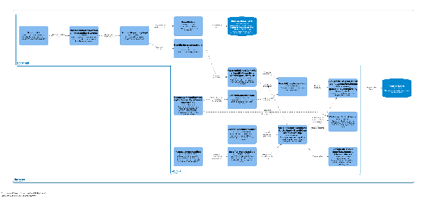
Enlace de la figura: https://drive.google.com/file/d/1bVXUmi_qM8hRHICWA4V5EpjW11_sGIr0/view?usp=sharing

En la **Mobile App**, los componentes del contexto deben permitir al colaborador consultar sus boletas y visualizar la información asociada a cada periodo de pago. La capa de presentación delega la recuperación de datos en el repositorio correspondiente, que coordina el acceso remoto al API Backend y, cuando aplique, la copia local de información previamente sincronizada.

En el **API Backend**, los controladores del contexto exponen las operaciones relacionadas con periodos y boletas. Las operaciones de consulta recuperan la información persistida, mientras que las operaciones de administración permiten registrar, reemplazar o publicar las boletas correspondientes.

El contexto se integra con Workspace para identificar al colaborador propietario de cada boleta y con el almacenamiento de archivos para conservar el documento asociado. Esta separación mantiene a Payroll enfocado en la publicación y consulta de información, sin asumir responsabilidades de cálculo salarial.

#### 2.6.6.6. Bounded Context Software Architecture Code Level Diagrams

##### 2.6.6.6.1. Bounded Context Domain Layer Class Diagrams

En esta sección se presenta el diagrama de clases UML correspondiente al Domain Layer del bounded context Payroll.

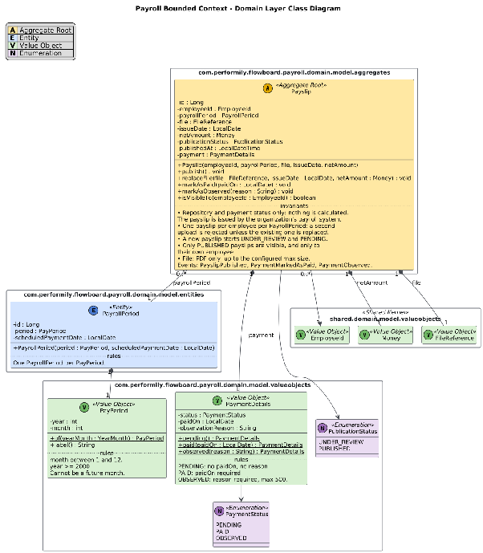
Enlace de la figura: https://drive.google.com/file/d/1q9KABHKNucaI5ybmjg2eHFTvobhnK1Rc/view?usp=sharing

El elemento central del dominio es **Payslip**, definido como **Aggregate Root**. Representa una boleta de pago perteneciente a un colaborador para un periodo determinado e incluye la referencia al archivo, fecha de emisión, monto neto, estado de publicación y detalles del pago.

El agregado permite operaciones como **publish()**, **replaceFile()**, **markAsPaid()** y **markAsObserved()**, que controlan los cambios permitidos sobre la boleta.

**PayrollPeriod** representa el periodo de nómina al que pertenece una boleta y utiliza el Value Object **PayPeriod** para identificar el año y mes correspondiente. El modelo establece que debe existir un único **PayrollPeriod** por periodo.

**PaymentDetails** encapsula el estado del pago, la fecha efectiva y, cuando corresponde, el motivo de observación. La enumeración **PaymentStatus** restringe los posibles estados a **PENDING**, **PAID** y **OBSERVED**.

Por otro lado, **PublicationStatus** distingue entre boletas **UNDER_REVIEW** y **PUBLISHED**, permitiendo controlar qué documentos pueden ser visualizados por el colaborador.

El agregado también utiliza objetos compartidos como **EmployeeId**, **Money** y **FileReference**. Entre sus principales reglas se establece que existe una sola boleta por colaborador y periodo, que únicamente las boletas publicadas pueden ser consultadas por el colaborador y que Payroll registra el monto y estado del pago sin realizar cálculos salariales.

##### 2.6.6.6.2. Bounded Context Database Design Diagram

En esta sección se presenta el Database Design Diagram correspondiente al bounded context Payroll.

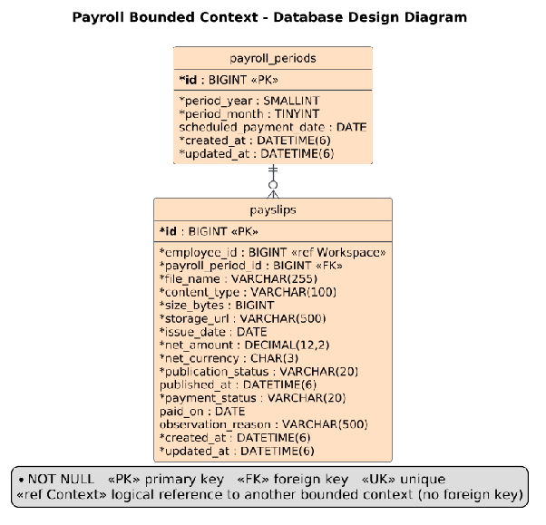
Enlace de la figura: https://drive.google.com/file/d/1gexNLUMXLYZlXSQ3wS2YsN5HE5MdtA_d/view?usp=sharing

La tabla **payroll_periods** almacena los periodos de pago administrados por el contexto, identificados mediante el año, mes y fecha programada de pago.

La tabla principal **payslips** almacena cada boleta asociada a un colaborador y a un periodo determinado. Incluye el nombre y ubicación del archivo, tipo de contenido, tamaño, fecha de emisión, monto neto, moneda y estado de publicación.

**employee_id** funciona como una referencia lógica hacia el bounded context Workspace, mientras que **payroll_period_id** constituye la relación interna con **payroll_periods**.

La tabla también conserva información relacionada con el pago mediante **payment_status**, **paid_on** y **observation_reason**. De esta forma, Payroll puede representar si una boleta se encuentra pendiente, pagada u observada sin asumir responsabilidades de cálculo de remuneraciones.

El diseño mantiene separado el **periodo de nómina** de la **boleta individual**, permitiendo que múltiples colaboradores posean una boleta correspondiente al mismo periodo y conservando la independencia del contexto respecto de Workspace.

### 2.6.7. Bounded Context: Wellbeing

Contexto de soporte enfocado en el clima laboral físico. Registra las lecturas ambientales de los espacios de trabajo captadas por dispositivos y las traduce en un indicador de salud ocupacional según umbrales configurables. Flowboard no provee ni comercializa sensores: administra su inventario y consume las lecturas que estos reporten, y en esta versión dichas lecturas se generan como datos de prueba.

#### 2.6.7.1. Domain Layer

Sub-capa Model — Aggregates, Entities, Value Objects y Enumerations

| Tipo | Nombre | Descripción y responsabilidad | Miembros principales | Relación con otros elementos |
| :---- | :---- | :---- | :---- | :---- |
| AggregateRoot | Office | Espacio de trabajo de la organización. Agrupa sus dispositivos, sus lecturas y sus umbrales, y determina el indicador de habitabilidad vigente. | Atributos: id, name, location : OfficeLocation , areaId : AreaId, devices, thresholds, currentIndicator :  HealthIndicator . Métodos: linkDevice(), unlinkDevice(), configureThreshold(), registerReading(), evaluateIndicator(). Invariantes: nombre único, un dispositivo solo puede estar vinculado a una oficina a la vez, y no se aceptan lecturas de un tipo sin umbral configurado | Compuesto por Device , EnvironmentalReading y MetricThreshold . Referencia AreaId del Shared Kernel. |
| Entity | Device | Dispositivo de captación instalado en una oficina, con su código, su estado y las métricas que soporta. | Atributos: id, code : DeviceCode , model , status :DeviceStatus, supportedMetrics : List<MetricType>, linkedAt . Métodos: link(), unlink(), deactivate(), supports(metric) | Entidad interna de Office.Tipada por DeviceStatus |
| Entity | EnvironmentalReading | Lectura de una métrica física en un instante, con su clasificación frente al umbral vigente. | Atributos: id, deviceId, metricType, value :MetricValue, capturedAt, indicator :HealthIndicator. Método: classifyAgainst(threshold) | Entidad interna de Office |
| Entity | MetricThreshold | Configuración de los rangos de una métrica para una oficina. | Atributos: id, metricType, ranges :List<ThresholdRange>. Método: classify(value): HealthIndicater | Entidad interna de Office |
| Value Object | OfficeLocation | Ubicación del espacio de trabajo. | address, floor, reference | Componente de Office |
| Value Object | DeviceCode | Código único del dispositivo dentro del inventario. | value, \+ isValid() | Componente de Device |
| Value Object | MetricValue | Magnitud de la lectura con su unidad de medida. | magnitude: BigDecimal, unit, \+isWithin(range) | Componente de EnvironmentalReading |
| Value Object | ThresholdRange | Rango de una métrica asociado a un nivel del indicador. | minValue, maxValue, indicator :HealthIndicator, \+contains(value) | Componente de MetricThreshold |
| Enumerations | MetricType,HealthIndicator,DeviceStatus | MetricType : TEMPERATURE,ILLUMINATION,AIR_QUALITY. HealthIndicator :OPTIMAL, ACCEPTABLE,POOR, HAZARDOUS. DeviceStatus :IN_INVENTORY, LINKED,INACTIVE | Valores enumerados | Tipan al agregado y a sus entidades |

Sub-capa Model — Commands, Queries y Events

| Tipo | Nombre | Descripción y responsabilidad | Miembros principales | Relación con otros elementos |
| :---- | :---- | :---- | :---- | :---- |
| Command | RegisterOfficeCommand | Da de alta una oficina y la asocia a un área organizativa | name , location , areaId | Procesado por WellbeingCommandServiceImpl |
| Command | RegisterDeviceCommand,LinkDeviceToOfficeCommand,UnlinkDeviceCommand | Administrar el inventario de dispositivos y su vinculación a oficinas. | code, model, supportedMetrics, officeId | Restringidos al rol HR_STAFF |
| Command | ConfigureMetricThresholdCommand | Define los rangos de una métrica para una oficina.Corresponde al mensaje Configurar Umbrales de Alerta del canvas | officeId , metricType , ranges | Restringidos al rol HR_STAFF |
| Command | CaptureEnvironmentalReadingCommand | Registra una lectura reportada por un dispositivo.Corresponde al mensaje Capturar Lectura Ambiental | deviceCode , metricType , magnitude , unit , capturedAt | Procesado por WellbeingCommandServiceImpl , que la clasifica y recalcula el indicador |
| Query | GetOfficesQuery | Oficinas de la organización con su indicador vigente | areaId | Alimenta la vista general de sedes |
| Query | GetReadingsByOfficeIdQuery | Lecturas de una oficina en un rango de tiempo. | officeId, metricType, from, to | Alimenta la vista de monitoreo |
| Query | GetHealthIndicatorByOfficeIdQuery | Indicador vigente de una oficina. | officeId | Alimenta los indicadores operativos |
| Query | GetDeviceInventoryQuery | Inventario de dispositivos consu estado y su oficina | status | Restringida al rol HR STAFF |
| DomainEvent | ReadingCaptured | Notifica el registro de una lectura. Corresponde al evento Lectura Capturada del canvas. | officeId, deviceId, metricType, magnitude, occurredOn | Consumido por el proceso de clasificación. |
| DomainEvent | IndicatorClassified | Notifica la actualización del indicador de una oficina.Corresponde al evento Indicador Clasificado. | officeId , indicator , occurredOn | Consumido por los indicadores operativos |
| DomainEvent | HazardousConditionDetected | Notifica que una lectura alcanzó el nivel HAZARDOUS.Implementa la regla que exige emitir una alerta inmediata.Corresponde al evento Alerta Ambiental Emitida | officeId, readingId, metricType, magnitude, occurredOn | Consumido por EnvironmentalAlertEventHandler |

Sub-capa Services y Repositories

| Tipo | Nombre | Descripción y responsabilidad | Miembros principales | Relación con otros elementos |
| :---- | :---- | :---- | :---- | :---- |
| Interface | WellbeingCommandService,WellbeingQueryService | Contratos de escritura y lectura del contexto | handle() sobrecargado | Implementados en Application. |
| Interface | OfficeRepository | Persistencia del agregado Office Persistencia de las lecturas | findByAreaId() , existsByName(), findByDeviceCode() | Implementado en Infrastructure |
| Interface | EnvironmentalReadingRepository | Persistencia de las lecturas | findAllByOfficeIdAndCapturedAtBetween(), findLatestByOfficeIdAndMetricType() | Implementado en Infrastructure |

#### 2.6.7.2. Interface Layer

| Tipo | Nombre | Descripción y responsabilidad | Miembros principales | Relación con otros elementos |
| :---- | :---- | :---- | :---- | :---- |
| Resource | RegisterOfficeResource, RegisterDeviceResource,ConfigureThresholdResource, CaptureReadingResource | Estructuras de entrada del contexto. | Campos de cada comando | Recibidos por los controladores |
| Resource | OfficeResource, DeviceResource,EnvironmentalReadingResource,HealthIndicatorResource | Respuestas con las oficinas, su inventario, sus lecturas y su indicador. | name, location , areaName, currentIndicator, metricType, magnitude, capturedAt | Producidos por sus assemblers |
| Assembler | OfficeResourceFromEntityAssembler,EnvironmentalReadingResourceFromEntityAssembler,CaptureReadingCommandFromResourceAssembler | Transforman entre recursos REST y objetos de dominio. | toResourceFromEntity() , toCommandFromResource() | Usados por los controladores. |
| Controller | OfficesController | Endpoints de alta de oficinas,configuración de umbrales y consulta de indicadores | POST /api/v1/offices, GET /api/v1/offices, PUT /api/v1/offices/{id}/thresholds, GET/api/v1/offices/{id}/indicator | Restringido al rol HR STAFF,salvo la consulta del indicador |
| Controller | DevicesController | Endpoints de administración del inventario de dispositivos. | POST /api/v1/devices,GET /api/v1/devices ,POST /api/v1/offices/{id}/devices ,DELETE/api/v1/offices/{id}/devices/{deviceId} | Restringido al rol HR STAFF. |
| Controller | EnvironmentalReadingsController | Punto de ingreso de las lecturas y su consulta histórica. | POST /api/v1/offices/{officeId}/readings, GET /api/v1/offices/{officeId}/readings | El endpoint de ingreso se protege con una credencial de servicio, no con el token de usuario. |

#### 2.6.7.3. Application Layer

| Tipo | Nombre | Descripción y responsabilidad | Miembros principales | Relación con otros elementos |
| :---- | :---- | :---- | :---- | :---- |
| CommandHandler | WellbeingCommandServiceImpl | Implementa el alta de oficinas, el inventario y vinculación de dispositivos, la configuración de umbrales y el registro de lecturas.Al registrar una lectura la clasifica contra el umbral vigente, recalcula el indicador de la oficina y, si alcanza el nivel HAZARDOUS,pública la alerta. | Depende de OfficeRepository , EnvironmentalReadingRepository y el publicador de eventos | Implementa WellbeingCommandService |
| QueryHandler | WellbeingQueryServiceImpl | Implementa las consultas de oficinas, lecturas, indicadores e inventario. | Depende de los repositorios del contexto | Implementa WellbeingQueryService |
| EventHandler | EnvironmentalAlertEventHandler | Reacciona a una condición peligrosa enviando una notificación inmediata a las cuentas con rol HR STAFF, que son quienes asumen la responsabilidad de seguridad y salud ocupacional en el alcance del proyecto. | on(event :HazardousConditionDetected) | Usa NotificationService del contexto Request |
| EventHandler | AreaCreatedEventHandler | Habilita el registro de oficinas asociadas a un área recién creada | on(event : AreaCreated) | Escucha el evento de Workspace. |

#### 2.6.7.4. Infrastructure Layer

| Tipo | Nombre | Descripción y responsabilidad | Miembros principales | Relación con otros elementos |
| :---- | :---- | :---- | :---- | :---- |
| RepositoryImpl | JpaOfficeRepository,JpaEnvironmentalReadingRepository | Implementaciones con SpringData JPA sobre las tablas offices, devices, device_supported_metrics, metric_thresholds, threshold_ranges y environmental_readings. | Extienden JpaRepository y la interfaz del dominio | Persistencia del contexto |
| Adapter | SensorReadingIngestionAdapter | Punto de entrada de las lecturas provenientes de los dispositivos. Traduce el formato del proveedor al comando de dominio y valida la credencial de servicio del emisor. | ingest(payload), validateServiceCredential() | Emite CaptureEnvironmentalReadingComman |
| Seeder | EnvironmentalReadingSeeder | Generador de lecturas de prueba que alimenta el contexto mientras la organización no disponga de dispositivos instalados. Está declarado de forma explícita en el alcance del proyecto. | seedReadingsForOffice(officeId,days) | Activo solo en los perfiles de desarrollo y de demostración |
| DAO(móvil) | WellbeingDao | Copia local del indicador vigente de cada oficina | upsertIndicators(), getIndicators() | Room en Kotlin, Drift en Flutter |
| DataSource(móvil) | WellbeingRemoteDataSource | Cliente HTTP de los endpoints de oficinas e indicadores | fetchOffices(), fetchIndicator(), fetchReadings() | Consumido por WellbeingRepositoryImpl |
| ViewModel(móvil) | WellbeingDashboardViewModel | Gestiona la vista de monitoreo ambiental. En la aplicación móvil este contexto es de solo lectura: el inventario de dispositivos y la configuración de umbrales se administran desde la experiencia de administración. | load() , selectOffice() , refresh() | Observado por WellbeingDashboardScreen |

#### 2.6.7.5. Bounded Context Software Architecture Component Level Diagrams

En esta sección se presenta el Component Diagram correspondiente al bounded context Wellbeing. El diagrama muestra los componentes encargados de registrar oficinas y dispositivos, recibir lecturas ambientales, clasificarlas y exponer indicadores para su consulta desde la aplicación móvil.

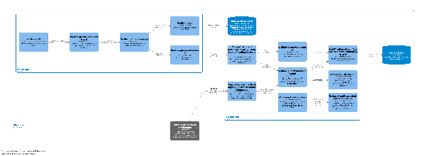
Enlace de la figura: https://drive.google.com/file/d/12vyMi-MQLcCmbG9bNR7d726iB0cFdjfL/view?usp=sharing

En la **Mobile App**, **Wellbeing UI** muestra al usuario los indicadores ambientales correspondientes a las sedes registradas. **WellbeingDashboardViewModel** administra el estado de esta información y delega su recuperación en **WellbeingRepositoryImpl**.

**WellbeingRepositoryImpl** coordina los datos obtenidos desde **WellbeingRemoteDataSource** con la copia local administrada por **WellbeingDao**, permitiendo mantener disponible la información ambiental recientemente sincronizada.

En el API Backend, **OfficesController**, **DevicesController** y **EnvironmentalReadingsController** exponen los endpoints relacionados con oficinas, inventario de dispositivos, configuración de umbrales y lecturas ambientales.

Las operaciones de consulta son procesadas por **WellbeingQueryServiceImpl**, mientras que **WellbeingCommandServiceImpl** administra el registro y configuración de oficinas y dispositivos, además de procesar las lecturas recibidas.

**SensorReadingIngestionAdapter** recibe las lecturas provenientes del **Sistema de Sensores Ambientales** y las envía al servicio de aplicación para su registro y clasificación. El modelo de dominio **Office** concentra la configuración de la oficina, sus dispositivos y las lecturas ambientales asociadas.

Finalmente, **Wellbeing Event Handlers** procesa eventos relevantes del contexto. Cuando se detecta una condición clasificada como peligrosa, **FirebaseCloudMessagingNotificationService** permite enviar una notificación al personal correspondiente.

#### 2.6.7.6. Bounded Context Software Architecture Code Level Diagrams

##### 2.6.7.6.1. Bounded Context Domain Layer Class Diagrams

En esta sección se presenta el diagrama de clases UML correspondiente al Domain Layer del bounded context Wellbeing.

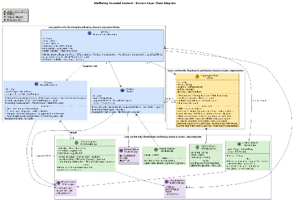
Enlace de la figura: https://drive.google.com/file/d/1kuUnHmtumps9wziuJqwDGgZSF1mPYcqF/view?usp=sharing

El elemento central del dominio es **Office**, definido como **Aggregate Root**. Representa una sede física registrada en Flowboard y mantiene su nombre, ubicación, estado y los dispositivos asociados a ella.

**Device** representa cada dispositivo capaz de generar lecturas ambientales. Cada dispositivo posee un código, un estado y un conjunto de métricas soportadas. La enumeración **DeviceStatus** permite clasificarlo como **IN_INVENTORY**, **LINKED** o **INACTIVE**.

**EnvironmentalReading** representa una lectura obtenida desde un dispositivo y contiene la oficina, dispositivo, valor medido, fecha de captura y clasificación ambiental resultante.

Las métricas ambientales se representan mediante **MetricValue**, que combina un **MetricType** con su correspondiente valor. **MetricType** restringe las métricas admitidas a **TEMPERATURE**, **ILLUMINATION** y **AIR_QUALITY**.

**MetricThreshold** define los criterios utilizados para clasificar cada lectura. Para ello utiliza diferentes **ThresholdRange**, cada uno asociado a un **HealthIndicator**. Los indicadores posibles son **OPTIMAL**, **ACCEPTABLE**, **POOR** y **HAZARDOUS**.

##### 2.6.7.6.2. Bounded Context Database Design Diagram

En esta sección se presenta el Database Design Diagram correspondiente al bounded context Wellbeing.

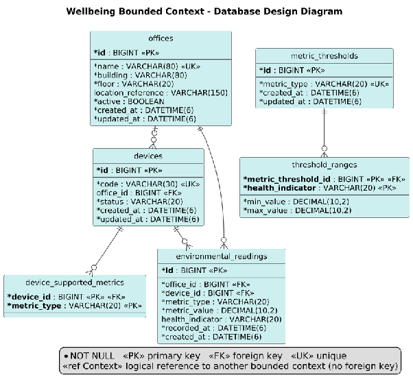
Enlace de la figura: https://drive.google.com/file/d/1beMKRbzfaEdriqcP_b3e9esvD33PUfBY/view?usp=sharing

La tabla **offices** almacena las sedes registradas en el sistema, incluyendo su nombre, edificio, piso, referencia de ubicación y estado.

La tabla **devices** registra los dispositivos vinculados a cada oficina. Cada dispositivo posee un código único, una referencia hacia la oficina correspondiente y un estado operativo.

**device_supported_metrics** permite registrar las métricas que cada dispositivo es capaz de medir. Su clave compuesta por **device_id** y **metric_type** evita duplicar una misma capacidad para un dispositivo.

La tabla **environmental_readings** almacena las lecturas ambientales generadas por los dispositivos, incluyendo oficina, dispositivo, tipo de métrica, valor medido, clasificación ambiental y fecha de registro.

Por otro lado, **metric_thresholds** define los umbrales configurados para cada tipo de métrica, mientras que **threshold_ranges** almacena los rangos específicos asociados a cada indicador de salud ambiental.

El diseño permite separar claramente la configuración de oficinas y dispositivos, las reglas de clasificación ambiental y las lecturas registradas, manteniendo la trazabilidad de cada medición desde su dispositivo de origen hasta el indicador resultante.

